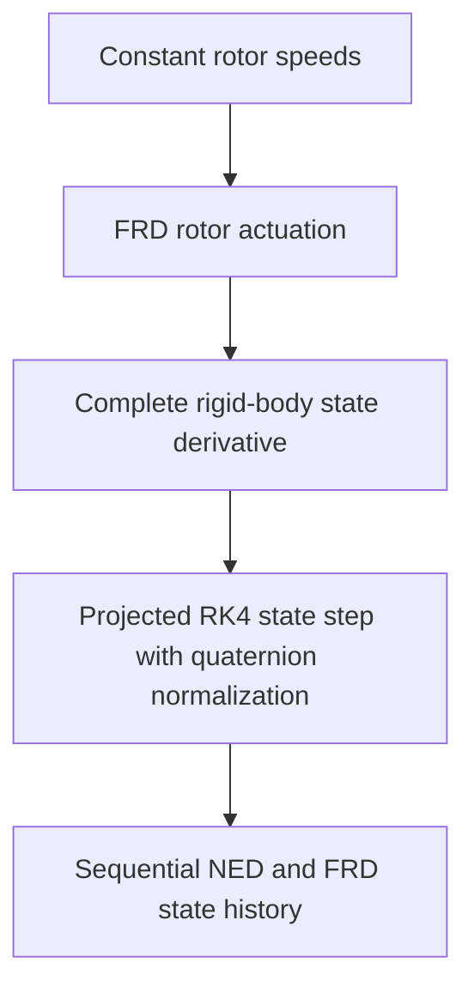

# Robust Autonomous Quadrotor

## Project purpose

This repository develops the mathematical core of an autonomous quadrotor in small,
independently tested layers. The intended progression is rigid-body dynamics, numerical
simulation, feedback control, state estimation, robustness analysis under model and sensor
uncertainty, and later integration with PX4 and ROS 2.

The package under `src/quadrotor_math` is deliberately independent of ROS 2, PX4, and
simulator middleware. That boundary keeps frame conventions, equations, numerical methods,
and validation testable without depending on a flight stack or message transport.

## Current status

At commit `81b38f9`, the foundational rotor-actuation and six-degree-of-freedom rigid-body
dynamics pipeline includes explicit-Euler propagation, fixed-step projected RK4 propagation,
and deterministic multi-step RK4 state histories. The project gate passes 157 tests.

The repository does not yet contain convergence experiments, invariant-monitoring studies, a
closed-loop controller, a state estimator, adaptive integration, robustness campaigns, or a
completed ROS 2/PX4 integration layer.

## Current end-to-end pipeline



The actuation model converts four nonnegative rotor angular speeds into static thrust
magnitudes, sums their force along negative body `z`, and combines offset thrust moments with
the rotor reaction moment about body `z`. The resulting body wrench drives the translational
and rotational equations, which produce instantaneous state derivatives. Explicit Euler
remains a transparent one-step baseline. Fixed-step projected RK4 advances one state while
normalizing its intermediate and final quaternions, and the deterministic simulator applies
that RK4 step sequentially to construct a complete state history.

**Practical interpretation.** Rotor speeds determine the force and turning effect on the
vehicle; the dynamics convert those effects into rates of motion; integration turns those
rates into a new state.

## Mathematical model

The propagated rigid-body state consists of world-frame position `position_W`, world-frame
velocity `velocity_W`, body-to-world attitude `q_WB`, and body-frame angular velocity
`omega_B`. Rotor speeds are inputs to the current rigid-body step rather than independently
propagated motor states.

### Translational dynamics

```text
velocity_derivative_W =
    gravity_W + (R_WB @ force_B) / mass
```

Here `gravity_W = [0, 0, gravity_acceleration]` in m/s², `force_B` is the net rotor force in
the FRD body frame in newtons, `R_WB` maps body-coordinate vectors into NED world
coordinates, and `mass` is in kilograms.

**Practical interpretation.** Gravity and the rotated rotor force determine how world-frame
velocity changes. Position changes at the current world-frame velocity.

### Rotational dynamics

```text
inertia_B @ angular_velocity_derivative_B =
    moment_B - cross(omega_B, inertia_B @ omega_B)
```

`inertia_B` is the symmetric positive-definite inertia tensor about the centre of mass in body
coordinates, in kg·m². `moment_B` is the FRD body moment in N·m. The cross-product term is the
gyroscopic coupling required by rigid-body rotational dynamics; the implementation solves the
linear system rather than explicitly inverting the inertia matrix.

**Practical interpretation.** Applied moments change the rotation rate, while the coupling
term accounts for the fact that a rotating body's axes and angular momentum interact.

### Quaternion kinematics

```text
quaternion_derivative_WB =
    0.5 * q_WB ⊗ [0, omega_B]
```

The symbol `⊗` denotes the Hamilton quaternion product. `q_WB` uses scalar-first ordering
`[w, x, y, z]`, and `omega_B` is expressed in the FRD body frame in rad/s.

**Practical interpretation.** Body angular velocity determines the instantaneous rate of
change of the vehicle's body-to-world attitude.

### Explicit-Euler propagation

```text
state_next = state_current + time_step * state_derivative
```

The same current state is used to calculate all four derivatives before position, velocity,
quaternion, and angular velocity are updated. After the Euler update, only the quaternion is
normalized:

```text
q_WB_next = normalize(q_WB + time_step * quaternion_derivative_WB)
```

**Practical interpretation.** Euler integration projects the current rates forward over a
short interval. Quaternion normalization removes the norm drift introduced by that numerical
update so the result remains a valid attitude representation.

### Fixed-step projected RK4 propagation

Let `state` contain `position_W`, `velocity_W`, `q_WB`, and `omega_B`. Let `input` be the four
rotor speeds, held constant over one integration step, and let
`f = rigid_body_state_derivative_from_rotor_speeds`. The rotor geometry and all physical
parameters also remain constant over the step. Every `k` below is a complete state derivative,
not a state:

```text
k1 = f(state_current, input)

k2 = f(
    state_current + 0.5 * time_step * k1,
    input,
)

k3 = f(
    state_current + 0.5 * time_step * k2,
    input,
)

k4 = f(
    state_current + time_step * k3,
    input,
)

state_next =
    state_current
    + (time_step / 6)
    * (k1 + 2*k2 + 2*k3 + k4)
```

The `k2` derivative is evaluated at the `k1` half-step state, `k3` at the `k2` half-step
state, and `k4` at the `k3` full-step state. Each intermediate state is constructed from the
original state and the corresponding scaled derivative. Because attitude must remain on the
unit-quaternion manifold, the intermediate `q_WB` values used for the `k2`, `k3`, and `k4`
evaluations are normalized. The final quaternion component of the classically weighted update
is normalized as well. This is a projected quaternion treatment within a fixed-step RK4
method; it is neither exact nor adaptive.

**Practical interpretation.** Euler samples one slope at the start of the step. RK4 samples
four slopes across the step and combines them to represent curved motion more accurately.

### Deterministic multi-step RK4 simulation

`simulate_rigid_body_rk4_from_rotor_speeds` applies the RK4 state step for a fixed positive
`time_step` and a positive, non-Boolean integer `number_of_steps`. Rotor speeds, rotor geometry,
mass, body-frame inertia, gravity magnitude, thrust coefficient, and moment coefficient remain
constant throughout the simulation. Each returned RK4 state becomes the input state for the
next transition, including the quaternion normalization performed by the RK4 stepper.

The function returns five float64 arrays in this exact order:

1. `time_s`, shape `(N + 1,)`, in seconds;
2. `position_history_W`, shape `(N + 1, 3)`, in the NED world frame in metres;
3. `velocity_history_W`, shape `(N + 1, 3)`, in the NED world frame in m/s;
4. `q_history_WB`, shape `(N + 1, 4)`, containing dimensionless Hamilton scalar-first
   body-to-world unit quaternions; and
5. `omega_history_B`, shape `(N + 1, 3)`, in the FRD body frame in rad/s.

Here `N = number_of_steps`. The histories have `N + 1` rows because row zero stores the
supplied initial state; row `i` corresponds to `time_s[i] = i * time_step`.

A state derivative describes the instantaneous rate of change of position, velocity,
attitude, and angular velocity. One RK4 state step combines four derivative evaluations to
produce one next state. A multi-step simulation history performs `N` such transitions in
sequence and records the initial state plus every result.

**Think about it this way.** The derivative says how the vehicle is changing now, one RK4 step
moves it to the next instant, and the simulator repeatedly feeds each new state into the next
step to build a time-aligned history.

## Frame and attitude conventions

- World frame `W` is north-east-down (NED): `+x` north, `+y` east, and `+z` down.
- Body frame `B` is forward-right-down (FRD): `+x` forward, `+y` right, and `+z` down.
- `R_WB` is an active rotation that maps body-coordinate vectors into world coordinates.
- `q_WB` is the equivalent Hamilton scalar-first `[w, x, y, z]` body-to-world quaternion.
- Positive world `z` points downward, so increasing world `z` means descending.

The full convention, state shapes, signs, and hover sanity check are defined in the
[frame and state contract](docs/architecture/frame-contract.md).

## Implemented capabilities

- Deterministic NumPy random-number generator construction from explicit seeds.
- A squared-norm vector primitive.
- Skew-symmetric matrices, quaternion normalization and differentiation, and active
  body-to-world rotation matrices.
- Quadratic rotor thrust magnitudes from four rotor speeds.
- FRD collective thrust force, offset thrust moment, and yaw reaction moment.
- Combined FRD body force and moment from rotor speeds.
- NED translational acceleration from body force and uniform gravity.
- FRD rotational acceleration with gyroscopic coupling.
- Complete rigid-body state derivative from an applied body wrench.
- Complete rigid-body state derivative directly from rotor speeds.
- Explicit-Euler state propagation with quaternion normalization as a transparent baseline.
- Fixed-step RK4 propagation of the complete rigid-body state.
- Intermediate and final quaternion normalization during RK4 propagation.
- Finite positive RK4 time-step validation.
- Deterministic constant-input multi-step RK4 simulation with time-aligned state histories.
- Positive non-Boolean integer validation for the requested number of RK4 transitions.
- Typed interfaces, explicit shape/value/physical-parameter validation, and unit tests for
  the implemented boundaries.

## Verification and development workflow

The project targets Python 3.12 and pins uv 0.12.3. Runtime code depends on NumPy; the
development group provides Ruff, mypy, and pytest. Work proceeds in small RED/GREEN TDD
increments: a focused failing test establishes one behavior, the minimum implementation makes
it pass, and the complete gate checks the repository.

With Python 3.12 and uv 0.12.3 available:

```sh
uv sync
make check
```

`make check` runs:

```sh
uv run ruff check .
uv run ruff format --check .
uv run mypy src
uv run pytest
```

At commit `81b38f9`, this complete gate passes 157 tests.

## Repository structure

- `src/quadrotor_math/`: ROS/PX4-independent vector, randomness, rotation, actuation,
  dynamics, integration, and deterministic simulation algorithms.
- `tests/unit/`: focused unit and composition tests for the mathematical core.
- `docs/architecture/`: architectural contracts, including frames and state conventions.
- `docs/decisions/`: accepted workflow and frame-convention decisions.
- `docs/environment.md`: recorded host, toolchain, ROS 2, Gazebo, and PX4 environment details.
- `docs/progress/`: dated engineering progress records.

## Current limitations

- The simulator supports constant rotor input and a fixed positive time step only.
- No quantitative Euler-versus-RK4 convergence or physical-invariant study exists yet.
- No controller, scheduled input, callback, event handling, or adaptive step size exists.
- No state estimator exists yet.
- No Monte Carlo campaign exists yet.
- No completed ROS 2/PX4 adapter exists yet.
- The current mathematical model represents only the effects present in the source: static
  quadratic rotor thrust, thrust-offset and yaw reaction moments, uniform gravity, rigid-body
  inertia, gyroscopic coupling, and quaternion kinematics. It does not yet model additional
  aerodynamic, motor-transient, contact, or environmental effects.

Explicit Euler is useful because each update is transparent and easy to verify against the
continuous equations. Its first-order accuracy and error accumulation make it unsuitable as
the final high-accuracy simulation method, especially for larger time steps or long runs.

## Near-term roadmap

1. Quantify Euler-versus-RK4 convergence across decreasing time steps.
2. Monitor state validity and physical invariants during propagation.
3. Establish hover and controlled-perturbation reference scenarios.
4. Begin feedback-controller implementation after the numerical model is characterized.
5. Continue later with sensors, estimation, uncertainty, Monte Carlo validation, and ROS 2/PX4
   adapters.
