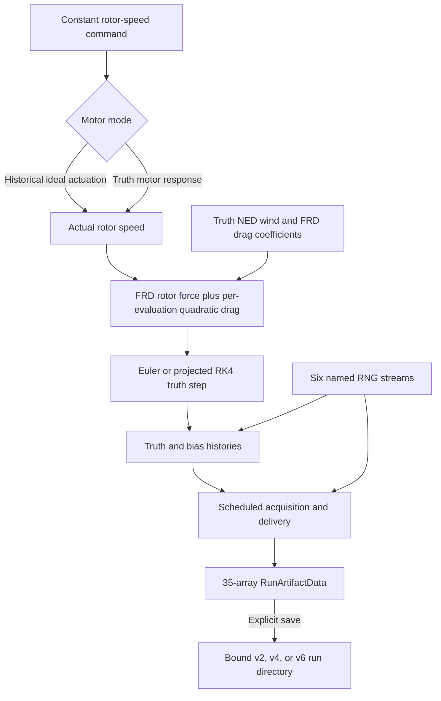

# Robust Autonomous Quadrotor

## Project purpose

This repository develops the mathematical core of an autonomous quadrotor in small,
independently tested layers. The intended progression is rigid-body dynamics, numerical
simulation, feedback control, state estimation, robustness analysis under model and sensor
uncertainty, and later integration with PX4 and ROS 2.

The package under `src/quadrotor_math` is deliberately independent of ROS 2, PX4, and
simulator middleware. That boundary keeps frame conventions, equations, numerical methods,
and validation testable without depending on a flight stack or message transport.

## Current status

The current working tree extends the foundational rotor-actuation and six-degree-of-freedom
rigid-body dynamics pipeline with explicit-Euler propagation, fixed-step projected RK4
propagation, deterministic multi-step Euler and RK4 state histories, reusable rigid-body
state-history structural validation, physical trajectory-error metrics, and a completed
deterministic Euler-versus-RK4 convergence study. Focused characterization now also shows that
the derivative model and both simulators recognize and preserve one exact balanced-thrust,
zero-moment hover equilibrium. A gravity-only ballistic reference additionally verifies RK4
against the analytical constant-gravity trajectory and Euler against its derived discrete
trajectory. Scenario-specific energy characterization now verifies RK4 mechanical-energy
conservation and Euler's analytically predicted positive energy drift for that gravity-only
case. Torque-free asymmetric rotation characterization additionally verifies instantaneous
rotational-energy conservation and projected-RK4 near-conservation of inertial-frame angular
momentum.

The mathematical core now also exposes ideal accelerometer and gyroscope boundaries in
`src/quadrotor_math/imu.py`. The accelerometer applies the repository's NED/FRD frame contract,
accepts zero gravity, and rejects malformed or non-finite array inputs and invalid gravity
magnitudes. The body-aligned gyroscope returns `omega_B` in the FRD body frame as an
independently owned float64 array and rejects malformed or non-finite rates. A separate
deterministic boundary adds a supplied constant three-axis gyroscope bias without hidden
sensor state. A reproducible noisy-measurement boundary adds caller-configured per-axis,
per-sample white noise from a caller-owned NumPy generator with explicit validation and fixed
random-consumption semantics. A matching accelerometer measurement boundary now combines
ideal FRD specific force, a caller-supplied constant three-axis bias, and caller-configured
per-axis, per-sample white noise. It uses a caller-owned NumPy generator, validates all inputs
before sampling, has fixed one-vector draw semantics for valid calls, preserves RNG state for
rejected calls, and returns an independently owned float64 measurement. Deterministic replay,
successive-draw behavior, and population-level first-two-moment consistency are characterized.
Separate reproducible accelerometer and gyroscope bias-random-walk boundaries now advance
caller-owned three-axis bias state using continuous-time densities and positive time steps.
They retain caller ownership of both state and RNG, validate before sampling, and have fixed
random-consumption semantics.

A ROS/PX4-independent position-sensor module now provides ideal and noisy local-position
measurements in the NED world frame together with ideal and noisy positive-up barometric
altitude boundaries. Position vectors have shape `(3,)`, dtype float64, and units of metres;
altitude outputs are Python floats in metres. Bias and per-sample white-noise standard
deviations are supplied per call, RNGs remain caller-owned, and validation completes before
sampling. The module contains 54 focused tests.

A ROS/PX4-independent fixed-rate sensor scheduler now separates measurement acquisition from
fixed-delay delivery on the existing fixed truth grid. It derives acquisition timestamps from
integer truth indices, catches up every crossed acquisition in order, queues delayed records
FIFO, returns every due delivery, and holds an independently owned snapshot of the latest
delivered value. The caller supplies the measurement producer and owns any RNG it uses, so
random sampling occurs only at acquisition and never during delivery. The focused scheduler
module contains 58 tests.

Run 1 of the reproducible run architecture is complete. The mathematical core now groups
validated truth and nominal parameters, an independently owned initial truth state, fixed
truth numerics, four sensor schedules, a constant four-rotor input, a 128-bit root seed, and
explicit truth/nominal mismatch declarations. Six persistent named random generators use a
versioned derivation with explicit stream IDs, so consuming one stream does not advance any
other. At the Run 1 checkpoint, the repository gate passed Ruff lint, Ruff format verification
reported 59 files already formatted, mypy found no issues in 15 source files, and pytest
collected and passed exactly 645 tests in 14.03s. `test_run_configuration.py` contains 169
tests and `test_run_randomness.py` contains 16 tests. There were no failures, errors, skips,
or warnings.

Run 2A's reproducible run manifest and Run 2B's immutable, authenticated NPZ run-artifact
layer are now implemented and tested. Run 2B covers persistence, shared configuration
validation, digest authentication, and durable no-replace publication on Linux. The
2026-09-16 closeout audit found no unresolved Run 2B correctness defect. Run 2C's bounded
manifest-decoder validation is also complete.

First-order motor response and rotor control allocation are published actuation boundaries.
The published Run 3 motorized configuration and manifest work adds motor parameters, an
initial actual rotor speed, and manifest versions 3 and 4 without changing the 35-array
artifact schema. Published in commit `4cc132af291f9352b8145e6397482e8a632e76fd`,
`generate_run_artifact_data` composes motor response, truth propagation, bias evolution,
scheduled sensors, and named randomness into a complete in-memory run.

Gate G1 is complete and published. It was published in
[commit `32e4886c63b38b62f41aa236b4439ca22560f5b7`](https://github.com/Gayles9/robust-quadrotor/commit/32e4886c63b38b62f41aa236b4439ca22560f5b7)
with subject `feat: add environmental wind and drag`. The implementation provides constant
NED wind, anisotropic FRD quadratic drag, validated truth/nominal configuration and declared
environmental mismatches, and drag recomputation from the current velocity and projected
attitude at every derivative evaluation, including all four projected-RK4 stages. Truth
environmental changes alter trajectories and accelerometer truth, while properly declared
nominal-only environmental changes leave all 35 artifact arrays exactly unchanged, including
with sensor noise and bias random walks enabled.

Environmental manifests use versions 5 and 6 for unbound and SHA-256-bound runs,
respectively, with either historical ideal or complete motorized actuation. Versions 1/2
remain the historical zero-environment unbound/bound pair, and versions 3/4 remain the
motorized zero-environment pair. The 35-array artifact schema is unchanged. In the tested
environment, environmental v5-save/v6-load replay reproduces all arrays and both canonical
files exactly. The local publication gate passed all 1,362 tests, Ruff lint and formatting,
and mypy. Hosted push CI
[run 35793062927](https://github.com/Gayles9/robust-quadrotor/actions/runs/35793062927)
subsequently succeeded.

The mathematical core now also contains the first 15-state ESKF milestone. It provides an
immutable nominal state, right-local body-frame attitude-error injection, bias-corrected IMU
nominal prediction, continuous `F` and `G` construction, first-order `Phi` and `Q_d`,
explicitly symmetric covariance prediction, and a composed prediction boundary. Independent
finite-difference Jacobians, adversarial covariance validation, empirical process-noise
covariance, and repeated-prediction probes verify the frame/sign convention and numerical
behavior. That initial milestone covered prediction; measurement correction is now implemented
as described below. A bounded measurement-only replay runner is also implemented below;
live-stream and closed-loop estimator integration remain outside the current scope.
It was published in
[commit `104fdfc1902e968de283ec76e720220fba577320`](https://github.com/Gayles9/robust-quadrotor/commit/104fdfc1902e968de283ec76e720220fba577320),
and hosted push CI
[run 35802813457](https://github.com/Gayles9/robust-quadrotor/actions/runs/35802813457)
succeeded. A bounded post-publication audit has since hardened warning-free quaternion
validation, subnormal covariance handling, bit-exact symmetrization, and exact zero-duration
composed prediction. That correction was published in
[commit `3afe58e91ec4bda283a81b9fe8032379582b8a4d`](https://github.com/Gayles9/robust-quadrotor/commit/3afe58e91ec4bda283a81b9fe8032379582b8a4d),
and hosted push CI
[run 35805483357](https://github.com/Gayles9/robust-quadrotor/actions/runs/35805483357)
succeeded.

The ESKF measurement-update core is also complete. It provides local-position and
positive-up barometric-altitude models with explicit nominal sensor biases, scaled Cholesky
gain solves, Joseph covariance updates, right-local injection, full covariance reset using
the SO(3) right Jacobian, and immutable diagnostics. Code commit
[`a751fe843178440e035a6ad375a3abec828a2b1a`](https://github.com/Gayles9/robust-quadrotor/commit/a751fe843178440e035a6ad375a3abec828a2b1a)
passed local checks and [hosted CI](https://github.com/Gayles9/robust-quadrotor/actions/runs/35870476786).
The same change closes audited generation, manifest, artifact, timing, and numerical-boundary
gaps while preserving the tested historical run outputs. See
[ADR 0005](docs/decisions/0005-eskf-measurement-updates.md) and the
[verification record](docs/progress/2026-09-23-eskf-measurement-updates-and-contract-audit.md).

The ESKF can now replay generated or loaded sensor records through a measurement-only
execution boundary. It uses an explicit prior at the first acquired IMU epoch, left-held
paired IMU prediction, deterministic position-before-altitude correction, and explicit
stale/pending/disabled observation outcomes. It owns state/covariance histories and full
per-fusion diagnostics without reading true trajectories or biases. Code commit
[`2e26a26d2b4867e0a905e94fad68cb1385955b84`](https://github.com/Gayles9/robust-quadrotor/commit/2e26a26d2b4867e0a905e94fad68cb1385955b84)
passed [hosted CI](https://github.com/Gayles9/robust-quadrotor/actions/runs/35884309624).
The supported recorded-run IMU contract is deliberately full-rate, paired and zero-delay.
See [ADR 0006](docs/decisions/0006-eskf-sensor-replay.md) and the
[replay verification record](docs/progress/2026-09-23-eskf-sensor-replay.md).

Replay now also supports opt-in pre-update innovation diagnostics and fixed outlier gates
for position and altitude. It records residuals, predicted innovation covariance, whitened
residuals and normalized innovation squared (NIS); rejected values leave the state and
covariance unchanged. The default remains unscored replay. Code commit
[`b674c716b4d2fff345e457b6f0ff247b40acd88c`](https://github.com/Gayles9/robust-quadrotor/commit/b674c716b4d2fff345e457b6f0ff247b40acd88c)
passed [hosted CI](https://github.com/Gayles9/robust-quadrotor/actions/runs/35890398654).
See [ADR 0007](docs/decisions/0007-eskf-innovation-gating.md) and the
[gating verification record](docs/progress/2026-09-23-eskf-innovation-gating.md).

Evaluation now includes exact truth/replay alignment, right-local 15-state error extraction,
positive-definite NEES, an explicit sampled-IMU noise conversion, and independent-seed
NIS/NEES summaries. A frozen nominal ensemble compares fused estimation with dead reckoning
on hover and translating/yaw cases, with separate smoke, development and validation seeds.
Truth remains confined to evaluation. Every numerical failure is retained, and scored NIS
includes rejected observations. See
[ADR 0008](docs/decisions/0008-eskf-consistency-evaluation.md) and the
[consistency verification record](docs/progress/2026-09-23-eskf-consistency-evaluation.md).

The known-prior ESKF now also has independent continuously varying motion fixtures,
immutable observation-fault injection, bias-convergence and dropout-recovery evidence,
paired gated/ungated held-out trials, Q/R sensitivity, and reproducible headless figures.
The frozen completion campaign ran 100 randomized 30-second trajectories and 280 paired
replay variants without numerical failure or nominal/gated divergence. The full-state
NEES coverage was **88.84%**, below the declared 90–98% investigation band; that measured
calibration limitation is preserved and investigated rather than called a pass. The G3
engineering evidence is available with this explicit consistency qualification. See the
[estimator guide](docs/estimation.md), [ADR 0009](docs/decisions/0009-eskf-completion-validation.md)
and [completion verification record](docs/progress/2026-09-23-eskf-completion.md).

An explicit **endpoint IMU propagation** option now integrates adjacent instantaneous
samples with second-order accuracy and propagates their matched discrete covariance.
It retains the current sample's conditional noise mean and cross-covariance across
prediction and correction. There are 15 physical error states and six temporary noise
coordinates. The original first-order default and its campaign remain reproducible.
See [ADR 0010](docs/decisions/0010-eskf-endpoint-propagation.md) and the
[endpoint interface guide](docs/estimation.md#endpoint-integration-and-matched-sample-noise-covariance).

The [fresh calibration campaign](docs/progress/2026-09-23-eskf-endpoint-calibration.md)
passed the declared targets across 100 independent 30-second trajectories and 380
replay variants. Endpoint full-state NEES coverage was **95.29%** (mean 14.60), versus
91.99% (mean 16.96) for the original method on the same new data. Mean position RMSE
improved from .06809 m to .06739 m. All 2,517 tests and static checks pass locally
and in [GitHub CI](https://github.com/Gayles9/robust-quadrotor/actions/runs/35926981124).
This is evidence for the declared known-prior simulation distribution, not flight readiness.

The baseline **attitude and body-rate inner loop** is now implemented. It composes a
local quaternion attitude P loop, inertia-aware rate P feedback, explicit rate/moment
limits and collective-preserving rotor allocation. A deterministic true-state harness
evaluates motor response at every projected-RK4 stage and retains commands, actual motor
states and all limiting diagnostics. The fixed campaign verifies signed reference steps,
30-degree recovery, torque-pulse recovery, saturation recovery and the predicted nonzero
offset under persistent torque. See the [control guide](docs/control.md),
[ADR 0011](docs/decisions/0011-baseline-attitude-control.md) and
[verification record](docs/progress/2026-09-24-baseline-attitude-control.md).
The attitude harness remains separate from sensor generation and ESKF replay; the
position/mission composition is described below. At the inner-loop checkpoint the
local gate passed **2,659 tests**; all 14 fixed/refinement cases, five development
cases and 30 held-out attitude recoveries pass their declared criteria.
Published implementation
[`f589082e`](https://github.com/Gayles9/robust-quadrotor/commit/f589082e004e044aea05e9bbbc2ae9741474767e)
also passes [GitHub CI](https://github.com/Gayles9/robust-quadrotor/actions/runs/35946303612).
The second audit verifies all published file objects, clean-checkout execution and
physical consistency of every retained control trial.

The **true-state position/velocity and baseline mission layer** is now implemented.
It adds acceleration feedforward plus PD feedback, explicit acceleration/tilt/thrust
limits, desired attitude construction, hold/quintic/step references, and sampled
initialize/takeoff/track/land/complete/abort supervision. It reuses the unchanged
attitude loop and motor/RK4 plant. The local full gate passes **2,859 tests**.
All five fixed/refinement cases, three development runs and **10/10 held-out square
missions** pass; held-out full-mission position RMSE is **0.01968–0.02292 m**, below
the frozen 0.15 m target. The 60-second hover, vertical-step and mild-wind cases pass,
with no actuator limiting in the mission campaign. See the
[position/mission guide](docs/position-control.md),
[ADR 0012](docs/decisions/0012-position-control-and-missions.md) and
[verification record](docs/progress/2026-09-24-position-control-and-missions.md).
These satisfy the declared G2 true-state numerical targets; they are not evidence of
estimated-state flight, real ground contact or hardware readiness. Landing is virtual
and a guard abort stops the simulation, not a physical emergency maneuver.
Published implementation
[`7366409f`](https://github.com/Gayles9/robust-quadrotor/commit/7366409f1fdfe0c2365c21d786b557780f9e1477)
passes [GitHub CI](https://github.com/Gayles9/robust-quadrotor/actions/runs/35993128185)
with 2,859 tests; the published-tree comparison and clean-checkout smoke also pass.

The repository does not yet contain a reusable physically conditional invariant-monitoring
API, a live estimator/control integration, adaptive integration, or a completed
ROS 2/PX4 integration layer. The implemented delay
strategy rejects stale observations; delayed fusion/rewind remains outside this basic ESKF.

## Recorded sensor-run pipeline



The actuation model converts four nonnegative rotor angular speeds into static thrust
magnitudes, sums their force along negative body `z`, and combines offset thrust moments with
the rotor reaction moment about body `z`. The resulting body wrench drives the translational
and rotational equations, which produce instantaneous state derivatives. Explicit Euler
remains a transparent one-step baseline. Fixed-step projected RK4 advances one state while
normalizing its intermediate and final quaternions. Matching deterministic simulators apply
either stepper sequentially to construct complete state histories. Reusable metrics then
compare corresponding trajectory samples in their own physical units, and the convergence
experiment measures how those errors change as the fixed time step is refined.

The reusable history validator independently rejects malformed or numerically invalid state
histories. The existing Euler and projected-RK4 simulators both produce histories accepted by
that validator without modification.

`generate_run_artifact_data(configuration)` uses the configured rotor-speed command directly
in historical ideal-actuator mode. Complete motorized configurations advance a private actual
rotor-speed history with truth motor parameters before each state transition. The generator
combines rotor force with truth environmental drag at every derivative evaluation, then
advances accelerometer and gyroscope biases, samples four scheduled sensors from the completed
truth row, and records acquisitions and deliveries in the unchanged 35-array artifact. The
accelerometer truth calculation uses the same environmental derivative as propagation.
Properly declared nominal-only wind or drag changes do not affect physical or stochastic
artifact data. Actual rotor-speed history is reconstructed during generation but is not persisted.
The allocator is not invoked because the configuration already supplies rotor-speed commands;
allocation is upstream of this boundary. The new attitude controller uses allocation in its
separate closed-loop harness; it does not change this generator's constant-command contract.
Saving a run directory remains an explicit separate call.

For compatible sensor schedules, `eskf_replay_input_from_run_artifact` extracts only clock
and measurement/delivery information from an in-memory or loaded artifact. `replay_eskf`
then combines this owned measurement-only input with an independently supplied estimator
prior and nominal assumptions. Truth histories remain outside the filter, available to the
caller for evaluation. Replay never regenerates sensor noise or changes the run artifact.

**Practical interpretation.** Rotor speeds determine the force and turning effect on the
vehicle; the dynamics convert those effects into rates of motion; integration turns those
rates into a new state.

The separate published `motor_speed_first_order_step` boundary advances four actual rotor
speeds under a constant command using the exact finite-time first-order response. It clips
commands to configured speed limits before applying lag; a zero time step returns an owned
copy of the unchanged actual speeds. The published
`commanded_rotor_speeds_from_collective_thrust_and_body_moment` boundary converts a requested
collective thrust and FRD body moment into commanded speeds in the supplied rotor order. Its
force and moment signs follow the existing FRD/NED conventions. It validates demand, geometry,
spin directions, coefficients, speed limits, allocation-matrix rank, numerical bounds, and
feasibility. Materially infeasible demands are rejected, not silently saturated; only
roundoff-sized solved-square errors on either side of feasible boundaries are repaired. The
existing multi-step rigid-body simulators still take rotor speeds directly. The complete-run
generator uses motor response, while allocation remains upstream.

## Mathematical model

For the separate attitude controller's equations, input/output contracts, timing and
gain rationale, see [Baseline attitude and body-rate control](docs/control.md).

The propagated rigid-body state consists of world-frame position `position_W`, world-frame
velocity `velocity_W`, body-to-world attitude `q_WB`, and body-frame angular velocity
`omega_B`. Rotor speeds are inputs to the current rigid-body step rather than independently
propagated motor states.

### Translational dynamics

```text
velocity_derivative_W =
    gravity_W + (R_WB @ force_B) / mass
```

Here `gravity_W = [0, 0, gravity_acceleration]` in m/s², `force_B` is the net rotor force in
the historical zero-environment case and the combined rotor-plus-drag force otherwise, in the
FRD body frame in newtons. `R_WB` maps body-coordinate vectors into NED world
coordinates, and `mass` is in kilograms.

**Practical interpretation.** Gravity and the rotated rotor force determine how world-frame
velocity changes. Position changes at the current world-frame velocity.

### Constant wind and anisotropic quadratic drag

The environmental model uses one constant wind vector in NED world coordinates and one
nonnegative coefficient per FRD body axis:

```text
velocity_air_W = velocity_W - wind_velocity_W
velocity_air_B = R_WB.T @ velocity_air_W
force_drag_B = (
    -quadratic_drag_coefficient_B
    * abs(velocity_air_B)
    * velocity_air_B
)
```

Both velocity vectors use m/s, `quadratic_drag_coefficient_B` uses kg/m, and
`force_drag_B` uses newtons. The force is dissipative relative to the air:
`force_drag_B @ velocity_air_B <= 0`. It acts at the modelled centre of mass, so this
milestone introduces no aerodynamic moment. Euler evaluates it once at the current state;
projected RK4 evaluates it independently at all four stage velocities and projected
attitudes. The model contains no gust, turbulence, air-density decomposition, aerodynamic
moment, clipping, saturation, CFD, or blade-element approximation.

### Rotational dynamics

```text
inertia_B @ angular_velocity_derivative_B =
    moment_B - cross(omega_B, inertia_B @ omega_B)
```

`inertia_B` is the symmetric positive-definite inertia tensor about the centre of mass in body
coordinates, in kg·m². `moment_B` is the FRD body moment in N·m. The cross-product term is the
gyroscopic coupling required by rigid-body rotational dynamics; the implementation solves the
linear system rather than explicitly inverting the inertia matrix.

**Practical interpretation.** Applied moments change the rotation rate, while the coupling
term accounts for the fact that a rotating body's axes and angular momentum interact.

### Quaternion kinematics

```text
quaternion_derivative_WB =
    0.5 * q_WB ⊗ [0, omega_B]
```

The symbol `⊗` denotes the Hamilton quaternion product. `q_WB` uses scalar-first ordering
`[w, x, y, z]`, and `omega_B` is expressed in the FRD body frame in rad/s.

**Practical interpretation.** Body angular velocity determines the instantaneous rate of
change of the vehicle's body-to-world attitude.

### Ideal accelerometer specific force

The public module `src/quadrotor_math/imu.py` provides
`ideal_accelerometer_specific_force_body(...)`. For supplied world-frame inertial
translational acceleration `a_W`, the function calculates

```text
g_W = [0, 0, g]
f_B = R_WB.T @ (a_W - g_W)
```

The world frame is north-east-down (NED), the body frame is forward-right-down (FRD), and
positive world `z` points down. `R_WB` maps body-coordinate vectors into world coordinates,
so `R_WB.T` maps world-coordinate vectors into body coordinates. An ideal accelerometer
reports specific force rather than gravity-inclusive inertial acceleration, which is why
`g_W` is subtracted before the result is rotated into the body frame.

Three physical anchors fix the signs and frames: tilted thrust maps to body negative `z`,
level rest or hover returns `[0, 0, -g]`, and gravity-only free fall returns `[0, 0, 0]`.
Zero gravity is valid; with identity `R_WB`, the returned specific force then equals the
supplied inertial acceleration.

The function validates that `translational_acceleration_W` has shape `(3,)`, `R_WB` has shape
`(3, 3)`, both arrays contain only finite entries, and the gravity magnitude is finite and
nonnegative. Proper-rotation construction and correctness remain owned by the existing
rotations layer. This function does not independently test `R_WB` orthogonality or
determinant. The detailed derivation, evidence, ownership, and limitations are recorded in
the [ideal-accelerometer specific-force progress record](docs/progress/2026-09-01-ideal-accelerometer-specific-force.md).

### Constant accelerometer bias

The public IMU module now also provides:

```python
accelerometer_specific_force_with_bias_body(
    ideal_specific_force_B: NDArray[np.float64],
    accelerometer_bias_B: NDArray[np.float64],
) -> NDArray[np.float64]
```

Its deterministic measurement equation is:

```text
specific_force_with_bias_B
    = ideal_specific_force_B + accelerometer_bias_B
```

Both inputs and the output have exact shape `(3,)`, are expressed along the
forward-right-down body axes, and use m/s². `accelerometer_bias_B` is a caller-supplied
constant additive three-axis accelerometer bias. Finite positive, negative, and zero bias
components are valid; a negative component represents bias in the negative direction of the
corresponding signed FRD body axis. A zero bias returns values exactly equal to the ideal
specific force.

The function validates the ideal-input shape, bias-input shape, ideal-input finiteness, and
bias-input finiteness in that order. Invalid inputs raise `ValueError` with input-specific
messages. NumPy addition produces an independently owned result for the validated arrays: the
output shares memory with neither input, and production performs no separate explicit copy.

This bias-only milestone added no accelerometer white noise, RNG behavior, bias drift,
scale-factor or cross-axis error, saturation, quantization, latency, or sample scheduling.
Its historical next action—reproducible accelerometer white noise with caller-owned RNG
behavior—has now been completed as the separate measurement boundary documented below.
Gate G1 remains open. The bias-only contract and evidence remain recorded in the
[constant-accelerometer-bias progress record](docs/progress/2026-09-03-constant-accelerometer-bias.md).

### Reproducible accelerometer white noise

The public IMU module now also provides
`accelerometer_specific_force_measurement_body(...)`. Its measurement equation is:

```text
specific_force_measurement_B =
    ideal_specific_force_B
    + accelerometer_bias_B
    + noise_standard_deviation_B * standard_normal_sample_B
```

All three input vectors and the returned measurement have shape `(3,)`, use m/s², and are
resolved along the body-aligned forward-right-down axes.
`noise_standard_deviation_B` is configured per axis and per sample. The dimensionless
standard-normal sample comes from exactly one caller-owned generator draw:

```text
standard_normal_sample_B = rng.standard_normal(3)
```

Every valid call consumes that one vectorized draw, including when all configured standard
deviations are zero. Equal seeds with equal call sequences reproduce identical measurements,
and consecutive calls consume successive draws. Shape, finiteness, and nonnegative-noise
validation all complete before sampling, so rejected inputs do not advance the caller-owned
generator. NumPy arithmetic produces an independently owned float64 output.

A deterministic 20,000-sample characterization uses sample standard deviations with
`ddof=1`. On every axis, both the empirical-mean error and sample-standard-deviation error
remain below five normalized standard errors. This finite-sample evidence supports
consistency with the configured first two moments. It does not prove Gaussianity,
independence, stationarity, hardware fidelity, sensor bandwidth, sample-rate scaling, or
continuous-time noise-density conversion.

This boundary adds no bias drift or random walk, scale-factor or cross-axis error,
misalignment, saturation, quantization, latency, timestamps, sample scheduling, vibration,
temperature, calibration, or simulator integration. Gate G1 remains open. The complete
contract and evidence are recorded in the
[reproducible accelerometer white-noise progress record](docs/progress/2026-09-08-reproducible-accelerometer-white-noise.md).

### Ideal gyroscope angular velocity

The same public IMU module provides:

```python
ideal_gyroscope_angular_velocity_body(
    omega_B: NDArray[np.float64],
) -> NDArray[np.float64]
```

For an ideal body-aligned gyroscope, the measurement equation is

```text
gyroscope_output_B = omega_B
```

`omega_B` is rigid-body angular velocity with shape `(3,)`, expressed along the
forward-right-down body axes in rad/s. Its components follow the right-hand rule about body
forward, right, and down. Because the supplied quantity is already expressed in the aligned
sensor axes, no attitude or gravity transformation is required; position, translational
velocity, and translational acceleration are not inputs either.

The returned measurement is an independently owned float64 array with no shared memory with
caller-owned truth state. The function validates exact shape `(3,)` and finiteness in that
order. Zero and finite negative rates remain valid, and no arbitrary magnitude restriction is
imposed. Focused tests establish exact mixed-sign component preservation, independent-memory
ownership, invalid-shape rejection, and rejection of NaN and both infinities.

This boundary is ideal and deterministic. It includes no bias, white noise, bias drift or
random walk, scale-factor error, axis misalignment, saturation, quantization, sampling policy,
latency, or stochastic configuration. It does not validate the dynamics that produced
`omega_B`, establish realistic sensor behavior, or complete Gate G1. The detailed contract,
TDD evidence, decisions, and limitations are recorded in the
[ideal-gyroscope angular-velocity progress record](docs/progress/2026-09-01-ideal-gyroscope-angular-velocity.md).

### Constant gyroscope bias

The public IMU module also provides:

```python
gyroscope_angular_velocity_with_bias_body(
    ideal_angular_velocity_B: NDArray[np.float64],
    gyroscope_bias_B: NDArray[np.float64],
) -> NDArray[np.float64]
```

Its deterministic measurement equation is:

```text
angular_velocity_with_bias_B
    = ideal_angular_velocity_B + gyroscope_bias_B
```

Both inputs have exact shape `(3,)`, are resolved along the body-aligned FRD axes, and use
rad/s. `gyroscope_bias_B` is a caller-supplied constant additive three-axis vector; positive,
negative, and zero finite components are valid. The function contains no hidden mutable
sensor state. It establishes this layer separation:

```text
truth omega_B
    -> ideal gyroscope output
    -> deterministic additive bias
    -> biased measurement
```

NumPy addition produces an independently owned result for valid vectors. The result shares
no memory with either input, neither input is mutated, and the bias function adds no explicit
copy or dtype-conversion logic. Its typed public contract uses float64 arrays.

Validation occurs before addition in this exact order: ideal-measurement shape, bias shape,
ideal-measurement finiteness, and bias finiteness. Invalid inputs raise these exact messages:

```text
ideal_angular_velocity_B must have shape (3,)
gyroscope_bias_B must have shape (3,)
ideal_angular_velocity_B must contain only finite values
gyroscope_bias_B must contain only finite values
```

Ten new executed test cases establish component-wise mixed-sign bias addition, independent
output ownership from both inputs, separate invalid-shape rejection, and independent rejection
of NaN and both infinities in each input. There is no dedicated zero-bias characterization
test.

This milestone deliberately adds no white noise, bias random walk, RNG use, sample time,
scale factors, misalignment, saturation, quantization, latency, or generic sensor/configuration
abstraction. Gate G1 remains open: deterministic truth/ideal/biased-measurement separation is
now explicit, but stochastic reproducibility, sensor statistics, saved replay, estimation,
robustness, and hardware realism remain unestablished. The detailed contract, TDD evidence,
decisions, and limitations are recorded in the
[constant-gyroscope-bias progress record](docs/progress/2026-09-02-constant-gyroscope-bias.md).

### Reproducible gyroscope white noise

The public IMU module now also provides
`gyroscope_angular_velocity_measurement_body(...)`. Its measurement equation is:

```text
angular_velocity_measurement_B =
    ideal_angular_velocity_B
    + gyroscope_bias_B
    + noise_standard_deviation_B * standard_normal_sample_B
```

All three input vectors and the returned measurement have shape `(3,)`, use rad/s, and are
resolved along the body-aligned FRD axes. `noise_standard_deviation_B` is configured per axis
and per sample. The standard-normal sample comes from exactly one caller-owned generator
draw:

```text
standard_normal_sample_B = rng.standard_normal(3)
```

Every valid call consumes that one vectorized draw, including when all configured standard
deviations are zero. Equal seeds with equal call sequences reproduce identical measurements,
and consecutive calls consume successive draws. Rejected inputs do not advance the caller's
generator because shape, finiteness, and nonnegative-standard-deviation validation all occur
before sampling. NumPy arithmetic produces an independently owned output.

A deterministic 20,000-sample population characterization verifies the configured mean and
sample standard deviations on all three axes using five-standard-error bounds. This evidence
does not establish perfect Gaussianity, sample independence, hardware fidelity, estimator
performance, or continuous-time noise-density conversion. It adds no automatic sample-rate
scaling, accelerometer noise, bias random walk, scale-factor or misalignment error,
saturation, quantization, latency, or sample scheduling. Gate G1 remains open. The complete
contract and evidence are recorded in the
[reproducible gyroscope white-noise progress record](docs/progress/2026-09-02-reproducible-gyroscope-white-noise.md).

### Reproducible IMU bias random walk

The public IMU module provides two explicit bias-state update boundaries:

```python
accelerometer_bias_random_walk_step_body(
    current_accelerometer_bias_B: NDArray[np.float64],
    accelerometer_bias_random_walk_density_B: NDArray[np.float64],
    time_step: float,
    rng: Generator,
) -> NDArray[np.float64]

gyroscope_bias_random_walk_step_body(
    current_gyroscope_bias_B: NDArray[np.float64],
    gyroscope_bias_random_walk_density_B: NDArray[np.float64],
    time_step: float,
    rng: Generator,
) -> NDArray[np.float64]
```

Both implement the component-wise discrete update

```text
b_(k+1) = b_k + sigma_b * sqrt(dt) * z_k
z_k ~ N(0, I_3)
```

Here `dt` is `time_step` in seconds. The `sqrt(dt)` factor is required for a
continuous-time random-walk density so that increment variance scales linearly with elapsed
time. The bias and density vectors have shape `(3,)` and are resolved along the FRD body
axes. Accelerometer bias uses m/s², gyroscope bias uses rad/s, and each density multiplied by
the square root of seconds yields its corresponding bias-increment units.

Bias state and the NumPy `Generator` remain caller-owned. A valid call consumes exactly one
vectorized `rng.standard_normal(3)` draw, including a zero-density call. A rejected call
consumes no random values because validation completes before sampling. The returned float64
state is independently allocated, and neither caller-owned input vector is mutated.

Each function validates, in order, current-bias shape, density shape, current-bias
finiteness, density finiteness, density nonnegativity, time-step finiteness, and strict
time-step positivity before sampling. Invalid inputs raise input-specific `ValueError`
messages. This boundary does not create hidden sensor state or promise identical random
bitstreams across NumPy versions or different bit generators. Sprint 3, Week 6 remains in
progress, and Gate G1 remains open. The full contract and evidence are recorded in the
[reproducible IMU bias-random-walk progress record](docs/progress/2026-09-09-reproducible-imu-bias-random-walk.md).

### Local position and barometric altitude

The public module `src/quadrotor_math/position_sensors.py` provides four pure measurement
boundaries:

```python
ideal_position_measurement_world(
    position_W: NDArray[np.float64],
) -> NDArray[np.float64]

position_measurement_world(
    ideal_position_W: NDArray[np.float64],
    position_bias_W: NDArray[np.float64],
    noise_standard_deviation_W: NDArray[np.float64],
    rng: Generator,
) -> NDArray[np.float64]

ideal_barometric_altitude_from_position_world(
    position_W: NDArray[np.float64],
    reference_altitude: float,
) -> float

barometric_altitude_measurement(
    ideal_altitude: float,
    barometric_altitude_bias: float,
    noise_standard_deviation: float,
    rng: Generator,
) -> float
```

The local-position boundary is generic local Cartesian position, not GPS latitude/longitude.
Its input and output vectors use the NED world frame, have exact shape `(3,)`, use float64,
and are measured in metres. The ideal boundary returns an independent copy of `position_W`.
The noisy boundary implements

```text
standard_normal_sample_W = rng.standard_normal(3)

position_measurement_W =
    ideal_position_W
    + position_bias_W
    + noise_standard_deviation_W * standard_normal_sample_W
```

The configured position-noise standard deviation is per sample, not a continuous-time noise
density. Every valid call consumes exactly one vector draw, including a zero-noise call.
Shape, finiteness, and nonnegative-noise validation all complete before sampling, so rejected
calls consume no draws. Inputs remain caller-owned and unmodified, while vector outputs own
independent storage.

Public barometric altitude is positive up, while NED `position_W[2]` is positive down. The
explicit conversion is

```text
altitude = reference_altitude - position_W[2]
```

`reference_altitude` is the caller-selected altitude assigned to the NED origin. There is no
hidden mean-sea-level, ellipsoid, or pressure datum: this boundary is a geometric or indicated
altitude proxy rather than an atmospheric-pressure model. The noisy scalar boundary implements

```text
standard_normal_sample = rng.standard_normal()

measured_altitude =
    ideal_altitude
    + barometric_altitude_bias
    + noise_standard_deviation * standard_normal_sample
```

Its output is a Python float in metres, and its standard deviation is configured per sample.
Every valid call consumes exactly one scalar draw, including a zero-noise call. Scalar
finiteness and nonnegative-noise validation complete before sampling, so rejected calls
consume no draws.

Position bias and barometric bias are caller-supplied on each call. The functions contain no
hidden sensor state, and the caller owns every NumPy generator. They do not determine whether
a sample is due and do not own sample rates, timestamps, held values, acquisition scheduling,
truth interpolation, or delivery delay. Fixed-rate acquisition and fixed delivery delay now
belong to the separate scheduling abstraction documented below; the measurement functions
remain pure value boundaries. The complete position-sensor contract, TDD record, and
deterministic evidence are in the
[local-position and barometric-altitude progress record](docs/progress/2026-09-10-local-position-and-barometric-altitude-sensors.md).

### Fixed-rate sensor scheduling

The public module `src/quadrotor_math/sensor_scheduling.py` schedules scalar Python-float or
float64 NumPy-array measurements without importing ROS 2, PX4, Gazebo, or any sensor-specific
physics. Each `FixedRateSensorScheduler` is configured by a public sample period, the fixed
truth-history time step, and an optional fixed nonnegative delivery delay. The configured
sample period must align with an integer number of truth steps. The implementation
canonicalizes that alignment to an integer stride rather than accumulating floating-point
periods.

For zero-based sequence index `k`, the schedule is:

```text
sample_stride = round(sample_period_s / truth_time_step_s)
truth_index_k = (k + 1) * sample_stride
acquisition_time_k = truth_index_k * truth_time_step_s
delivery_time_k = acquisition_time_k + delivery_delay_s
```

The first acquisition therefore occurs after one complete sample period, never at time zero.
Acquisition timestamps are derived from authoritative integer truth indices. An update that
crosses multiple acquisition boundaries catches up every due row in chronological order; it
does not skip to only the newest row. For each acquisition, the caller-provided callable
receives `(truth_index, acquisition_time_s)` and returns the measurement value. Measurement
frames and physical units remain defined by that producer: the scheduler transports the
value without interpreting its frame or units. All scheduler timestamps are elapsed
simulation seconds.

Each acquired value is stored in a `SensorMeasurement` with its zero-based sequence index,
acquisition timestamp, fixed-delay delivery timestamp, and measurement. All acquisitions due
at an update complete before delivery processing begins. Because a single scheduler has a
fixed nonnegative delay and monotonically increasing acquisition times, pending records have
the same order by acquisition and delivery time; a FIFO queue is therefore sufficient.
Delivery never invokes or resamples the producer. Every record due at the current update is
returned in sequence order, and `latest_delivered_measurement` holds the newest delivered
record until a later delivery replaces it.

The alignment check uses `rtol=1e-12` and `atol=0.0`. Acquisition, delivery, and monotonic-time
comparisons use the scale-aware tolerance

```text
16 * eps_float64 * max(1, abs(a), abs(b))
```

A scheduled event is due when its timestamp is no later than the current time plus that
tolerance. Updates must otherwise be finite, nonnegative, and monotonically nondecreasing.
A tiny backward time within tolerance is accepted, but the scheduler retains the previous
authoritative time instead of moving it backward. Scheduler-owned validation completes before
the first producer invocation, so rejected scheduler updates consume no producer RNG.

The scheduler does not own, create, seed, or serialize RNGs. Random consumption occurs inside
the caller's producer when an acquisition is due. Delivery-only updates consume no random
values. Equal scheduler configuration, truth, initial state, RNG state, update sequence, and
producer behavior reproduce equal acquisitions and timestamps. Incremental and catch-up
updates preserve acquisition order and values when they reach the same final time, although
delivery batch boundaries can differ because deliveries are observed only when `update` is
called. Separate stochastic sensors and bias processes should use separate caller-owned
generators.

`SensorMeasurement` records are frozen, slotted, and use identity rather than field equality.
Producer arrays are copied into pending storage, returned array deliveries cannot mutate the
internally held value, and every latest-delivered array snapshot owns independent storage.
Python floats remain Python floats; arrays within the declared float64 contract preserve
their dtype and values. Pending records are not automatically flushed when a simulation
terminates: the caller must issue a sufficiently late update if it wants later deliveries.

This scheduling boundary does not provide ROS 2 or PX4 integration, asynchronous threads,
truth interpolation, off-grid acquisition, variable or adaptive truth stepping, stochastic
latency, packet loss or dropout, clock offsets or drift, bounded-buffer overflow policies,
transactional recovery from producer exceptions, scheduler or RNG serialization, automatic
end-of-run draining, or estimator or controller integration. It is a timing and ownership
primitive, not a complete sensor layer, estimator, controller, or Monte Carlo program. Gate
G1 remains open. The complete contract and development evidence are recorded in the
[fixed-rate sensor-scheduling progress record](docs/progress/2026-09-11-fixed-rate-sensor-scheduling.md).

### Reproducible run configuration and named random streams

The public run-configuration foundation separates the values used by truth from the values
assumed by future consumers. `TruthConfiguration` and `NominalConfiguration` each group
rigid-body, rotor, world, IMU, and position-sensor parameters. `RunConfiguration` adds an
independently owned initial truth state, the truth integration method, a finite positive fixed
truth time step, an authoritative positive non-Boolean integer step count, explicit schedules
for the accelerometer, gyroscope, local-position sensor, and barometric-altitude sensor, a
constant four-rotor speed input in rad/s, one root seed, and declared truth/nominal
mismatches. The integration methods have stable values `euler` and `projected_rk4`.

`RotorParameters` optionally adds `minimum_rotor_omega`, `maximum_rotor_omega`, and
`motor_time_constant_s`. All three may be omitted for historical configurations, or all
three must be supplied. Supplied limits are finite and nonnegative at the minimum, strictly
ordered, and safe to square in float64; the time constant is finite and positive.
`RunConfiguration.initial_actual_rotor_omega` is likewise optional historically. When
present, it requires truth motor parameters and a float64-compatible, finite `(4,)` vector
within the inclusive **truth** speed limits. Its stored value is an owned, C-contiguous,
read-only float64 copy. Truth/nominal motor differences use the existing declared-mismatch
rules rather than a separate override.

The configuration dataclasses are frozen, slotted, and use `eq=False`. Generated field
equality is deliberately avoided because NumPy arrays do not have a suitable scalar truth
value for general dataclass equality; array-bearing result-record design follows the same
policy. At every array-bearing configuration boundary, valid input is copied into
independently owned float64 storage, no caller-owned view is retained, and the stored array is
marked non-writeable. Validation completes before a constructed object is returned. The
NumPy writeable flag is an ownership and accidental-mutation guard, not an adversarial
security boundary.

Frames and units follow the existing contract: the world frame is NED, the body frame is
FRD, and `R_WB` maps body-coordinate vectors into world coordinates. Initial position and
velocity are world-frame quantities, `omega_B` is FRD body angular velocity, and `q_WB` is a
Hamilton scalar-first body-to-world attitude quaternion. Sensor periods and delivery delays
are seconds, rotor speeds are rad/s, and the existing IMU parameter units remain those of
their measurement and random-walk boundaries. Barometric altitude stays positive-up relative
to its explicit reference datum.

Local validation rejects non-finite or non-positive mass; malformed, non-finite,
non-symmetric, or non-positive-definite inertia; malformed rotor geometry or spin directions;
negative thrust or moment coefficients; negative gravity magnitude; malformed or non-finite
sensor vectors; negative sensor noise and random-walk density values; malformed or non-finite
initial state; and a non-unit `q_WB` without silently normalizing it. It also requires a valid
integration enum, a finite positive truth step, a positive non-Boolean integer step count,
finite positive sample periods, finite nonnegative delivery delays, a shape `(4,)`, finite,
nonnegative constant rotor-speed input, nonempty mismatch paths and rationales, and a
non-Boolean Python integer root seed in `[0, 2**128)`.

Structural configuration retains historical zero gravity/coefficient values and its original
inertia tolerance. Before executing a run, `generate_run_artifact_data` preflights the
narrower truth-plant domain: positive gravity and rotor coefficients, inertia symmetry with
`rtol=0, atol=1e-12`, and an initial quaternion accepted by the downstream rotation utility.
These checks precede history allocation and RNG creation. Nominal-only values remain beliefs
and do not drive truth generation.

Each requested sensor period must align with the fixed truth grid. Configuration validation
uses:

```text
sample_stride = round(sample_period_s / truth_time_step_s)
effective_sample_period_s = sample_stride * truth_time_step_s
```

Acceptance requires `sample_stride > 0` and:

```python
np.isclose(
    sample_period_s,
    effective_sample_period_s,
    rtol=1e-12,
    atol=0.0,
)
```

Delivery delays must be finite and nonnegative but need not be truth-grid multiples. This
cross-field check neither constructs nor advances a scheduler and does not rewrite the
requested period. The prior scheduling milestone remains authoritative for stateful
fixed-rate acquisition and delivery behavior.

A deliberate model mismatch has exactly two representations: differing truth and nominal
values, plus a declaration containing the exact parameter path and a rationale. There is no
third numerical override set. Unsupported and duplicate paths are rejected; every actual
difference must be declared; and every declaration must identify an actual difference.
Scalars are compared exactly and arrays use `np.array_equal`. Caller declaration order is
retained as historical input but does not affect mismatch-set equality. The supported schema
is exactly:

```text
rigid_body.mass
rigid_body.inertia_B
rotors.rotor_positions_B
rotors.rotor_spin_directions
rotors.thrust_coefficient
rotors.moment_coefficient
rotors.minimum_rotor_omega
rotors.maximum_rotor_omega
rotors.motor_time_constant_s
world.gravity_acceleration
imu.initial_accelerometer_bias_B
imu.accelerometer_noise_standard_deviation_B
imu.accelerometer_bias_random_walk_density_B
imu.initial_gyroscope_bias_B
imu.gyroscope_noise_standard_deviation_B
imu.gyroscope_bias_random_walk_density_B
position_sensors.local_position_bias_W
position_sensors.local_position_noise_standard_deviation_W
position_sensors.barometric_reference_altitude
position_sensors.barometric_altitude_bias
position_sensors.barometric_altitude_noise_standard_deviation
```

The six stable random-stream names and their explicit numeric IDs are:

| ID | Stable stream name |
| ---: | --- |
| 1 | `accelerometer.measurement_noise` |
| 2 | `accelerometer.bias_random_walk` |
| 3 | `gyroscope.measurement_noise` |
| 4 | `gyroscope.bias_random_walk` |
| 5 | `local_position.measurement_noise` |
| 6 | `barometric_altitude.measurement_noise` |

The implemented derivation protocol has version `1`. For one named stream it constructs:

```python
SeedSequence(
    [derivation_version, stable_numeric_stream_id, root_seed],
    pool_size=4,
)
```

Each child generator explicitly uses `PCG64`. `create_run_random_streams` creates a persistent
bundle of six distinct generators, and explicit IDs keep derivation independent of enum
iteration order. Recreating the same name from the same root seed replays its sequence in the
tested environment, while consuming one generator leaves the others untouched. `create_rng`
retains its original `np.random.default_rng(seed)` behavior. The narrow reproducibility claim
is: the same configuration, root seed, stream protocol, NumPy environment, and consumption
order reproduce the same stochastic sequences. This is not a promise across arbitrary NumPy
or Python versions, platforms, or future distribution implementations.

Run 1 establishes structural truth/nominal separation. The complete-run generator test
confirms that selected nominal perturbations leave all 35 generated arrays exactly
unchanged. Wind, drag, deliberate mismatch effects, estimation, and control remain future
work, and Gate G1 remains open. The Run 1 contract and historical TDD evidence are in the
[run-configuration and named-stream progress record](docs/progress/2026-09-14-run-configuration-and-random-streams.md).

### Reproducible run manifests and authenticated artifacts

Run 2A adds a canonical UTF-8 JSON run manifest. Version 1 contains the `schema` name and
version, `randomness`, `software_provenance`, and `run_configuration`. Its canonical bytes
remain stable and version-1 manifests remain decodable as unbound compatibility manifests.
Version 2 adds only this binding object:

```json
{
  "data_artifact": {
    "sha256": "<64 lowercase hexadecimal characters>"
  }
}
```

The manifest version is selected from environmental state, motor completeness, and binding
presence:

| Environment | Motor mode | Unbound | SHA-256 bound |
| --- | --- | ---: | ---: |
| All environmental arrays zero | Historical | Version 1 | Version 2 |
| All environmental arrays zero | Complete motorized | Version 3 | Version 4 |
| Any environmental element nonzero | Historical | Version 5 | Version 6 |
| Any environmental element nonzero | Complete motorized | Version 5 | Version 6 |

Versions 1 and 2 retain their historical canonical representation. Versions 3 and 4 persist
the three motor fields in both truth and nominal rotor objects, plus
`initial_actual_rotor_omega`. Versions 5 and 6 add truth and nominal
`quadratic_drag_coefficient_B` and `wind_velocity_W`, while retaining the version-3/4 motor
field layout. Historical environmental manifests encode all six rotor motor scalars and the
initial actual speed as JSON `null`; motorized environmental manifests require every value.
Partial motor configurations are rejected rather than silently downgraded. Decoding requires
exact version-specific top-level, run-configuration, and parameter-object member sets, and a
manually labelled v5/v6 document with four all-zero environmental arrays is rejected.
Duplicate JSON keys, nonstandard numeric constants, malformed versions or bindings,
inconsistent derived duration or sensor stride/effective period, and invalid configuration
values are rejected. A persisted `sample_stride` must be a non-Boolean integer, and
`effective_sample_period_s` must exactly equal that stride times the truth step. Canonical
encoding is deterministic, compact, sorted, finite UTF-8 JSON with no trailing newline.

Invalid keys, types, versions, and digests are rejected rather than normalized. Run 2B saves
one run directory with exactly two entries:

```text
run-directory/
├── manifest.json
└── data.npz
```

`manifest.json` is canonical UTF-8 JSON. `data.npz` is a deterministic, uncompressed NumPy
archive. Versions 2, 4, and 6 bind the exact archive bytes by SHA-256; unbound versions 1, 3,
and 5 cannot be loaded as run directories.

`RunArtifactData` is frozen, slotted, and identity-equal. Its 35 explicitly ordered NumPy
arrays comprise truth and command histories; six aligned arrays for each of four sensor
streams; accelerometer and gyroscope bias histories; and three columns for the global
delivery table. Construction requires exact `np.ndarray` inputs with the specified
little-endian float64 or int64 dtype, rank, and trailing shape. Every floating payload must
be finite, including measurements and all bias-history rows. Stored arrays are owned,
C-contiguous, read-only copies. Intrinsic checks enforce aligned dimensions, stream indices,
and exact global delivery-table membership and order.

Save and authenticated load share one compatibility validator. It checks configured truth and
command row counts, the exact truth-time grid and constant rotor commands, sensor acquisition
counts and timestamps, delivered-at-truth rows with pending `-1` semantics, finite valid
rigid-body histories with unit quaternions, and configured initial state and bias values.
Artifact timestamps use the scheduler's scale-aware tolerance
`16 * eps_float64 * max(1, abs(t1), abs(t2))`. Delivery matching uses the same due-time
inequality as the scheduler. Save rechecks every floating payload for finiteness; these
checks do not reintegrate the trajectory.

`save_run_directory` requires an absent destination and checks compatibility before NPZ
encoding or filesystem staging. It encodes the NPZ in memory, hashes those exact bytes, and
returns a distinct bound manifest without changing the caller's manifest: historical v1
input becomes v2, complete motorized v3 input becomes v4, and environmental v5 input becomes
v6 for either actuator mode. In the destination's parent directory, it writes and
individually fsyncs `data.npz` and
`manifest.json`, fsyncs their staging directory, publishes with one Linux `renameat2` call
using `RENAME_NOREPLACE`, and fsyncs the parent. Failures before publication clean staging;
a racing destination is never replaced. There is no overwrite mode. If the final parent
fsync fails, the error propagates while the published two-file directory remains present.

`load_run_directory` requires a directory containing exactly those two entries. It reads and
decodes the manifest first and requires a data binding. It reads `data.npz` once, checks its
SHA-256 before NPZ parsing, decodes with `allow_pickle=False`, requires exactly the 35
expected logical members, and validates the decoded artifact against the manifest before
returning the bound manifest and immutable data.

The existing 35-array artifact schema did not change for motorization or the environmental
model. It stores
`commanded_rotor_omega`, but not an actual rotor-speed trajectory. The persisted initial
actual speed, truth motor parameters, command history, truth step, and fixed motor update
policy suffice to reconstruct that trajectory under the current deterministic model;
`actual_rotor_omega_history` was therefore not added. The published complete-run generator
reconstructs this private history while running and leaves it out of the artifact. Loaded
arrays remain owned, C-contiguous, and read-only; valid
manifest and NPZ re-encoding is byte-identical in the tested environment.

Manifest decoding rejects duplicate JSON keys in the top-level or any nested object before
they can be discarded by dictionary construction. It also rejects the nonstandard numeric
constants `NaN`, `Infinity`, and `-Infinity`, and requires
`run_configuration.numerics.duration_s` to equal exactly `truth_time_step_s * number_of_steps`.
These invalid manifests raise `ValueError`. The public APIs, manifest versions, and
deterministic canonical encoding were unchanged by the Run 2C decoder increment; the later
published Run 3 work added versions 3 and 4 without changing the public save/load APIs.

Given an already valid `manifest` and `data`, the public calls are:

```python
from pathlib import Path

from quadrotor_math.run_artifact import load_run_directory, save_run_directory

run_directory = Path("runs/example")  # Must not exist before saving.
bound_manifest = save_run_directory(run_directory, manifest, data)
loaded_manifest, loaded_data = load_run_directory(run_directory)
```

Atomic no-replace publication requires Linux `renameat2`; an unavailable symbol fails
closed. Run 2B authenticates and structurally validates trusted, locally produced artifacts.
The digest binds data to the supplied manifest; it is not a signature protecting against a
maliciously replaced manifest.

The [run-architecture progress record](docs/progress/2026-09-14-run-configuration-and-random-streams.md)
records the Run 2B, Run 2C, and published Run 3 implementation and verification history.
The [complete-run generation progress record](docs/progress/2026-09-22-complete-run-generation.md)
records the generator audit, publication, hosted CI, and exact replay evidence.

### Explicit-Euler propagation

```text
state_next = state_current + time_step * state_derivative
```

The same current state is used to calculate all four derivatives before position, velocity,
quaternion, and angular velocity are updated. After the Euler update, only the quaternion is
normalized:

```text
q_WB_next = normalize(q_WB + time_step * quaternion_derivative_WB)
```

**Practical interpretation.** Euler integration projects the current rates forward over a
short interval. Quaternion normalization removes the norm drift introduced by that numerical
update so the result remains a valid attitude representation.

### Fixed-step projected RK4 propagation

Let `state` contain `position_W`, `velocity_W`, `q_WB`, and `omega_B`. Let `input` be the four
rotor speeds, held constant over one integration step, and let
`f = rigid_body_state_derivative_from_rotor_speeds`. The rotor geometry and all physical
parameters also remain constant over the step. Every `k` below is a complete state derivative,
not a state:

```text
k1 = f(state_current, input)

k2 = f(
    state_current + 0.5 * time_step * k1,
    input,
)

k3 = f(
    state_current + 0.5 * time_step * k2,
    input,
)

k4 = f(
    state_current + time_step * k3,
    input,
)

state_next =
    state_current
    + (time_step / 6)
    * (k1 + 2*k2 + 2*k3 + k4)
```

The `k2` derivative is evaluated at the `k1` half-step state, `k3` at the `k2` half-step
state, and `k4` at the `k3` full-step state. Each intermediate state is constructed from the
original state and the corresponding scaled derivative. Because attitude must remain on the
unit-quaternion manifold, the intermediate `q_WB` values used for the `k2`, `k3`, and `k4`
evaluations are normalized. The final quaternion component of the classically weighted update
is normalized as well. This is a projected quaternion treatment within a fixed-step RK4
method; it is neither exact nor adaptive.

**Practical interpretation.** Euler samples one slope at the start of the step. RK4 samples
four slopes across the step and combines them to represent curved motion more accurately.

### Deterministic multi-step Euler and RK4 simulation

Two public simulators provide method-specific, constant-input histories:

- `simulate_rigid_body_euler_from_rotor_speeds`; and
- `simulate_rigid_body_rk4_from_rotor_speeds`.

They share the same explicit-array inputs and history contract. Both use a fixed positive
`time_step` and a positive, non-Boolean integer `number_of_steps`. Rotor speeds, rotor geometry,
mass, body-frame inertia, gravity magnitude, thrust coefficient, and moment coefficient remain
constant throughout a simulation. Each returned complete state becomes the input state for
the next transition. Quaternion normalization is performed by the selected underlying
stepper.

Both functions return five float64 arrays in this exact order:

1. `time_s`, shape `(N + 1,)`, in seconds;
2. `position_history_W`, shape `(N + 1, 3)`, in the NED world frame in metres;
3. `velocity_history_W`, shape `(N + 1, 3)`, in the NED world frame in m/s;
4. `q_history_WB`, shape `(N + 1, 4)`, containing dimensionless Hamilton scalar-first
   body-to-world unit quaternions; and
5. `omega_history_B`, shape `(N + 1, 3)`, in the FRD body frame in rad/s.

Here `N = number_of_steps`. The histories have `N + 1` rows because row zero stores the
supplied initial state; row `i` corresponds to `time_s[i] = i * time_step`.

A state derivative describes the instantaneous rate of change of position, velocity,
attitude, and angular velocity. One integration step turns derivative information into one
next state. A multi-step simulation history performs `N` such transitions in sequence and
records the initial state plus every result.

Euler uses one derivative evaluation per step and is a first-order method. RK4 uses four
derivative stages per step and is expected to provide much better accuracy for a given step
size. Because the RK4 stepper projects intermediate and final quaternions to unit norm, the
observed order of the complete state update is measured rather than assumed.

**Think about it this way.** The derivative says how the vehicle is changing now, a stepper
chooses how carefully to advance one interval, and a simulator repeatedly feeds each new state
into the next step to build a time-aligned history.

### Rigid-body state-history validation

The public module `src/quadrotor_math/validation.py` provides
`validate_rigid_body_state_history(...)` for reusable unconditional validation of complete
rigid-body histories. It checks:

- `time_s` has shape `(N,)` and contains at least two samples;
- `position_history_W` and `velocity_history_W` have shape `(N, 3)` in the NED world frame;
- `q_history_WB` has shape `(N, 4)` as Hamilton scalar-first body-to-world quaternions;
- `omega_history_B` has shape `(N, 3)` in the FRD body frame;
- all state histories contain the same number of samples as `time_s`;
- time and state entries are finite;
- time is strictly increasing and uniformly spaced; and
- every quaternion row has unit Euclidean norm.

Uniform time spacing uses internal `rtol=1e-12` and `atol=0.0`. Quaternion unit norms use
internal `rtol=1e-12` and `atol=1e-12`. Invalid histories raise `ValueError`; the validator
does not normalize or otherwise repair corrupted inputs. Focused integration-style tests pass
the Euler and projected-RK4 simulator outputs directly into the validator, and both are
accepted without preprocessing.

This boundary establishes structural and numerical validity only. It does not prove that a
trajectory is dynamically accurate, conserves energy or momentum, represents hover, or
satisfies any scenario-specific physical invariant. Conditional conservation and equilibrium
checks remain deferred to explicitly named reference-scenario and invariant work.

Rotation-matrix orthogonality and determinant checks are not duplicated here because
`R_WB` is not stored in the state history. Unit quaternion validity is checked at this
boundary, while quaternion-to-matrix correctness remains owned and tested by `rotations.py`.

### Balanced-hover equilibrium characterization

A test-local balanced-hover scenario exercises the physical model at identity attitude with
zero world-frame velocity and zero body-frame angular velocity. In NED, gravity acts along
positive world `z`; in FRD, upward rotor thrust acts along negative body `z`. Four equal rotor
speeds are selected from

```text
hover_rotor_speed = sqrt(
    mass * gravity_acceleration / (4 * thrust_coefficient)
)
```

The test geometry places the rotors at front `[+L, 0, 0]`, right `[0, +L, 0]`, rear
`[-L, 0, 0]`, and left `[0, -L, 0]`, with spin directions `[+1, -1, +1, -1]`. This ordering is
local to the tests and does not establish a package-wide rotor numbering convention. For the
tested parameters, each rotor produces `2.4525 N`, total body thrust is `[0, 0, -9.81] N`,
symmetric offset-thrust moments cancel roll and pitch, and the balanced spin directions cancel
the yaw reaction moment.

The derivative-level test independently verifies zero position, velocity, quaternion, and
angular-velocity derivatives. A parameterized simulation test verifies that explicit Euler
and projected RK4 preserve constant position, zero velocity, identity attitude, and zero
angular velocity over 20 steps of `0.05 s`, using `rtol=0.0` and `atol=1e-12`.

This proves that the implemented model recognizes and numerically preserves this specified
exact hover equilibrium. It does not prove hover stability: without a feedback controller, a
perturbed vehicle will not automatically return to equilibrium. Arbitrary yaw, tilted hover,
motor dynamics, aerodynamic effects, disturbances, sensors, estimation, and uncertainty are
not validated by this scenario. Gate G1 remains open. The scenario remains test-local because
there is not yet a second production consumer that would justify a reusable helper,
configuration dataclass, or standalone experiment.

### Gravity-only ballistic trajectory characterization

A second test-local physical scenario uses zero rotor speeds, zero angular velocity, and
identity attitude in the NED world frame. Zero rotor speeds produce zero body force and moment,
so translation is driven only by `gravity_W = [0, 0, +g]`, while attitude remains identity and
body angular velocity remains zero. The scenario starts at `[10, 20, 30] m` with velocity
`[1, -2, -3] m/s`, uses mass `2.0 kg`, gravity `9.81 m/s²`, a `0.25 s` time step, and four
steps for a total duration of `1.0 s`.

Projected RK4 matches the analytical constant-gravity position and velocity histories, the
constant identity attitude, and zero angular velocity using `rtol=0.0` and `atol=1e-12`. At
`t = 1.0 s`, the analytical position is `[11, 18, 31.905] m` and velocity is
`[1, -2, 6.81] m/s`. Quaternion projection has no physical effect in this scenario because the
attitude remains constant and unit length.

Explicit Euler matches its separately derived discrete trajectory. Its velocity is analytical
at the grid times because acceleration is constant, while its position uses the velocity at
the beginning of each step. At `t = 1.0 s`, Euler position is `[11, 18, 30.67875] m`, giving
Euler-minus-analytical position error `[0, 0, -1.22625] m`. This is expected first-order
integration behavior, not a dynamics defect.

These trajectory tests establish method-specific behavior independently of the separate
conservation characterization below. They do not establish aerodynamic realism, stability,
control, estimation, or robustness. Gate G1 remains open. The scenario remains test-local;
no helper, invariant module, energy metric, or standalone experiment has been added.

### Gravity-only mechanical-energy characterization

Under the explicit assumptions of zero rotor speeds, no thrust or applied body moment,
constant uniform NED gravity, constant mass, and no other conservative or nonconservative
effects, the test-local mechanical energy is

```text
kinetic_energy = 0.5 * mass * sum(velocity_history_W**2, axis=1)
potential_energy = -mass * gravity_acceleration * position_history_W[:, 2]
mechanical_energy = kinetic_energy + potential_energy
```

The negative potential-energy sign follows from positive NED world `z` pointing downward.
For the established `2.0 kg` ballistic scenario, the initial kinetic energy is `14.0 J`, the
initial potential energy is `-588.6 J`, and total mechanical energy is `-574.6 J`.

Projected RK4 maintains `-574.6 J` across all five stored samples within `rtol=0.0` and
`atol=1e-12 J`. This tight result is specific to the short polynomial constant-gravity case;
it does not mean RK4 exactly conserves energy for arbitrary nonlinear systems.

Explicit Euler instead follows the analytically derived drift law

```text
energy_n - energy_0 = (
    0.5
    * mass
    * gravity_acceleration**2
    * time_n
    * time_step
)
```

At `t = 1.0 s` with a `0.25 s` step, the drift is `+24.059025 J` and final energy is
`-550.540975 J`. This is predictable numerical drift from Euler's position discretization,
not physical energy entering the vehicle or a dynamics-model defect. The existing analytical
and discrete trajectory tests already establish constant horizontal velocity, so for the
fixed `2.0 kg` mass they implicitly verify constant horizontal momentum
`[2.0, -4.0] kg·m/s`; a duplicate momentum-only test was not added.

Energy remains calculated locally in the tests. No public energy function, metrics extension,
`invariants.py` module, generic monitor, report object, or tolerance policy has been added.

### Torque-free rotation invariants

A test-local asymmetric rigid-body scenario uses `inertia_B = diag(2, 3, 4) kg·m²`, initial
`omega_B = [0.7, -0.4, 1.1] rad/s`, identity `q_WB`, and zero applied moment. A focused
dynamics test verifies the nonzero gyroscopically coupled angular acceleration and zero
instantaneous rotational-energy rate within `1e-12 W`.

Over a separate 10-second projected-RK4 simulation with a `0.05 s` step, the complete
inertial-frame angular-momentum history remains within an absolute componentwise bound of
`5e-7 kg·m²/s` from its initial value. This characterizes small numerical drift for the exact
scenario and grid; it does not claim exact discrete conservation or make RK4 an
invariant-preserving integrator. The detailed derivations, measured drift, ownership decision,
and limitations are recorded in the
[torque-free rotation invariants progress record](docs/progress/2026-08-31-torque-free-rotation-invariants.md).
Gate G1 remains open.

### Trajectory-error and convergence metrics

Three reusable metrics support quantitative comparisons:

- `euclidean_vector_trajectory_errors` returns one row-wise Euclidean error per sample for a
  generic `(N, D)` history. It is used independently for NED position in metres, NED velocity
  in m/s, and FRD angular velocity in rad/s. These quantities are not combined into a single
  mixed-unit norm.
- `quaternion_attitude_trajectory_errors_body_to_world` returns sign-invariant geodesic
  attitude errors in radians for Hamilton scalar-first body-to-world quaternion histories.
  It sign-aligns each pair before applying the chord-based physical angle, so `q_WB` and
  `-q_WB` correctly have zero attitude error.
- `observed_convergence_orders` reports one order for each adjacent pair of decreasing time
  steps. Pairs touching the numerical error floor return `NaN`; negative measured orders are
  retained. Differences of logarithms avoid overflow and underflow from extreme direct
  ratios, and targeted `log1p` fallbacks preserve distinguishable values when separately
  rounded logarithms cancel.

### Deterministic Euler-versus-RK4 convergence study

The reproducible study runs the established asymmetric one-active-rotor scenario for 1 second
at fixed time steps `0.1`, `0.05`, `0.025`, and `0.0125` seconds. A 2560-step projected-RK4
trajectory supplies a fine numerical reference sampled at the coarse output times by exact
integer strides. Errors are measured separately for NED position, NED velocity,
sign-invariant body-to-world attitude, and FRD angular velocity at final time and over the
matching trajectory samples.

Euler's measured orders approach one across all four state quantities. Projected RK4 shows
measured approximately fourth-order convergence, with observed orders ranging from about
`3.97` to `4.01`. This supports the expected RK4 behavior over the tested range. All values
are measured relative to a fine numerical reference, not an exact solution, so the experiment
is empirical evidence rather than a proof of formal order or absolute accuracy.

For position at final time, the Euler error decreases from `3.7898843195e-01 m` on the
coarsest grid to `4.8673997501e-02 m` on the finest grid. The corresponding RK4 error decreases
from `8.0402004144e-06 m` to `2.0267431351e-09 m`. The reported final-time and
maximum-trajectory order tables contain no `NaN`, negative, or nonmonotonic measured orders
for this scenario.

**Think about it this way.** In this experiment, halving the time step reduces Euler error by
roughly a factor of two and RK4 error by roughly a factor of sixteen.

Run the study with:

```sh
uv run python experiments/euler_rk4_convergence.py
```

## ESKF measurement correction

The update interfaces consume measurements at the current nominal state's epoch. They
operate on the existing `(delta_p_W, delta_v_W, delta_theta_B, delta_b_a_B, delta_b_g_B)`
error ordering; `P` has shape `(15, 15)`. Position noise is a `(3, 3)` per-observation
covariance in m², and altitude noise is a scalar variance in m². The caller supplies nominal
sensor biases and the altitude reference explicitly. No function reads simulator truth.

The following small synthetic example shows the interface; its numbers are illustrative,
not calibrated vehicle or sensor parameters.

```python
import numpy as np
from quadrotor_math.eskf import (
    EskfNominalState,
    update_eskf_local_position,
    update_eskf_barometric_altitude,
)

state = EskfNominalState(
    position_W=np.zeros(3),
    velocity_W=np.zeros(3),
    q_WB=np.array([1.0, 0.0, 0.0, 0.0]),
    accelerometer_bias_B=np.zeros(3),
    gyroscope_bias_B=np.zeros(3),
)
P = np.eye(15) * 0.1
position_update = update_eskf_local_position(
    state, P, np.array([0.1, -0.2, -0.3]), np.eye(3) * 0.01, np.zeros(3)
)
# This second observation is assumed independent and refers to the same epoch.
altitude_update = update_eskf_barometric_altitude(
    position_update.nominal_state,
    position_update.covariance,
    altitude_measurement=100.3,
    measurement_noise_variance=0.04,
    reference_altitude=100.0,
    barometric_altitude_bias=0.0,
)
state, P = altitude_update.nominal_state, altitude_update.covariance
```

Each `EskfMeasurementUpdate` owns the posterior state and reset covariance, innovation,
innovation covariance, Kalman gain, and injected correction. Arrays are read-only independent
copies. The correction is diagnostic and must not be injected again. Zero innovation
preserves nominal-state bytes while covariance still updates. PSD prior/noise matrices are
accepted when the innovation covariance admits a scaled Cholesky factorization; singular
innovation covariance raises `ValueError`, without regularization or an implicit gate.

The full derivation and contracts are in
[ADR 0005](docs/decisions/0005-eskf-measurement-updates.md). Saved sensor deliveries can be
delayed; these timestamp-free primitives must not be called on such data without a separate
measurement-epoch policy.

## ESKF sensor replay

`eskf_replay.py` provides that execution policy, while `eskf_run_replay.py` adapts recorded
runs and nominal parameters. The initial state and covariance must refer to the first
replay epoch. For generated runs this is `dt`, not zero, because no time-zero IMU sample
exists. IMU row `k` predicts only the following interval `[t[k], t[k+1])`. Each output row
contains the state after its current position and altitude updates, in that order.

This runnable synthetic example uses illustrative values, not calibrated sensor parameters:

```python
import numpy as np
from quadrotor_math.eskf import EskfNominalState
from quadrotor_math.eskf_replay import (
    EskfObservationKind,
    EskfReplayConfiguration,
    EskfReplayInput,
    EskfReplayObservation,
    replay_eskf,
)

measurements = EskfReplayInput(
    time_s=np.array([0.01, 0.02, 0.03]),
    specific_force_measurements_B=np.tile([0.0, 0.0, -9.81], (3, 1)),
    angular_velocity_measurements_B=np.zeros((3, 3)),
    observations=(
        EskfReplayObservation(
            kind=EskfObservationKind.LOCAL_POSITION,
            observation_index=0,
            acquisition_index=1,
            delivery_index=1,
            measurement=np.zeros(3),
        ),
    ),
)
prior = EskfNominalState(
    position_W=np.array([0.1, -0.1, 0.2]),
    velocity_W=np.zeros(3),
    q_WB=np.array([1.0, 0.0, 0.0, 0.0]),
    accelerometer_bias_B=np.zeros(3),
    gyroscope_bias_B=np.zeros(3),
)
configuration = EskfReplayConfiguration(
    initial_time_s=0.01,
    initial_state=prior,
    initial_covariance=np.eye(15) * 0.1,
    gravity_acceleration=9.81,
    continuous_noise_covariance=np.zeros((12, 12)),
    local_position_bias_W=np.zeros(3),
    local_position_noise_covariance_W=np.eye(3) * 0.01,
    barometric_reference_altitude=0.0,
    barometric_altitude_bias=0.0,
    barometric_altitude_noise_variance=0.04,
)
result = replay_eskf(measurements, configuration)
assert len(result.states) == 3
assert result.covariances.shape == (3, 15, 15)
assert result.events[0].status.value == "fused"
```

For saved runs, first use the existing authenticated `load_run_directory`, then call
`eskf_replay_input_from_run_artifact(data)`. The optional
`eskf_replay_configuration_from_nominal(manifest.run_configuration.nominal, ...)` helper
requires explicit `initial_time_s`, `initial_state`, `initial_covariance` and
`continuous_noise_covariance`. It maps nominal gravity, observation biases, altitude datum
and squared observation standard deviations; it does not initialize from truth or convert
per-sample IMU noise into a continuous spectral density. Direct configuration supports
correlated position noise. Noise covariances retain the units and ordering in ADRs 0004/0005.

The adapter accepts paired IMU at every completed truth-clock row with zero delay. It
rejects sparse/asynchronous/delayed IMU, off-grid acquisitions and contradictory delivery
metadata. Position/altitude measurements delivered at a later epoch are logged as `STALE`
and skipped; `PENDING` observations are never fused early. Fresh disabled streams produce
`DISABLED` events, allowing a same-input dead-reckoning comparison. This is explicit
rejection of stale observations. The optional statistical gate described next operates only
on fresh enabled values and does not provide delay compensation.

Each `FUSED` event retains its full `EskfMeasurementUpdate`. Result states, covariance
history and event arrays own read-only copies. Invalid or singular updates fail without
changing caller input or returning a partial result. No RNG is advanced. The result is
in memory only; no estimator file schema or live continuation API is introduced. See
[ADR 0006](docs/decisions/0006-eskf-sensor-replay.md) for exact validation, timing, ownership
and limitations, and the [test record](docs/progress/2026-09-23-eskf-sensor-replay.md).

## ESKF innovation diagnostics and outlier gating

`eskf_innovation.py` provides `compute_eskf_linear_innovation(P, z, h, H, R)` and the
immutable `EskfInnovation` diagnostic. For the pre-observation covariance `P`, measured
value `z`, model prediction `h`, Jacobian `H` and discrete noise covariance `R`, it computes

$$
r=z-h,\qquad S=HPH^T+R,\qquad \mathrm{NIS}=r^TS^{-1}r.
$$

Shapes are `(15,15)`, `(m,)`, `(m,)`, `(m,15)` and `(m,m)`, respectively, with `m>0`.
Diagonal scaling and Cholesky solves whiten the residual without constructing an inverse.
For replay, position is a 3D NED vector in metres, altitude is positive-up metres, and `S`
has units m². `whitened_innovation` and `normalized_innovation_squared` are dimensionless.
The diagnostic owns its residual, covariance and whitened residual and derives its own NIS.

`EskfReplayConfiguration.innovation_policy` selects three explicit modes:

| Value | Behavior for fresh enabled observations |
| --- | --- |
| `None` (default) | Original unscored correction; no extra numeric scoring domain |
| `EskfInnovationPolicy()` | Record diagnostics for both sensors and apply every correction |
| Policy with per-sensor thresholds | Record diagnostics; reject that sensor when NIS is strictly above its threshold |

The two optional fields are `local_position_nis_threshold` and
`barometric_altitude_nis_threshold`. Each supplied threshold must be positive and finite.
An absent threshold leaves that sensor in diagnostics-only mode. The explicit factory
`chi_square_99_percent_eskf_innovation_policy()` supplies rounded thresholds 11.345 for
joint 3D position and 6.635 for scalar altitude. These have an approximately 99% marginal
acceptance interpretation under a correct zero-mean Gaussian innovation model; they do
not establish estimator consistency or guarantee detection of physical sensor faults.
Choose the policy before evaluation; the implementation never tunes it from residuals.

This continuation of the runnable replay example above demonstrates both opt-in modes:

```python
from dataclasses import replace
from quadrotor_math.eskf_innovation import (
    EskfInnovationPolicy,
    chi_square_99_percent_eskf_innovation_policy,
)
from quadrotor_math.eskf_replay import EskfReplayStatus

scored = replay_eskf(
    measurements,
    replace(configuration, innovation_policy=EskfInnovationPolicy()),
)
assert scored.covariances.tobytes() == result.covariances.tobytes()
assert scored.events[0].innovation is not None

# Deliberate test value; the production sensor generator is unchanged.
outlier = replace(measurements.observations[0], measurement=np.array([100.0, 0.0, 0.0]))
gated = replay_eskf(
    replace(measurements, observations=(outlier,)),
    replace(configuration, innovation_policy=chi_square_99_percent_eskf_innovation_policy()),
)
event = gated.events[0]
assert event.status is EskfReplayStatus.REJECTED
assert event.update is None
assert event.innovation is not None and event.nis_threshold is not None
assert event.innovation.normalized_innovation_squared > event.nis_threshold
```

The nominal configuration helper also accepts the explicit `innovation_policy` keyword.
It does not infer thresholds from nominal noise or true parameters. `FUSED` and `REJECTED`
events carry pre-correction diagnostics when scoring is enabled. Only `FUSED` carries a
correction; rejected values do not inject error or contract covariance. The next same-epoch
sensor sees the actual current prior. Stale, disabled and pending observations are not scored.

Invalid covariance, singular `S`, nonfinite whitening or unrepresentable NIS raises
`ValueError`; these are numerical/model failures, never statistical rejections. No partial
result or caller mutation is produced. Scoring is optional because an otherwise valid
zero-gain correction can coexist with an unrepresentable squared residual. Diagnostics-only
also cannot prevent damage from applying a gross outlier. No jitter, clipping, automatic
noise adjustment, truth access or random draws are introduced.

Records and policy remain in memory; existing manifests and artifacts do not persist them.
Keep the estimator configuration to reproduce a scored replay. Fixed outlier regressions
and Gaussian statistic checks are documented in
[ADR 0007](docs/decisions/0007-eskf-innovation-gating.md) and the
[verification record](docs/progress/2026-09-23-eskf-innovation-gating.md). The nominal NIS/NEES
evaluation below adds bounded coverage evidence; general fault-detection performance and
closed-loop robustness remain unverified.

## ESKF consistency evaluation

`eskf_consistency.py` is an evaluation boundary. `eskf_reference_from_run_artifact(data)`
extracts truth/bias rows `1..N` to match the existing replay adapter's completed-row IMU
clock. `evaluate_eskf_replay(result, reference)` requires exactly equal epochs and returns
owned read-only `time_s`, `error_states` `(N,15)` and dimensionless `nees` `(N,)`.
It evaluates the final post-update state and reset covariance at each epoch. No reference
history enters prediction, correction or prior construction.

`eskf_right_local_error(estimate, reference)` returns additive reference-minus-estimate
position, velocity and bias blocks, with attitude error
`Log(R_estimate_WB.T @ R_reference_WB)`. This is a signed local-body rotation vector in
radians; quaternion signs do not matter. Its principal angle is at most π, with a
deterministic exact-π axis tie and the unavoidable discontinuity of a principal log.
Large attitude errors do not satisfy a local Gaussian interpretation.

`normalized_estimation_error_squared(error_state, covariance)` computes
`error_state.T @ inverse(covariance) @ error_state` through a scaled Cholesky solve,
without forming an inverse. It requires finite, symmetric, numerically positive-definite
`(15,15)` covariance. Singular covariance is an evaluation error, including for zero error;
there is no pseudoinverse, jitter or hidden change of degrees of freedom.

The explicit `sampled_imu_continuous_noise_covariance(parameters, sample_interval_s)` maps
independent per-sample IMU variances to continuous `Q_c`: white accelerometer/gyro blocks
are `sigma**2 * dt`, and bias random-walk blocks are `density**2`. This matches leading
velocity/attitude increment variance for left-held samples. It does not supply missing
higher-order position/cross terms in the unchanged first-order covariance discretization.
The ordinary nominal replay adapter still requires caller-supplied `Q_c`.

`NormalizedErrorEnsemble` takes a `(seeds, common_epochs)` matrix and one fixed degree
count: 15 for NEES, 3 for position NIS, 1 for altitude NIS. Individual central95 bounds
use χ² with that count. Pointwise mean bounds use χ² with `seed_count * degrees`, divided
by `seed_count`. Time samples are not independent trials; temporal averages and coverage
are descriptive. The dependency-free quantile helper supports integer degrees 1–15,000.
Chi-square comparisons assume zero-mean Gaussian errors with correctly specified covariance.

The frozen protocol and its mathematical justification are in
[ADR 0008](docs/decisions/0008-eskf-consistency-evaluation.md). Run from a Git checkout:

```bash
uv sync --locked
uv run python experiments/eskf_consistency.py --partition smoke --output /tmp/eskf-smoke.json
uv run python experiments/eskf_consistency.py --partition development --output /tmp/eskf-development.json
uv run python experiments/eskf_consistency.py --partition validation --output /tmp/eskf-validation.json
```

Use a new output path each time. The study performs four short smoke trials, 20 full-horizon
development trials or 200 validation trials (100 seeds per case). The full replay spans
`.01..2.01 s`, with noisy IMU, bias random walks, position and altitude updates. The prior
is sampled independently around the declared analytic case, and includes the generator's
first bias-random-walk increment variance. Both NIS gates remain off. The paired dead-
reckoning run uses the same prior and IMU with observation fusion disabled.

JSON contains complete per-trial run manifests, priors, `Q_c`, NEES and pre-update NIS
histories, all event counts, physical block RMSE distributions, final bias errors, numerical
failures and predeclared divergence flags. Incomplete numerical ensembles have no aggregate
summary; finite divergent trials remain included. The CLI returns nonzero for numerical
failures or fused divergence flags. Coverage outside the predeclared investigation band is
reported as a scientific finding, not converted into a CI failure or tuned away.

The output also records the frozen protocol SHA-256, actual software versions, Git HEAD
and dirty status, source digest and UTC generation time. Repeating the same study under
the same source/environment reproduces its numerical content. Results are created
exclusively and belong outside Git. This JSON is an evaluation report; the existing
manifest/artifact formats and estimator persistence boundary are unchanged.

## ESKF completion and engineering evidence

The complete basic filter comprises IMU prediction, position/altitude correction, IMU-bias
states, Joseph covariance, right-local quaternion injection/reset, measurement-only replay,
explicit stale rejection and optional fixed NIS gates. Independent verification now covers
changing roll/pitch/yaw and translational acceleration, with separate development and held-out
seeds. These trajectories are estimator kinematic fixtures, not rotor-feasible flight missions.

| Held-out result | Measured value |
| --- | --- |
| Nominal randomized trajectories | 100, each 30 seconds at 100 Hz |
| Total paired replay variants | 280, including dead reckoning, faults and Q/R sensitivity |
| Numerical failures; nominal/gated divergence | 0; 0 |
| Mean nominal position RMSE | 0.069264 m |
| Mean dead-reckoning position RMSE | 167.647204 m under the declared initial bias uncertainty |
| Final/initial mean accelerometer bias-error norm | 0.106321 (89.37% reduction) |
| Final/initial mean gyro bias-error norm | 0.044695 (95.53% reduction) |
| Position / altitude outlier precision | 94.58% / 94.59% |
| Position / altitude outlier recall | 100% / 100% on the declared 2–3 m faults |
| Dropout uncertainty growth and recovery | 20/20 paired fault cases |
| Position / altitude NIS central95 coverage | 94.96% / 94.77% |
| Full-state NEES central95 coverage | **88.84%; investigation-band miss** |

The NEES finding means that small estimation error alone does not establish calibrated
full-state uncertainty. Development-only, noise-free and step-refinement probes show a
discretization contribution. First-order integration/covariance and local Gaussian
approximations remain explicit limits. No Q/R values or gate thresholds were changed after
held-out evaluation. Stationary/pure-yaw cases also demonstrate weaker bias information than
excited motion. Results are specific to these priors, trajectories, noise and fault distributions.

From the repository root, choose fresh output paths:

```bash
uv sync --locked
uv run python -m experiments.kalman_sandbox --output /tmp/kalman-sandbox
uv run python -m experiments.eskf_validation --partition smoke --output /tmp/eskf-completion-smoke.json
uv run python -m experiments.eskf_validation --partition validation --workers 4 --output /tmp/eskf-completion-validation.json
uv run python -m experiments.plot_eskf_validation --input /tmp/eskf-completion-validation.json --output /tmp/eskf-completion-plots
```

The `development` partition runs stationary, translating/yaw and excited motion controls.
Workers do not change seeds or report ordering. The CLI retains every failed/divergent seed,
records protocol/source hashes and actual software provenance, and refuses overwrite.
Fault labels remain outside the filter; dropped/stale/pending observations never count as
true negatives. Plots use stored data and preserve rejected NIS and out-of-band findings.
Matplotlib is installed only in the development group; core dependencies remain NumPy-only.

Code commit [`39e27daeceef755cc1b12a54a3571e935b9d9c76`](https://github.com/Gayles9/robust-quadrotor/commit/39e27daeceef755cc1b12a54a3571e935b9d9c76)
passed local lint/format/type checks and all 2,427 tests, including a warnings-as-errors run.
[Hosted code CI](https://github.com/Gayles9/robust-quadrotor/actions/runs/35904707795)
also passed 2,427 tests. Its clean-checkout smoke source digest matches the held-out campaign.
Existing production modules, tests, run schemas and numerical defaults are unchanged.

The [post-merge audit](docs/progress/2026-09-23-eskf-post-merge-audit.md) adds strict
trial/protocol accounting and validates stored evidence before plotting. Reports now
record actual diagnostic epochs, reject duplicate seeds and unknown variants, and retain
compatibility with the original report format. Existing campaign values and the NEES
qualification remain unchanged.

## ESKF endpoint propagation

The [verification record](docs/progress/2026-09-23-eskf-endpoint-calibration.md) reports
the fresh 100-seed campaign, derivation checks, development ablations and compatibility audit.

| Fresh held-out comparison, identical data and prior | Original first order | Endpoint |
| --- | --- | --- |
| Mean 15-state NEES (reference mean 15) | 16.9643 | 14.6030 |
| Individual central95 NEES coverage | 91.9943% | 95.2896% |
| Epoch means inside pointwise 95% reference band | 14.5618% | 90.1699% |
| Mean position RMSE | .0680870 m | .0673876 m |
| Nominal divergence | 0/100 | 0/100 |

The epoch percentages are descriptive because successive epochs are correlated.
The original 88.84% result used different seeds and remains recorded above. The new
380-replay campaign had zero numerical failures; its bias reduction, fault detection,
dropout recovery and paired accuracy targets passed without retuning Q/R or gates.

`EskfReplayConfiguration.sampled_imu_noise` explicitly selects the endpoint method.
Provide `EskfSampledImuNoise(sample_covariance_B, bias_walk_spectral_density_B)` and
set the unused `continuous_noise_covariance` to a zero `(12,12)` matrix. Both new
matrices have shape `(6,6)` in FRD accelerometer-then-gyro order. Sample covariance
is in squared measurement units; bias-walk spectral density is bias covariance per
second. This avoids an implicit sample-noise/continuous-noise conversion.

At each output epoch the filter uses only the current and preceding IMU samples,
then processes fresh position and altitude observations. The first epoch has no
prediction. Output remains an `EskfReplayResult` with physical `(15,15)` covariance;
internal sample memory is conditioned by accepted observations and carried into the
next interval. The saved-run adapter supports the same explicit option. See the
[mathematical design](docs/decisions/0010-eskf-endpoint-propagation.md) for the
nominal map, all discrete Jacobians and sample-memory covariance derivation.

The fresh protocol preserves physical/noise/fault assumptions and adds a paired
first-order comparison on identical data and priors. Its independent held-out seeds
are 50000–50099; the original seeds are not reused for acceptance. Reproduce using
Python 3.12 and pinned uv 0.12.3 with new output paths:

```bash
uv run python -m experiments.eskf_validation --propagation endpoint --partition smoke --output /tmp/eskf-endpoint-smoke.json
uv run python -m experiments.eskf_validation --propagation endpoint --partition development --workers 4 --output /tmp/eskf-endpoint-development.json
uv run python -m experiments.eskf_validation --propagation endpoint --partition validation --workers 4 --output /tmp/eskf-endpoint-validation.json
uv run python -m experiments.plot_eskf_validation --input /tmp/eskf-endpoint-validation.json --output /tmp/eskf-endpoint-plots
```

Omitting `--propagation endpoint` runs the original protocol. Report schema version
2 supports both explicitly identified protocol versions, validates complete trial
accounting and recomputes assessments before plotting. No dependency, physical
sensor model, controller, run-artifact schema or live transport is added.

## Frame and attitude conventions

- World frame `W` is north-east-down (NED): `+x` north, `+y` east, and `+z` down.
- Body frame `B` is forward-right-down (FRD): `+x` forward, `+y` right, and `+z` down.
- `R_WB` is an active rotation that maps body-coordinate vectors into world coordinates.
- `q_WB` is the equivalent Hamilton scalar-first `[w, x, y, z]` body-to-world quaternion.
- Positive world `z` points downward, so increasing world `z` means descending.

The full convention, state shapes, signs, and hover sanity check are defined in the
[frame and state contract](docs/architecture/frame-contract.md).

## Implemented capabilities

- Local quaternion attitude P and full-inertia body-rate P control, bounded rate/moment
  demand, and collective-preserving feasible rotor allocation.
- Deterministic true-state closed-loop execution with motor forcing at projected-RK4
  stages, fixed-rate command holds, supplied body disturbances and immutable diagnostics.
- Frozen attitude step/recovery/limiting experiments, independent seed partitions,
  complete trial ledgers, validated metrics and headless scientific plots.

- Deterministic NumPy random-number generator construction from explicit seeds.
- An immutable, validated run-configuration schema with explicit truth and nominal parameter
  groups, initial truth state, fixed truth numerics, four sensor schedules, constant rotor
  input, root seed, and declared mismatch ownership.
- Exact cross-field truth-grid schedule validation and exact array-aware mismatch-set
  validation over 23 supported parameter paths, including motor, NED wind, and FRD
  quadratic-drag parameters.
- Six persistent named random generators derived through versioned explicit stream IDs,
  `SeedSequence(..., pool_size=4)`, and explicit `PCG64` construction.
- Canonical manifest versions 1–6 with exact version-specific schemas: historical
  zero-environment v1/v2, motorized zero-environment v3/v4, and environmental v5/v6 for
  either actuator mode, with SHA-256 binding in versions 2, 4, and 6.
- An immutable 35-array NPZ run artifact with shared configuration validation, authenticated
  loading, and durable Linux no-replace directory publication.
- A complete in-memory run generator combining truth motor response, Euler or projected-RK4
  propagation, IMU bias random walks, four scheduled sensor streams, named RNGs, and the
  unchanged 35-array artifact.
- A squared-norm vector primitive.
- Skew-symmetric matrices, quaternion normalization and differentiation, and active
  body-to-world rotation matrices.
- An immutable, independently owned 15-state ESKF nominal state with NED position and
  velocity, body-to-world attitude, and FRD accelerometer and gyroscope biases.
- Right-local body-frame ESKF error injection with stable rotation-vector exponentiation and
  quaternion normalization.
- Bias-corrected IMU nominal prediction under NED gravity, with exact zero-duration behavior.
- Continuous 15-state ESKF `F` and 12-input `G` matrices in the fixed right-local error and
  process-noise orderings.
- First-order high-rate `Phi` and `Q_d`, explicitly symmetric covariance prediction, and a
  composed pre-step-linearized ESKF prediction boundary.
- Independent full-column finite-difference Jacobian, adversarial covariance/PSD, empirical
  process-noise, fixed-seed SPD, and long-run numerical validation for the prediction core.
- Local-position and positive-up altitude correction with explicit assumed sensor biases,
  discrete observation covariance, stable gain solves, Joseph covariance, error injection,
  and exact local SO(3) reset Jacobian applied to all covariance blocks.
- Immutable posterior diagnostics plus analytic, finite-difference, seeded covariance,
  numerical-edge, and known-motion prediction/update composition tests.
- Measurement-only ESKF replay with explicit initialization and left-held IMU timing,
  canonical position/altitude order, stale/pending/disabled outcomes, and owned histories.
- A validated recorded-run adapter, nominal-only model mapping, exact save/load estimator
  replay tests, truth-access traps and deterministic generated-run regressions.
- Pre-update innovation whitening/NIS, opt-in per-sensor fixed gates, complete rejected
  observation diagnostics, and tested rejection-before-correction semantics.
- Exact reference/replay alignment, signed right-local state errors, positive-definite
  NEES, explicit sampled-IMU noise conversion and pointwise independent-seed statistics.
- A frozen nominal ensemble with paired dead reckoning, complete seed/failure accounting,
  physical error distributions and reproducible JSON/provenance records.
- Quadratic rotor thrust magnitudes from four rotor speeds.
- First-order motor-speed response with saturated command targets, plus feasible
  collective-thrust/body-moment allocation to ordered rotor-speed commands.
- FRD collective thrust force, offset thrust moment, and yaw reaction moment.
- Combined FRD body force and moment from rotor speeds.
- Constant NED wind and nonnegative anisotropic FRD quadratic-drag coefficients, with a pure
  dissipative centre-of-mass drag-force boundary and no aerodynamic moment.
- NED translational acceleration from body force and uniform gravity.
- FRD rotational acceleration with gyroscopic coupling.
- Complete rigid-body state derivative from an applied body wrench.
- Complete rigid-body state derivative directly from rotor speeds, including optional
  current-state quadratic drag while preserving exact historical zero-environment arithmetic.
- Explicit-Euler state propagation with quaternion normalization as a transparent baseline.
- Fixed-step RK4 propagation of the complete rigid-body state, with environmental drag
  recomputed from each stage velocity and projected attitude.
- Intermediate and final quaternion normalization during RK4 propagation.
- Finite positive RK4 time-step validation.
- Deterministic constant-input multi-step Euler simulation with time-aligned state histories.
- Deterministic constant-input multi-step RK4 simulation with time-aligned state histories.
- Positive non-Boolean integer validation for the requested number of Euler or RK4
  transitions.
- Reusable rigid-body state-history structural validation for shapes, sample alignment,
  finiteness, fixed increasing time grids, and unit quaternion norms.
- Derivative-level and multi-step characterization of one exact balanced-thrust, zero-moment
  hover equilibrium for explicit Euler and projected RK4.
- Gravity-only ballistic characterization against the analytical RK4 trajectory and the
  derived discrete-Euler trajectory.
- Gravity-only mechanical-energy characterization of RK4 conservation and Euler's predicted
  positive numerical drift under explicit scenario assumptions.
- Torque-free asymmetric rotation characterization of instantaneous rotational-energy
  conservation and projected-RK4 near-conservation of inertial-frame angular momentum.
- Row-wise Euclidean trajectory errors for independently measured vector quantities.
- Sign-invariant geodesic quaternion attitude trajectory errors.
- Numerically guarded observed convergence orders across adjacent time-step resolutions.
- A reproducible deterministic Euler-versus-RK4 convergence experiment with final-time and
  maximum-trajectory error tables.
- Typed interfaces, explicit shape/value/physical-parameter validation, and unit tests for
  the implemented boundaries.
- Ideal accelerometer specific force in the FRD body frame from supplied NED inertial
  acceleration and body-to-world attitude, including shape, finiteness, and nonnegative
  gravity-magnitude validation.
- Deterministic constant additive three-axis accelerometer bias in the FRD body frame, with
  separate shape and finiteness validation, exact zero-bias behavior, and independent output
  ownership.
- Reproducible accelerometer white-noise measurements in the FRD body frame with per-axis,
  per-sample standard deviations, a caller-owned generator, fixed draw consumption,
  pre-sampling validation, deterministic replay, rejected-call RNG preservation, and
  population-level first-two-moment evidence.
- Ideal body-aligned gyroscope angular velocity in the FRD body frame, with exact shape and
  finiteness validation plus independent float64 measurement ownership.
- Deterministic constant additive three-axis gyroscope bias in the FRD body frame, with
  separate shape and finiteness validation plus independent output ownership.
- Reproducible gyroscope white-noise measurements with per-axis, per-sample standard
  deviations, a caller-owned generator, fixed draw consumption, pre-sampling validation,
  deterministic replay, and population-level first-two-moment evidence.
- Reproducible accelerometer and gyroscope bias-random-walk steps in the FRD body frame with
  continuous-time density scaling, caller-owned bias state and generators, fixed valid-call
  draw consumption, pre-sampling validation, rejected-call RNG preservation, and independent
  output ownership.
- Ideal generic local-position measurement in the NED world frame with exact `(3,)` float64
  shape, metre units, validation, and independent output ownership.
- Reproducible NED local-position measurements with supplied bias, per-axis per-sample white
  noise, caller-owned RNG, fixed vector-draw semantics, validation before sampling, replay,
  rejected-call preservation, and bounded first-two-moment evidence.
- Positive-up altitude conversion from NED down-position using an explicit caller-selected
  origin altitude and no hidden geodetic, mean-sea-level, ellipsoid, or pressure datum.
- Reproducible positive-up barometric-altitude proxy measurements with supplied scalar bias,
  per-sample white noise, caller-owned RNG, fixed scalar-draw semantics, pre-sampling
  validation, rejected-call preservation, and bounded first-two-moment evidence.
- Fixed-rate sensor acquisition on an integer stride of the existing fixed truth grid, with
  integer-derived acquisition timestamps and the first acquisition after one full period.
- Chronological catch-up of every crossed acquisition through a caller-provided truth-index
  and acquisition-time callable.
- Fixed nonnegative delivery delay, FIFO pending records, delivery of every due record, and a
  held latest-delivered snapshot with zero-based sequence indices.
- Scalar Python-float and float64-array measurement transport with defensive array ownership
  across pending storage, returned deliveries, and repeated latest-delivered snapshots.
- Caller-owned acquisition RNG behavior with no resampling or random consumption during
  delivery, plus deterministic incremental-versus-catch-up replay evidence.
- Finite, nonnegative, monotonic scheduler-time validation with scale-aware boundary
  tolerance and no backward movement of authoritative time.

## Verification and development workflow

The project targets Python 3.12 and pins uv 0.12.3. Runtime code depends on NumPy; the
development group provides Ruff, mypy, pytest, and Matplotlib for analysis plots. Work proceeds
in small RED/GREEN TDD
increments: a focused failing test establishes one behavior, the minimum implementation makes
it pass, and the complete gate checks the repository.

With Python 3.12 and uv 0.12.3 available:

```sh
uv sync
make check
```

`make check` runs:

```sh
uv run ruff check .
uv run ruff format --check .
uv run mypy src experiments
uv run pytest
```

At the Run 1 checkpoint, the IMU module passed 118 tests, the position-sensor module
passed 54 tests, the sensor-scheduling module passed 58 tests, the run-configuration module
passed 169 tests, and the named run-randomness module passed 16 tests. The completed
repository gate passed Ruff lint, Ruff format verification reported 59 files already
formatted, strict mypy over `src` and `experiments` found no issues in 15 source files, and
pytest collected and passed exactly 645 tests in 14.03s. There were no failures, errors,
skips, or warnings. Documentation was updated only after that successful gate and the gate
was not rerun.

The completed Run 2C verification snapshot passed 1,060 tests with zero skipped or xfailed
and no warnings. Ruff lint passed, Ruff format verification found 64 files already formatted,
and mypy found no issues in 16 source files. These counts record the verified working-tree
snapshot before this documentation update.

The published motorized Run 3 checkpoint passed the 20-case exact modern-schema
characterization, 165 manifest tests, 653 configuration/manifest/artifact tests, 810 tests
with actuation included, and the full suite of 1,226 tests. There were no failures, errors,
skips, xfails, or warnings. Ruff lint passed, Ruff format verification reported 64 files
already formatted, mypy found no issues in 17 source files, and `make check` passed with all
1,226 tests. These counts are the historical local verification snapshot for the now
published motorized milestone.

The complete-run generator audit passed 13 generator tests, 1,082 related tests, and
1,239 full-suite tests. It added regression coverage for empty acquisition streams and runs
whose observations all remain pending. Commit `4cc132af291f9352b8145e6397482e8a632e76fd`
published the generator. Its [hosted push CI run](https://github.com/Gayles9/robust-quadrotor/actions/runs/35674673151)
succeeded with Ruff lint, 67 files already formatted, mypy passing over 18 source
files, and 1,239 tests passed. The follow-up replay characterization confirms that both
historical and motorized configurations loaded from saved runs reproduce all 35 artifact
arrays exactly, as well as the canonical manifest and NPZ bytes in the tested environment.
This follow-up passed 15 generator tests, 668 related tests, and 1,241 full-suite tests;
`make check` passed with 1,241 tests, Ruff, formatting, and mypy.

The pre-publication Gate G1 environmental audit passed 865 focused dynamics, integration,
simulation, configuration, manifest, artifact, and generation tests and all 1,362 repository
tests. Ruff lint passed, Ruff format verification reported 69 files already formatted,
and mypy found no issues in 18 source files. An independent fixed-seed probe checked 4,096
finite anisotropic drag cases and found no positive relative-air power. A separate
fixed-final-time probe of `dv/dt = -0.5 * abs(v) * v`, `v(0) = 2`, observed RK4 orders
3.888, 3.977, 3.995, and 3.999 under successive step halving. The audited work was published
in [commit `32e4886c63b38b62f41aa236b4439ca22560f5b7`](https://github.com/Gayles9/robust-quadrotor/commit/32e4886c63b38b62f41aa236b4439ca22560f5b7),
and hosted push CI
[run 35793062927](https://github.com/Gayles9/robust-quadrotor/actions/runs/35793062927)
succeeded. The evidence remains specific to the tested environment and is not a
cross-platform reproducibility claim.

The ESKF prediction-core closeout passed 96 focused ESKF tests and all 1,458 repository tests
with no failures, errors, skips, xfails, or warnings. Ruff lint and formatting passed, mypy
reported no issues in 19 source files, and `make check` agreed. An independent 32-case,
15-column finite-difference audit confirmed the expected first-order transition with
quadratic step-halving convergence. A 250,000-sample process-noise probe matched
`G @ Q_c @ G.T * dt` within 0.410% relative Frobenius error. Adversarial covariance cases
spanning approximately `1e-24` through `1e24` passed, and 750 repeated predictions retained
unit quaternion norm, exact covariance symmetry, and positive covariance margin.

A subsequent post-publication hardening pass added warning-as-error coverage for finite
quaternion-norm overflow, positive-subnormal PSD inputs and outputs, underflow-resistant local
asymmetry detection, signed-zero bit symmetry, and exact zero-duration prediction with
extreme finite biases. The published correction passes 108 focused ESKF tests, 397 related
tests, and all 1,470 repository tests; Ruff, formatting, mypy, and `make check` also pass.
Hosted push CI completed successfully.

The September 23 measurement-update and contract-audit revision passed **1,675 tests**,
including a full warnings-as-errors run. Ruff passed, all 74 files were already
formatted, and mypy passed over 19 source files. The focused prediction/update/generation/
artifact audit passed 579 tests. Six original-versus-revised replay cases matched every
artifact array and both canonical files byte for byte. Hosted code CI
[run 35870476786](https://github.com/Gayles9/robust-quadrotor/actions/runs/35870476786)
passed after publication. Exact commands, scope, and compatibility qualifications are in the
[verification record](docs/progress/2026-09-23-eskf-measurement-updates-and-contract-audit.md).

The sensor-replay increment added **246 tests** and passed **1,921 tests** in both `make check`
and a full warnings-as-errors run. Ruff and formatting passed (82 files at that documentation
closeout), and mypy passed over 21 source files. All 82 prior tracked files were byte-identical before that
documentation update. [Hosted code CI](https://github.com/Gayles9/robust-quadrotor/actions/runs/35884309624)
also passed. The 24 seeded stationary/moving cases and vertical-bias case are bounded
regression evidence, not a held-out consistency campaign. Exact commands and claims are in
the [replay verification record](docs/progress/2026-09-23-eskf-sensor-replay.md).

The innovation/gating increment added **236 tests**, reaching
**2,157 passing tests** in `make check` and a full warnings-as-errors run. Ruff/formatting
passed (87 files at documentation closeout), and mypy passed over 22 source files.
[Hosted code CI](https://github.com/Gayles9/robust-quadrotor/actions/runs/35890398654) passed.
Six independent-process baseline comparisons match all 2,394 compared array payloads and
metadata. Fixed signed outlier fixtures verify exact rejection-versus-omission equality
and fresh recovery. These are bounded regressions; known-Gaussian NIS tests do not certify
the ESKF's covariance. See the
[gating verification record](docs/progress/2026-09-23-eskf-innovation-gating.md).

The consistency-evaluation increment adds **201 tests**, bringing the suite to
**2,358 passing tests** in `make check` and the full warnings-as-errors run. Ruff and
formatting pass, and mypy checks **25 source files**.
[Hosted code CI](https://github.com/Gayles9/robust-quadrotor/actions/runs/35896788372) also passes.
Analytic geometric/covariance checks, independent chi-square values, timing and
truth-isolation traps, complete seed accounting, deterministic reruns and CLI failure
tests verify the evaluation contract. Campaign findings and exact commands are in the
[consistency verification record](docs/progress/2026-09-23-eskf-consistency-evaluation.md).

The fixed validation partition completed **100 seeds per case**, without numerical
failures or divergence flags. Mean position RMSE was 0.106205 m for hover and 0.107411 m
for translating yaw, reductions of 73.4% and 72.7% relative to paired dead reckoning.
Descriptive NEES coverage was 96.2% and 95.5%; position/altitude NIS coverage was near 95%.
These are short nominal-case results. Development's higher NEES coverage is retained in
the record; no gates, noise assumptions or seed selections were fitted to validation.

The completion increment adds **69 tests**, bringing that revision to **2,427 passing
tests** in the full gate and warnings-as-errors run. Hosted code CI also passes, with
31 source files checked by mypy. Its 100-trajectory held-out evaluation and explicitly
missed NEES investigation target are documented in the
[completion record](docs/progress/2026-09-23-eskf-completion.md).

The subsequent [post-merge audit](docs/progress/2026-09-23-eskf-post-merge-audit.md) added
22 regression cases. At that checkpoint the suite had **2,449 passing tests**, including the full
warnings-as-errors run; lint, formatting and strict typing pass. Report validation and
diagnostic timing are strengthened without changing the estimator or its measured NEES
qualification.

## Repository structure

- `src/quadrotor_math/`: ROS/PX4-independent vector, randomness, rotation, actuation,
  dynamics, integration, deterministic simulation, ideal IMU mathematics, state-history
  validation, sensor measurement, fixed-rate sensor scheduling, immutable run configuration,
  named run-random-stream ownership, canonical run manifests, immutable run artifacts,
  complete-run generation, ESKF prediction/measurement mathematics, measurement-only replay
  and run adapters, innovation diagnostics/gating, aligned consistency evaluation,
  independent-seed statistics, analytic ESKF verification motion, immutable observation
  faults, trajectory-error algorithms, bounded attitude/rate and position control,
  mission references/supervision and true-state closed-loop execution.
- `experiments/`: reproducible numerical studies built from the public mathematical core.
- `tests/unit/`: focused unit and composition tests for the mathematical core.
- `docs/architecture/`: architectural contracts, including frames and state conventions.
- `docs/decisions/`: workflow, frame, environment, ESKF and control execution decisions.
- `docs/environment.md`: recorded host, toolchain, ROS 2, Gazebo, and PX4 environment details.
- `docs/estimation.md`: complete basic ESKF contracts, interpretation and reproduction guide.
- `docs/control.md`: attitude/rate law, allocation, timing, tuning rationale and reproduction.
- `docs/position-control.md`: position/velocity law, feasibility mapping, references,
  sampled mission guards, evidence format and reproduction.
- `docs/progress/`: dated engineering progress records.

## Current limitations

- The historical Euler/RK4 simulators support constant rotor input and a fixed positive
  time step. The separate attitude harness supplies bounded feedback commands at a fixed
  controller period and evaluates changing actual motor speed within each RK4 step.
- Motor response is composed by the complete-run generator, while allocation remains a
  separate upstream boundary. The existing multi-step simulators still take rotor speeds
  directly and do not propagate motor state.
- The convergence study covers one deterministic asymmetric scenario over 1 second and uses a
  fine numerical reference rather than an exact solution.
- Structural history validation does not establish dynamic accuracy or scenario-specific
  conservation, equilibrium, hover, energy, or momentum behavior.
- The balanced-hover characterization covers one exact identity-attitude equilibrium; it does
  not establish stability or behavior after perturbations.
- The gravity-only ballistic characterization establishes method-specific trajectories on one
  fixed grid. Its energy checks are scenario-specific and do not apply under rotor thrust,
  drag, wind, motor losses, contact, or other external work.
- Horizontal momentum is implicit in the existing fixed-mass trajectory assertions rather
  than exposed through a reusable momentum diagnostic.
- Physically conditional invariants are not yet owned by a reusable monitoring API, and RK4
  is not claimed to preserve energy for arbitrary nonlinear systems.
- The torque-free rotation evidence covers one identity-attitude, diagonal-inertia scenario
  and one 10-second RK4 grid. It does not establish exact discrete conservation, arbitrary
  inertia behavior, Euler drift, or long-duration stability.
- The local attitude/rate P/P controller uses true-state feedback in its test harness.
  The separate position/mission layer composes it with bounded translational feedback
  and sampled geofence/tilt guards. Neither loop has integral disturbance rejection
  or angular-reference feedforward. There is no estimated-state feedback, continuous
  safety guarantee, contact/disarming model or hardware abort policy. No generic
  integration callback or adaptive step size exists.
- ESKF mathematical primitives require same-epoch observations. The replay runner now
  enforces this with explicit stale rejection; its recorded-run adapter requires full-rate,
  paired, zero-delay IMU and a supplied prior at the first sample time. No delayed
  fusion/rewind, asynchronous IMU, live estimator service or estimator persistence schema
  exists yet. In-memory estimator configuration and a frozen nominal NIS/NEES campaign
  are implemented; evaluation JSON does not provide resumable estimator state.
- The initial nominal ensemble covers two short matched-model cases. The completion
  campaign adds 100 randomized 30-second excited trajectories and bounded faults, with
  demonstrated bias convergence. It does not establish universal observability or
  long-duration/hardware robustness. Full-state NEES coverage misses the investigation
  band (88.84%); full uncertainty calibration is not claimed. Pointwise chi-square
  comparisons are not simultaneous guarantees, and temporal samples are correlated.
- Opt-in NIS diagnostics and gating require a finite, positive-definite innovation
  covariance. A gate can reject valid data under a poor prior/model and can leave the
  filter drifting during sustained rejection. It is not a fault classifier or a consistency
  guarantee. A separate immutable observation-fault injector is implemented; the plant's
  sensor generation and persisted run/gate schemas remain unchanged.
- Position/altitude biases are explicit nominal assumptions rather than estimated extra
  states. The vertical-bias regression does not establish general IMU-bias observability or
  calibrated sensor performance. Covariance reset remains a local uncertainty approximation.
- The accelerometer measurement boundary models a supplied constant additive bias and
  caller-configured per-axis, per-sample white-noise standard deviation. Accelerometer bias
  evolution is available only through the separate caller-driven random-walk step; these
  boundaries do not model scale factors, cross-axis error, misalignment, saturation,
  quantization, temperature, timing, lever-arm effects, vibration, mounting dynamics,
  calibration, sensor bandwidth, stationarity, or hardware fidelity.
- The gyroscope measurement boundary models a supplied constant additive bias and per-axis,
  per-sample white-noise standard deviation. Gyroscope bias evolution is available only
  through the separate caller-driven random-walk step; these boundaries do not model scale
  factors, axis misalignment, saturation, quantization, latency, sample scheduling, or
  hardware fidelity.
- The local-position boundary is local NED Cartesian position, not GPS geodesy or
  latitude/longitude. The barometric boundary is a positive-up geometric/indicated-altitude
  proxy and does not model pressure, temperature, mean-sea-level or ellipsoid datums, or
  hardware calibration. These boundaries do not model correlated noise, drift, dropouts,
  quantization, saturation, sample-rate management, timestamps, held values, or delivery
  delay.
- The fixed-rate scheduler requires sample periods aligned to the fixed truth grid. It does
  not interpolate truth, acquire off-grid, vary or adapt the truth step, model stochastic
  latency, packet loss, dropouts, clock offset or drift, bound its pending queue, roll back
  caller state after producer exceptions, serialize scheduler or RNG state, drain pending
  deliveries automatically at termination, or integrate with an estimator, controller,
  ROS 2, or PX4.
- Runs 1, 2A, 2B, and 2C established reproducible configuration, named streams, manifests,
  and authenticated artifacts. Published Run 3 adds motorized configuration and persistence;
  the published generator assembles one complete in-memory run. Saving remains explicit. No
  separate replay API or persisted actual rotor-speed history is provided.
- Truth and nominal configuration are structurally separate. Constant NED wind and
  anisotropic FRD quadratic drag support declared truth/nominal differences; tested
  truth-side changes alter physical propagation and accelerometer truth, while declared
  nominal-only changes leave all 35 artifact arrays exactly unchanged.
- Nominal, fault and covariance-sensitivity estimator campaigns and the frozen true-state
  attitude recovery campaign are implemented. Mission/position tracking, broad control
  mismatch robustness and estimated-state closed-loop campaigns are not.
- No completed ROS 2/PX4 adapter exists yet.
- The existing multi-step rigid-body simulators represent static quadratic rotor thrust,
  thrust-offset and yaw reaction moments, uniform gravity, rigid-body inertia, gyroscopic
  coupling, quaternion kinematics, constant NED wind, and lumped anisotropic FRD quadratic
  drag. They do not model gusts, turbulence, aerodynamic moments, air-density/Cd/area
  decomposition, CFD or blade-element aerodynamics, contact, or ground effect. Published
  motor-transient and allocation functions remain separate.

Explicit Euler is useful because each update is transparent and easy to verify against the
continuous equations. Its first-order accuracy and error accumulation make it unsuitable as
the final high-accuracy simulation method, especially for larger time steps or long runs.

## Near-term roadmap

1. Run 1 of the reproducible run architecture is complete: immutable run configuration,
   structural truth/nominal separation, and six named persistent random streams are
   established.
2. Runs 2A, 2B, and the bounded Run 2C manifest-validation increment are complete: canonical
   manifests, a durable authenticated NPZ artifact, and manifest-decoder checks are implemented.
3. Published first-order motor response, rotor allocation, motorized manifest versions 3 and
   4, and complete-run generation are complete. Historical and motorized deterministic replay
   evidence is locally verified. Generation assembles in-memory data; callers explicitly save
   run directories. Allocation stays upstream, and actual rotor-speed history stays private.
4. Gate G1 constant-wind/quadratic-drag implementation, deliberate environmental mismatch
   evidence, manifest v5/v6 persistence, and exact tested-environment replay are published
   and complete in commit `32e4886c63b38b62f41aa236b4439ca22560f5b7`.
5. The 15-state ESKF prediction core is complete: immutable nominal state, right-local error
   injection, IMU nominal propagation, continuous `F` and `G`, first-order `Phi` and `Q_d`,
   symmetric covariance propagation, composed prediction, and independent Jacobian,
   covariance, process-noise, and long-run validation are established. The milestone is
   published in commit `104fdfc1902e968de283ec76e720220fba577320`; its bounded numerical-edge
   hardening correction is published in commit `3afe58e91ec4bda283a81b9fe8032379582b8a4d`.
6. The bounded measurement-update core is complete in code commit
   `a751fe843178440e035a6ad375a3abec828a2b1a`: position/altitude models, innovation and gain,
   Joseph covariance, injection/reset, owned diagnostics, and regression evidence.
7. Bounded sensor replay is complete in code commit
   `2e26a26d2b4867e0a905e94fad68cb1385955b84`: explicit prior epoch, paired left-held IMU,
   deterministic correction order, stale/pending policy, owned histories and a validated
   measurement-only artifact adapter. The filter can now run end to end on compatible
   generated or loaded measurements without truth access.
8. Pre-update innovation diagnostics and optional fixed gating are complete in code commit
   `b674c716b4d2fff345e457b6f0ff247b40acd88c`: owned residual/covariance/whitening/NIS,
   explicit per-sensor thresholds, rejection before correction and complete in-memory
   event records. Legacy unscored execution and the accepted epoch policy are preserved.
9. Aligned consistency evaluation and the frozen nominal measurement-only ensemble are
   implemented: exact reference epochs, right-local errors, a positive-definite NEES
   domain, explicit sampled-noise conversion, separate seed partitions, complete failure
   accounting and pointwise NIS/NEES summaries. See the
   [verification record](docs/progress/2026-09-23-eskf-consistency-evaluation.md) for results.
10. The basic ESKF completion implementation and frozen engineering evaluation are complete:
    independent excited motion, bias convergence, paired observation faults, uncertainty
    growth/recovery, Q/R sensitivity and reproducible plots are published in code commit
    `39e27daeceef755cc1b12a54a3571e935b9d9c76`. G3 evidence includes an explicit full-state
    NEES undercoverage finding; it is not an unqualified statistical-consistency pass.
    Any changed estimator/calibration must use a new protocol and new held-out seeds.
    G2 true-state baseline control is documented separately below. Live estimator transport,
    delayed fusion, ROS 2, PX4 and C++ integration are not part of this completion boundary.
11. The Week 7 baseline attitude/rate inner loop is implemented with explicit limits,
    feasible allocation, deterministic motorized execution, independent physical tests
    and frozen recovery/step/disturbance evidence. See the
    [control verification record](docs/progress/2026-09-24-baseline-attitude-control.md).
    The subsequent position/mission milestone reuses this unchanged inner loop.
12. The Week 8 true-state position/velocity cascade and baseline missions satisfy their
    frozen numerical targets: full 60-second hover, square/vertical-step/mild-wind cases,
    10/10 deterministic held-out missions below 0.15 m position RMSE, no sustained
    actuator saturation, explicit sampled guards, complete evidence and plots. See the
    [mission verification record](docs/progress/2026-09-24-position-control-and-missions.md).
    Estimated-state feedback remains a separate integration task with an explicit
    sensor/estimator/control timing and initialization contract; it is not implemented here.
