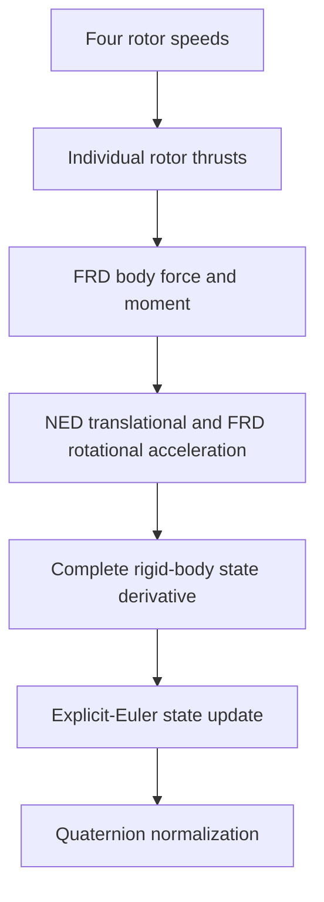

# Robust Autonomous Quadrotor

## Project purpose

This repository develops the mathematical core of an autonomous quadrotor in small,
independently tested layers. The intended progression is rigid-body dynamics, numerical
simulation, feedback control, state estimation, robustness analysis under model and sensor
uncertainty, and later integration with PX4 and ROS 2.

The package under `src/quadrotor_math` is deliberately independent of ROS 2, PX4, and
simulator middleware. That boundary keeps frame conventions, equations, numerical methods,
and validation testable without depending on a flight stack or message transport.

## Current status

At commit `aac5412`, the foundational rotor-actuation, six-degree-of-freedom rigid-body
dynamics, and explicit-Euler state-propagation pipeline are implemented. The project gate
passes 146 tests.

The repository does not yet contain a closed-loop controller, state estimator, higher-order
integrator, complete simulation experiment suite, or production ROS 2/PX4 integration layer.

## Current end-to-end pipeline



The actuation model converts four nonnegative rotor angular speeds into static thrust
magnitudes, sums their force along negative body `z`, and combines offset thrust moments with
the rotor reaction moment about body `z`. The resulting body wrench drives the translational
and rotational equations, which produce instantaneous state derivatives. Explicit Euler then
advances the state through one time interval and restores the quaternion to unit norm.

**Practical interpretation.** Rotor speeds determine the force and turning effect on the
vehicle; the dynamics convert those effects into rates of motion; integration turns those
rates into a new state.

## Mathematical model

The propagated rigid-body state consists of world-frame position `position_W`, world-frame
velocity `velocity_W`, body-to-world attitude `q_WB`, and body-frame angular velocity
`omega_B`. Rotor speeds are inputs to the current rigid-body step rather than independently
propagated motor states.

### Translational dynamics

```text
velocity_derivative_W =
    gravity_W + (R_WB @ force_B) / mass
```

Here `gravity_W = [0, 0, gravity_acceleration]` in m/s², `force_B` is the net rotor force in
the FRD body frame in newtons, `R_WB` maps body-coordinate vectors into NED world
coordinates, and `mass` is in kilograms.

**Practical interpretation.** Gravity and the rotated rotor force determine how world-frame
velocity changes. Position changes at the current world-frame velocity.

### Rotational dynamics

```text
inertia_B @ angular_velocity_derivative_B =
    moment_B - cross(omega_B, inertia_B @ omega_B)
```

`inertia_B` is the symmetric positive-definite inertia tensor about the centre of mass in body
coordinates, in kg·m². `moment_B` is the FRD body moment in N·m. The cross-product term is the
gyroscopic coupling required by rigid-body rotational dynamics; the implementation solves the
linear system rather than explicitly inverting the inertia matrix.

**Practical interpretation.** Applied moments change the rotation rate, while the coupling
term accounts for the fact that a rotating body's axes and angular momentum interact.

### Quaternion kinematics

```text
quaternion_derivative_WB =
    0.5 * q_WB ⊗ [0, omega_B]
```

The symbol `⊗` denotes the Hamilton quaternion product. `q_WB` uses scalar-first ordering
`[w, x, y, z]`, and `omega_B` is expressed in the FRD body frame in rad/s.

**Practical interpretation.** Body angular velocity determines the instantaneous rate of
change of the vehicle's body-to-world attitude.

### Explicit-Euler propagation

```text
state_next = state_current + time_step * state_derivative
```

The same current state is used to calculate all four derivatives before position, velocity,
quaternion, and angular velocity are updated. After the Euler update, only the quaternion is
normalized:

```text
q_WB_next = normalize(q_WB + time_step * quaternion_derivative_WB)
```

**Practical interpretation.** Euler integration projects the current rates forward over a
short interval. Quaternion normalization removes the norm drift introduced by that numerical
update so the result remains a valid attitude representation.

## Frame and attitude conventions

- World frame `W` is north-east-down (NED): `+x` north, `+y` east, and `+z` down.
- Body frame `B` is forward-right-down (FRD): `+x` forward, `+y` right, and `+z` down.
- `R_WB` is an active rotation that maps body-coordinate vectors into world coordinates.
- `q_WB` is the equivalent Hamilton scalar-first `[w, x, y, z]` body-to-world quaternion.
- Positive world `z` points downward, so increasing world `z` means descending.

The full convention, state shapes, signs, and hover sanity check are defined in the
[frame and state contract](docs/architecture/frame-contract.md).

## Implemented capabilities

- Deterministic NumPy random-number generator construction from explicit seeds.
- A squared-norm vector primitive.
- Skew-symmetric matrices, quaternion normalization and differentiation, and active
  body-to-world rotation matrices.
- Quadratic rotor thrust magnitudes from four rotor speeds.
- FRD collective thrust force, offset thrust moment, and yaw reaction moment.
- Combined FRD body force and moment from rotor speeds.
- NED translational acceleration from body force and uniform gravity.
- FRD rotational acceleration with gyroscopic coupling.
- Complete rigid-body state derivative from an applied body wrench.
- Complete rigid-body state derivative directly from rotor speeds.
- One explicit-Euler state step with quaternion normalization.
- Typed interfaces, explicit shape/value/physical-parameter validation, and unit tests for
  the implemented boundaries.

## Verification and development workflow

The project targets Python 3.12 and pins uv 0.12.3. Runtime code depends on NumPy; the
development group provides Ruff, mypy, and pytest. Work proceeds in small RED/GREEN TDD
increments: a focused failing test establishes one behavior, the minimum implementation makes
it pass, and the complete gate checks the repository.

With Python 3.12 and uv 0.12.3 available:

```sh
uv sync
make check
```

`make check` runs:

```sh
uv run ruff check .
uv run ruff format --check .
uv run mypy src
uv run pytest
```

## Repository structure

- `src/quadrotor_math/`: ROS/PX4-independent vector, randomness, rotation, actuation,
  dynamics, and integration algorithms.
- `tests/unit/`: focused unit and composition tests for the mathematical core.
- `docs/architecture/`: architectural contracts, including frames and state conventions.
- `docs/decisions/`: accepted workflow and frame-convention decisions.
- `docs/environment.md`: recorded host, toolchain, ROS 2, Gazebo, and PX4 environment details.
- `docs/progress/`: dated engineering progress records.

## Current limitations

- Explicit Euler is a first-order baseline integrator; no higher-order RK4 method exists yet.
- No closed-loop controller or trajectory-tracking implementation exists yet.
- No sensor model or state estimator exists yet.
- No full Monte Carlo robustness campaign has been implemented.
- ROS 2/PX4 compatibility has been explored, but no completed integration adapter layer is in
  this repository.
- The current mathematical model represents only the effects present in the source: static
  quadratic rotor thrust, thrust-offset and yaw reaction moments, uniform gravity, rigid-body
  inertia, gyroscopic coupling, and quaternion kinematics. It does not yet model additional
  aerodynamic, motor-transient, contact, or environmental effects.

Explicit Euler is useful because each update is transparent and easy to verify against the
continuous equations. Its first-order accuracy and error accumulation make it unsuitable as
the final high-accuracy simulation method, especially for larger time steps or long runs.

## Near-term roadmap

1. Add a higher-order numerical integrator and compare it with the Euler baseline.
2. Build deterministic simulation scenarios with explicit initial conditions and inputs.
3. Add model, state, and invariant checks for multi-step propagation.
4. Implement the first feedback controller against the verified dynamics.
5. Add sensor models and state-estimation foundations.
6. Introduce parameter uncertainty and deterministic Monte Carlo validation.
7. Add ROS 2/PX4 adapters after the mathematical and simulation interfaces stabilize.
