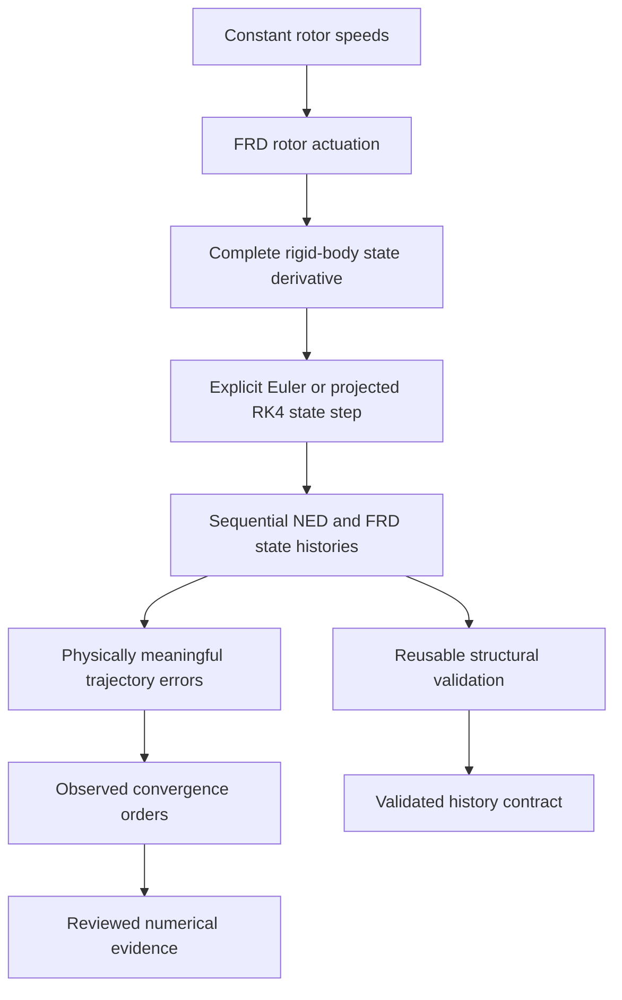

# Robust Autonomous Quadrotor

## Project purpose

This repository develops the mathematical core of an autonomous quadrotor in small,
independently tested layers. The intended progression is rigid-body dynamics, numerical
simulation, feedback control, state estimation, robustness analysis under model and sensor
uncertainty, and later integration with PX4 and ROS 2.

The package under `src/quadrotor_math` is deliberately independent of ROS 2, PX4, and
simulator middleware. That boundary keeps frame conventions, equations, numerical methods,
and validation testable without depending on a flight stack or message transport.

## Current status

The current working tree extends the foundational rotor-actuation and six-degree-of-freedom
rigid-body dynamics pipeline with explicit-Euler propagation, fixed-step projected RK4
propagation, deterministic multi-step Euler and RK4 state histories, reusable rigid-body
state-history structural validation, physical trajectory-error metrics, and a completed
deterministic Euler-versus-RK4 convergence study. Focused characterization now also shows that
the derivative model and both simulators recognize and preserve one exact balanced-thrust,
zero-moment hover equilibrium. A gravity-only ballistic reference additionally verifies RK4
against the analytical constant-gravity trajectory and Euler against its derived discrete
trajectory. Scenario-specific energy characterization now verifies RK4 mechanical-energy
conservation and Euler's analytically predicted positive energy drift for that gravity-only
case. Torque-free asymmetric rotation characterization additionally verifies instantaneous
rotational-energy conservation and projected-RK4 near-conservation of inertial-frame angular
momentum.

The mathematical core now also exposes ideal accelerometer and gyroscope boundaries in
`src/quadrotor_math/imu.py`. The accelerometer applies the repository's NED/FRD frame contract,
accepts zero gravity, and rejects malformed or non-finite array inputs and invalid gravity
magnitudes. The body-aligned gyroscope returns `omega_B` in the FRD body frame as an
independently owned float64 array and rejects malformed or non-finite rates. The verified
current project gate passes 248 tests with no warnings.

The repository does not yet contain a reusable physically conditional invariant-monitoring
API, a closed-loop controller, a state estimator, adaptive integration, robustness campaigns,
or a completed ROS 2/PX4 integration layer. Structural validation and test-local physical
characterization are foundations for later reference scenarios, but this milestone does not
complete Gate G1.

## Current end-to-end pipeline



The actuation model converts four nonnegative rotor angular speeds into static thrust
magnitudes, sums their force along negative body `z`, and combines offset thrust moments with
the rotor reaction moment about body `z`. The resulting body wrench drives the translational
and rotational equations, which produce instantaneous state derivatives. Explicit Euler
remains a transparent one-step baseline. Fixed-step projected RK4 advances one state while
normalizing its intermediate and final quaternions. Matching deterministic simulators apply
either stepper sequentially to construct complete state histories. Reusable metrics then
compare corresponding trajectory samples in their own physical units, and the convergence
experiment measures how those errors change as the fixed time step is refined.

The reusable history validator independently rejects malformed or numerically invalid state
histories. The existing Euler and projected-RK4 simulators both produce histories accepted by
that validator without modification.

**Practical interpretation.** Rotor speeds determine the force and turning effect on the
vehicle; the dynamics convert those effects into rates of motion; integration turns those
rates into a new state.

## Mathematical model

The propagated rigid-body state consists of world-frame position `position_W`, world-frame
velocity `velocity_W`, body-to-world attitude `q_WB`, and body-frame angular velocity
`omega_B`. Rotor speeds are inputs to the current rigid-body step rather than independently
propagated motor states.

### Translational dynamics

```text
velocity_derivative_W =
    gravity_W + (R_WB @ force_B) / mass
```

Here `gravity_W = [0, 0, gravity_acceleration]` in m/s², `force_B` is the net rotor force in
the FRD body frame in newtons, `R_WB` maps body-coordinate vectors into NED world
coordinates, and `mass` is in kilograms.

**Practical interpretation.** Gravity and the rotated rotor force determine how world-frame
velocity changes. Position changes at the current world-frame velocity.

### Rotational dynamics

```text
inertia_B @ angular_velocity_derivative_B =
    moment_B - cross(omega_B, inertia_B @ omega_B)
```

`inertia_B` is the symmetric positive-definite inertia tensor about the centre of mass in body
coordinates, in kg·m². `moment_B` is the FRD body moment in N·m. The cross-product term is the
gyroscopic coupling required by rigid-body rotational dynamics; the implementation solves the
linear system rather than explicitly inverting the inertia matrix.

**Practical interpretation.** Applied moments change the rotation rate, while the coupling
term accounts for the fact that a rotating body's axes and angular momentum interact.

### Quaternion kinematics

```text
quaternion_derivative_WB =
    0.5 * q_WB ⊗ [0, omega_B]
```

The symbol `⊗` denotes the Hamilton quaternion product. `q_WB` uses scalar-first ordering
`[w, x, y, z]`, and `omega_B` is expressed in the FRD body frame in rad/s.

**Practical interpretation.** Body angular velocity determines the instantaneous rate of
change of the vehicle's body-to-world attitude.

### Ideal accelerometer specific force

The public module `src/quadrotor_math/imu.py` provides
`ideal_accelerometer_specific_force_body(...)`. For supplied world-frame inertial
translational acceleration `a_W`, the function calculates

```text
g_W = [0, 0, g]
f_B = R_WB.T @ (a_W - g_W)
```

The world frame is north-east-down (NED), the body frame is forward-right-down (FRD), and
positive world `z` points down. `R_WB` maps body-coordinate vectors into world coordinates,
so `R_WB.T` maps world-coordinate vectors into body coordinates. An ideal accelerometer
reports specific force rather than gravity-inclusive inertial acceleration, which is why
`g_W` is subtracted before the result is rotated into the body frame.

Three physical anchors fix the signs and frames: tilted thrust maps to body negative `z`,
level rest or hover returns `[0, 0, -g]`, and gravity-only free fall returns `[0, 0, 0]`.
Zero gravity is valid; with identity `R_WB`, the returned specific force then equals the
supplied inertial acceleration.

The function validates that `translational_acceleration_W` has shape `(3,)`, `R_WB` has shape
`(3, 3)`, both arrays contain only finite entries, and the gravity magnitude is finite and
nonnegative. Proper-rotation construction and correctness remain owned by the existing
rotations layer. This function does not independently test `R_WB` orthogonality or
determinant. The detailed derivation, evidence, ownership, and limitations are recorded in
the [ideal-accelerometer specific-force progress record](docs/progress/2026-09-01-ideal-accelerometer-specific-force.md).

### Ideal gyroscope angular velocity

The same public IMU module provides:

```python
ideal_gyroscope_angular_velocity_body(
    omega_B: NDArray[np.float64],
) -> NDArray[np.float64]
```

For an ideal body-aligned gyroscope, the measurement equation is

```text
gyroscope_output_B = omega_B
```

`omega_B` is rigid-body angular velocity with shape `(3,)`, expressed along the
forward-right-down body axes in rad/s. Its components follow the right-hand rule about body
forward, right, and down. Because the supplied quantity is already expressed in the aligned
sensor axes, no attitude or gravity transformation is required; position, translational
velocity, and translational acceleration are not inputs either.

The returned measurement is an independently owned float64 array with no shared memory with
caller-owned truth state. The function validates exact shape `(3,)` and finiteness in that
order. Zero and finite negative rates remain valid, and no arbitrary magnitude restriction is
imposed. Focused tests establish exact mixed-sign component preservation, independent-memory
ownership, invalid-shape rejection, and rejection of NaN and both infinities.

This boundary is ideal and deterministic. It includes no bias, white noise, bias drift or
random walk, scale-factor error, axis misalignment, saturation, quantization, sampling policy,
latency, or stochastic configuration. It does not validate the dynamics that produced
`omega_B`, establish realistic sensor behavior, or complete Gate G1. The detailed contract,
TDD evidence, decisions, and limitations are recorded in the
[ideal-gyroscope angular-velocity progress record](docs/progress/2026-09-01-ideal-gyroscope-angular-velocity.md).

### Explicit-Euler propagation

```text
state_next = state_current + time_step * state_derivative
```

The same current state is used to calculate all four derivatives before position, velocity,
quaternion, and angular velocity are updated. After the Euler update, only the quaternion is
normalized:

```text
q_WB_next = normalize(q_WB + time_step * quaternion_derivative_WB)
```

**Practical interpretation.** Euler integration projects the current rates forward over a
short interval. Quaternion normalization removes the norm drift introduced by that numerical
update so the result remains a valid attitude representation.

### Fixed-step projected RK4 propagation

Let `state` contain `position_W`, `velocity_W`, `q_WB`, and `omega_B`. Let `input` be the four
rotor speeds, held constant over one integration step, and let
`f = rigid_body_state_derivative_from_rotor_speeds`. The rotor geometry and all physical
parameters also remain constant over the step. Every `k` below is a complete state derivative,
not a state:

```text
k1 = f(state_current, input)

k2 = f(
    state_current + 0.5 * time_step * k1,
    input,
)

k3 = f(
    state_current + 0.5 * time_step * k2,
    input,
)

k4 = f(
    state_current + time_step * k3,
    input,
)

state_next =
    state_current
    + (time_step / 6)
    * (k1 + 2*k2 + 2*k3 + k4)
```

The `k2` derivative is evaluated at the `k1` half-step state, `k3` at the `k2` half-step
state, and `k4` at the `k3` full-step state. Each intermediate state is constructed from the
original state and the corresponding scaled derivative. Because attitude must remain on the
unit-quaternion manifold, the intermediate `q_WB` values used for the `k2`, `k3`, and `k4`
evaluations are normalized. The final quaternion component of the classically weighted update
is normalized as well. This is a projected quaternion treatment within a fixed-step RK4
method; it is neither exact nor adaptive.

**Practical interpretation.** Euler samples one slope at the start of the step. RK4 samples
four slopes across the step and combines them to represent curved motion more accurately.

### Deterministic multi-step Euler and RK4 simulation

Two public simulators provide method-specific, constant-input histories:

- `simulate_rigid_body_euler_from_rotor_speeds`; and
- `simulate_rigid_body_rk4_from_rotor_speeds`.

They share the same explicit-array inputs and history contract. Both use a fixed positive
`time_step` and a positive, non-Boolean integer `number_of_steps`. Rotor speeds, rotor geometry,
mass, body-frame inertia, gravity magnitude, thrust coefficient, and moment coefficient remain
constant throughout a simulation. Each returned complete state becomes the input state for
the next transition. Quaternion normalization is performed by the selected underlying
stepper.

Both functions return five float64 arrays in this exact order:

1. `time_s`, shape `(N + 1,)`, in seconds;
2. `position_history_W`, shape `(N + 1, 3)`, in the NED world frame in metres;
3. `velocity_history_W`, shape `(N + 1, 3)`, in the NED world frame in m/s;
4. `q_history_WB`, shape `(N + 1, 4)`, containing dimensionless Hamilton scalar-first
   body-to-world unit quaternions; and
5. `omega_history_B`, shape `(N + 1, 3)`, in the FRD body frame in rad/s.

Here `N = number_of_steps`. The histories have `N + 1` rows because row zero stores the
supplied initial state; row `i` corresponds to `time_s[i] = i * time_step`.

A state derivative describes the instantaneous rate of change of position, velocity,
attitude, and angular velocity. One integration step turns derivative information into one
next state. A multi-step simulation history performs `N` such transitions in sequence and
records the initial state plus every result.

Euler uses one derivative evaluation per step and is a first-order method. RK4 uses four
derivative stages per step and is expected to provide much better accuracy for a given step
size. Because the RK4 stepper projects intermediate and final quaternions to unit norm, the
observed order of the complete state update is measured rather than assumed.

**Think about it this way.** The derivative says how the vehicle is changing now, a stepper
chooses how carefully to advance one interval, and a simulator repeatedly feeds each new state
into the next step to build a time-aligned history.

### Rigid-body state-history validation

The public module `src/quadrotor_math/validation.py` provides
`validate_rigid_body_state_history(...)` for reusable unconditional validation of complete
rigid-body histories. It checks:

- `time_s` has shape `(N,)` and contains at least two samples;
- `position_history_W` and `velocity_history_W` have shape `(N, 3)` in the NED world frame;
- `q_history_WB` has shape `(N, 4)` as Hamilton scalar-first body-to-world quaternions;
- `omega_history_B` has shape `(N, 3)` in the FRD body frame;
- all state histories contain the same number of samples as `time_s`;
- time and state entries are finite;
- time is strictly increasing and uniformly spaced; and
- every quaternion row has unit Euclidean norm.

Uniform time spacing uses internal `rtol=1e-12` and `atol=0.0`. Quaternion unit norms use
internal `rtol=1e-12` and `atol=1e-12`. Invalid histories raise `ValueError`; the validator
does not normalize or otherwise repair corrupted inputs. Focused integration-style tests pass
the Euler and projected-RK4 simulator outputs directly into the validator, and both are
accepted without preprocessing.

This boundary establishes structural and numerical validity only. It does not prove that a
trajectory is dynamically accurate, conserves energy or momentum, represents hover, or
satisfies any scenario-specific physical invariant. Conditional conservation and equilibrium
checks remain deferred to explicitly named reference-scenario and invariant work.

Rotation-matrix orthogonality and determinant checks are not duplicated here because
`R_WB` is not stored in the state history. Unit quaternion validity is checked at this
boundary, while quaternion-to-matrix correctness remains owned and tested by `rotations.py`.

### Balanced-hover equilibrium characterization

A test-local balanced-hover scenario exercises the physical model at identity attitude with
zero world-frame velocity and zero body-frame angular velocity. In NED, gravity acts along
positive world `z`; in FRD, upward rotor thrust acts along negative body `z`. Four equal rotor
speeds are selected from

```text
hover_rotor_speed = sqrt(
    mass * gravity_acceleration / (4 * thrust_coefficient)
)
```

The test geometry places the rotors at front `[+L, 0, 0]`, right `[0, +L, 0]`, rear
`[-L, 0, 0]`, and left `[0, -L, 0]`, with spin directions `[+1, -1, +1, -1]`. This ordering is
local to the tests and does not establish a package-wide rotor numbering convention. For the
tested parameters, each rotor produces `2.4525 N`, total body thrust is `[0, 0, -9.81] N`,
symmetric offset-thrust moments cancel roll and pitch, and the balanced spin directions cancel
the yaw reaction moment.

The derivative-level test independently verifies zero position, velocity, quaternion, and
angular-velocity derivatives. A parameterized simulation test verifies that explicit Euler
and projected RK4 preserve constant position, zero velocity, identity attitude, and zero
angular velocity over 20 steps of `0.05 s`, using `rtol=0.0` and `atol=1e-12`.

This proves that the implemented model recognizes and numerically preserves this specified
exact hover equilibrium. It does not prove hover stability: without a feedback controller, a
perturbed vehicle will not automatically return to equilibrium. Arbitrary yaw, tilted hover,
motor dynamics, aerodynamic effects, disturbances, sensors, estimation, and uncertainty are
not validated by this scenario. Gate G1 remains open. The scenario remains test-local because
there is not yet a second production consumer that would justify a reusable helper,
configuration dataclass, or standalone experiment.

### Gravity-only ballistic trajectory characterization

A second test-local physical scenario uses zero rotor speeds, zero angular velocity, and
identity attitude in the NED world frame. Zero rotor speeds produce zero body force and moment,
so translation is driven only by `gravity_W = [0, 0, +g]`, while attitude remains identity and
body angular velocity remains zero. The scenario starts at `[10, 20, 30] m` with velocity
`[1, -2, -3] m/s`, uses mass `2.0 kg`, gravity `9.81 m/s²`, a `0.25 s` time step, and four
steps for a total duration of `1.0 s`.

Projected RK4 matches the analytical constant-gravity position and velocity histories, the
constant identity attitude, and zero angular velocity using `rtol=0.0` and `atol=1e-12`. At
`t = 1.0 s`, the analytical position is `[11, 18, 31.905] m` and velocity is
`[1, -2, 6.81] m/s`. Quaternion projection has no physical effect in this scenario because the
attitude remains constant and unit length.

Explicit Euler matches its separately derived discrete trajectory. Its velocity is analytical
at the grid times because acceleration is constant, while its position uses the velocity at
the beginning of each step. At `t = 1.0 s`, Euler position is `[11, 18, 30.67875] m`, giving
Euler-minus-analytical position error `[0, 0, -1.22625] m`. This is expected first-order
integration behavior, not a dynamics defect.

These trajectory tests establish method-specific behavior independently of the separate
conservation characterization below. They do not establish aerodynamic realism, stability,
control, estimation, or robustness. Gate G1 remains open. The scenario remains test-local;
no helper, invariant module, energy metric, or standalone experiment has been added.

### Gravity-only mechanical-energy characterization

Under the explicit assumptions of zero rotor speeds, no thrust or applied body moment,
constant uniform NED gravity, constant mass, and no other conservative or nonconservative
effects, the test-local mechanical energy is

```text
kinetic_energy = 0.5 * mass * sum(velocity_history_W**2, axis=1)
potential_energy = -mass * gravity_acceleration * position_history_W[:, 2]
mechanical_energy = kinetic_energy + potential_energy
```

The negative potential-energy sign follows from positive NED world `z` pointing downward.
For the established `2.0 kg` ballistic scenario, the initial kinetic energy is `14.0 J`, the
initial potential energy is `-588.6 J`, and total mechanical energy is `-574.6 J`.

Projected RK4 maintains `-574.6 J` across all five stored samples within `rtol=0.0` and
`atol=1e-12 J`. This tight result is specific to the short polynomial constant-gravity case;
it does not mean RK4 exactly conserves energy for arbitrary nonlinear systems.

Explicit Euler instead follows the analytically derived drift law

```text
energy_n - energy_0 = (
    0.5
    * mass
    * gravity_acceleration**2
    * time_n
    * time_step
)
```

At `t = 1.0 s` with a `0.25 s` step, the drift is `+24.059025 J` and final energy is
`-550.540975 J`. This is predictable numerical drift from Euler's position discretization,
not physical energy entering the vehicle or a dynamics-model defect. The existing analytical
and discrete trajectory tests already establish constant horizontal velocity, so for the
fixed `2.0 kg` mass they implicitly verify constant horizontal momentum
`[2.0, -4.0] kg·m/s`; a duplicate momentum-only test was not added.

Energy remains calculated locally in the tests. No public energy function, metrics extension,
`invariants.py` module, generic monitor, report object, or tolerance policy has been added.

### Torque-free rotation invariants

A test-local asymmetric rigid-body scenario uses `inertia_B = diag(2, 3, 4) kg·m²`, initial
`omega_B = [0.7, -0.4, 1.1] rad/s`, identity `q_WB`, and zero applied moment. A focused
dynamics test verifies the nonzero gyroscopically coupled angular acceleration and zero
instantaneous rotational-energy rate within `1e-12 W`.

Over a separate 10-second projected-RK4 simulation with a `0.05 s` step, the complete
inertial-frame angular-momentum history remains within an absolute componentwise bound of
`5e-7 kg·m²/s` from its initial value. This characterizes small numerical drift for the exact
scenario and grid; it does not claim exact discrete conservation or make RK4 an
invariant-preserving integrator. The detailed derivations, measured drift, ownership decision,
and limitations are recorded in the
[torque-free rotation invariants progress record](docs/progress/2026-08-31-torque-free-rotation-invariants.md).
Gate G1 remains open.

### Trajectory-error and convergence metrics

Three reusable metrics support quantitative comparisons:

- `euclidean_vector_trajectory_errors` returns one row-wise Euclidean error per sample for a
  generic `(N, D)` history. It is used independently for NED position in metres, NED velocity
  in m/s, and FRD angular velocity in rad/s. These quantities are not combined into a single
  mixed-unit norm.
- `quaternion_attitude_trajectory_errors_body_to_world` returns sign-invariant geodesic
  attitude errors in radians for Hamilton scalar-first body-to-world quaternion histories.
  It sign-aligns each pair before applying the chord-based physical angle, so `q_WB` and
  `-q_WB` correctly have zero attitude error.
- `observed_convergence_orders` reports one order for each adjacent pair of decreasing time
  steps. Pairs touching the numerical error floor return `NaN`; negative measured orders are
  retained. Differences of logarithms avoid overflow and underflow from extreme direct
  ratios, and targeted `log1p` fallbacks preserve distinguishable values when separately
  rounded logarithms cancel.

### Deterministic Euler-versus-RK4 convergence study

The reproducible study runs the established asymmetric one-active-rotor scenario for 1 second
at fixed time steps `0.1`, `0.05`, `0.025`, and `0.0125` seconds. A 2560-step projected-RK4
trajectory supplies a fine numerical reference sampled at the coarse output times by exact
integer strides. Errors are measured separately for NED position, NED velocity,
sign-invariant body-to-world attitude, and FRD angular velocity at final time and over the
matching trajectory samples.

Euler's measured orders approach one across all four state quantities. Projected RK4 shows
measured approximately fourth-order convergence, with observed orders ranging from about
`3.97` to `4.01`. This supports the expected RK4 behavior over the tested range. All values
are measured relative to a fine numerical reference, not an exact solution, so the experiment
is empirical evidence rather than a proof of formal order or absolute accuracy.

For position at final time, the Euler error decreases from `3.7898843195e-01 m` on the
coarsest grid to `4.8673997501e-02 m` on the finest grid. The corresponding RK4 error decreases
from `8.0402004144e-06 m` to `2.0267431351e-09 m`. The reported final-time and
maximum-trajectory order tables contain no `NaN`, negative, or nonmonotonic measured orders
for this scenario.

**Think about it this way.** In this experiment, halving the time step reduces Euler error by
roughly a factor of two and RK4 error by roughly a factor of sixteen.

Run the study with:

```sh
uv run python experiments/euler_rk4_convergence.py
```

## Frame and attitude conventions

- World frame `W` is north-east-down (NED): `+x` north, `+y` east, and `+z` down.
- Body frame `B` is forward-right-down (FRD): `+x` forward, `+y` right, and `+z` down.
- `R_WB` is an active rotation that maps body-coordinate vectors into world coordinates.
- `q_WB` is the equivalent Hamilton scalar-first `[w, x, y, z]` body-to-world quaternion.
- Positive world `z` points downward, so increasing world `z` means descending.

The full convention, state shapes, signs, and hover sanity check are defined in the
[frame and state contract](docs/architecture/frame-contract.md).

## Implemented capabilities

- Deterministic NumPy random-number generator construction from explicit seeds.
- A squared-norm vector primitive.
- Skew-symmetric matrices, quaternion normalization and differentiation, and active
  body-to-world rotation matrices.
- Quadratic rotor thrust magnitudes from four rotor speeds.
- FRD collective thrust force, offset thrust moment, and yaw reaction moment.
- Combined FRD body force and moment from rotor speeds.
- NED translational acceleration from body force and uniform gravity.
- FRD rotational acceleration with gyroscopic coupling.
- Complete rigid-body state derivative from an applied body wrench.
- Complete rigid-body state derivative directly from rotor speeds.
- Explicit-Euler state propagation with quaternion normalization as a transparent baseline.
- Fixed-step RK4 propagation of the complete rigid-body state.
- Intermediate and final quaternion normalization during RK4 propagation.
- Finite positive RK4 time-step validation.
- Deterministic constant-input multi-step Euler simulation with time-aligned state histories.
- Deterministic constant-input multi-step RK4 simulation with time-aligned state histories.
- Positive non-Boolean integer validation for the requested number of Euler or RK4
  transitions.
- Reusable rigid-body state-history structural validation for shapes, sample alignment,
  finiteness, fixed increasing time grids, and unit quaternion norms.
- Derivative-level and multi-step characterization of one exact balanced-thrust, zero-moment
  hover equilibrium for explicit Euler and projected RK4.
- Gravity-only ballistic characterization against the analytical RK4 trajectory and the
  derived discrete-Euler trajectory.
- Gravity-only mechanical-energy characterization of RK4 conservation and Euler's predicted
  positive numerical drift under explicit scenario assumptions.
- Torque-free asymmetric rotation characterization of instantaneous rotational-energy
  conservation and projected-RK4 near-conservation of inertial-frame angular momentum.
- Row-wise Euclidean trajectory errors for independently measured vector quantities.
- Sign-invariant geodesic quaternion attitude trajectory errors.
- Numerically guarded observed convergence orders across adjacent time-step resolutions.
- A reproducible deterministic Euler-versus-RK4 convergence experiment with final-time and
  maximum-trajectory error tables.
- Typed interfaces, explicit shape/value/physical-parameter validation, and unit tests for
  the implemented boundaries.
- Ideal accelerometer specific force in the FRD body frame from supplied NED inertial
  acceleration and body-to-world attitude, including shape, finiteness, and nonnegative
  gravity-magnitude validation.
- Ideal body-aligned gyroscope angular velocity in the FRD body frame, with exact shape and
  finiteness validation plus independent float64 measurement ownership.

## Verification and development workflow

The project targets Python 3.12 and pins uv 0.12.3. Runtime code depends on NumPy; the
development group provides Ruff, mypy, and pytest. Work proceeds in small RED/GREEN TDD
increments: a focused failing test establishes one behavior, the minimum implementation makes
it pass, and the complete gate checks the repository.

With Python 3.12 and uv 0.12.3 available:

```sh
uv sync
make check
```

`make check` runs:

```sh
uv run ruff check .
uv run ruff format --check .
uv run mypy src experiments
uv run pytest
```

For the current working tree, this complete gate passes 248 tests with no warnings. Ruff lint,
Ruff formatting verification, and strict mypy over `src` and `experiments` pass, and
`git diff --check` reports no errors.

## Repository structure

- `src/quadrotor_math/`: ROS/PX4-independent vector, randomness, rotation, actuation,
  dynamics, integration, deterministic simulation, ideal IMU mathematics, state-history
  validation, and trajectory-error algorithms.
- `experiments/`: reproducible numerical studies built from the public mathematical core.
- `tests/unit/`: focused unit and composition tests for the mathematical core.
- `docs/architecture/`: architectural contracts, including frames and state conventions.
- `docs/decisions/`: accepted workflow and frame-convention decisions.
- `docs/environment.md`: recorded host, toolchain, ROS 2, Gazebo, and PX4 environment details.
- `docs/progress/`: dated engineering progress records.

## Current limitations

- Both simulators support constant rotor input and a fixed positive time step only.
- The convergence study covers one deterministic asymmetric scenario over 1 second and uses a
  fine numerical reference rather than an exact solution.
- Structural history validation does not establish dynamic accuracy or scenario-specific
  conservation, equilibrium, hover, energy, or momentum behavior.
- The balanced-hover characterization covers one exact identity-attitude equilibrium; it does
  not establish stability or behavior after perturbations.
- The gravity-only ballistic characterization establishes method-specific trajectories on one
  fixed grid. Its energy checks are scenario-specific and do not apply under rotor thrust,
  drag, wind, motor losses, contact, or other external work.
- Horizontal momentum is implicit in the existing fixed-mass trajectory assertions rather
  than exposed through a reusable momentum diagnostic.
- Physically conditional invariants are not yet owned by a reusable monitoring API, and RK4
  is not claimed to preserve energy for arbitrary nonlinear systems.
- The torque-free rotation evidence covers one identity-attitude, diagonal-inertia scenario
  and one 10-second RK4 grid. It does not establish exact discrete conservation, arbitrary
  inertia behavior, Euler drift, or long-duration stability.
- No controller, scheduled input, callback, event handling, or adaptive step size exists.
- No state estimator exists yet.
- The accelerometer boundary is ideal and deterministic; it does not model bias, noise,
  scale factors, misalignment, saturation, quantization, temperature, timing, lever-arm
  effects, vibration, mounting dynamics, or calibration.
- The gyroscope boundary is ideal and deterministic; it does not model bias, white noise,
  bias drift or random walk, scale factors, axis misalignment, saturation, quantization,
  sampling, latency, or stochastic configuration.
- No Monte Carlo campaign exists yet.
- No completed ROS 2/PX4 adapter exists yet.
- The current mathematical model represents only the effects present in the source: static
  quadratic rotor thrust, thrust-offset and yaw reaction moments, uniform gravity, rigid-body
  inertia, gyroscopic coupling, and quaternion kinematics. It does not yet model additional
  aerodynamic, motor-transient, contact, or environmental effects.

Explicit Euler is useful because each update is transparent and easy to verify against the
continuous equations. Its first-order accuracy and error accumulation make it unsuitable as
the final high-accuracy simulation method, especially for larger time steps or long runs.

## Near-term roadmap

1. Conduct a read-only stochastic IMU sensor-model and RNG-ownership design review before
   introducing bias or noise tests.
2. Continue Gate G1 work without claiming completion until its remaining deterministic and
   stochastic evidence is implemented.
3. Continue later with estimation, control, uncertainty, Monte Carlo validation, and ROS 2/PX4
   adapters.
