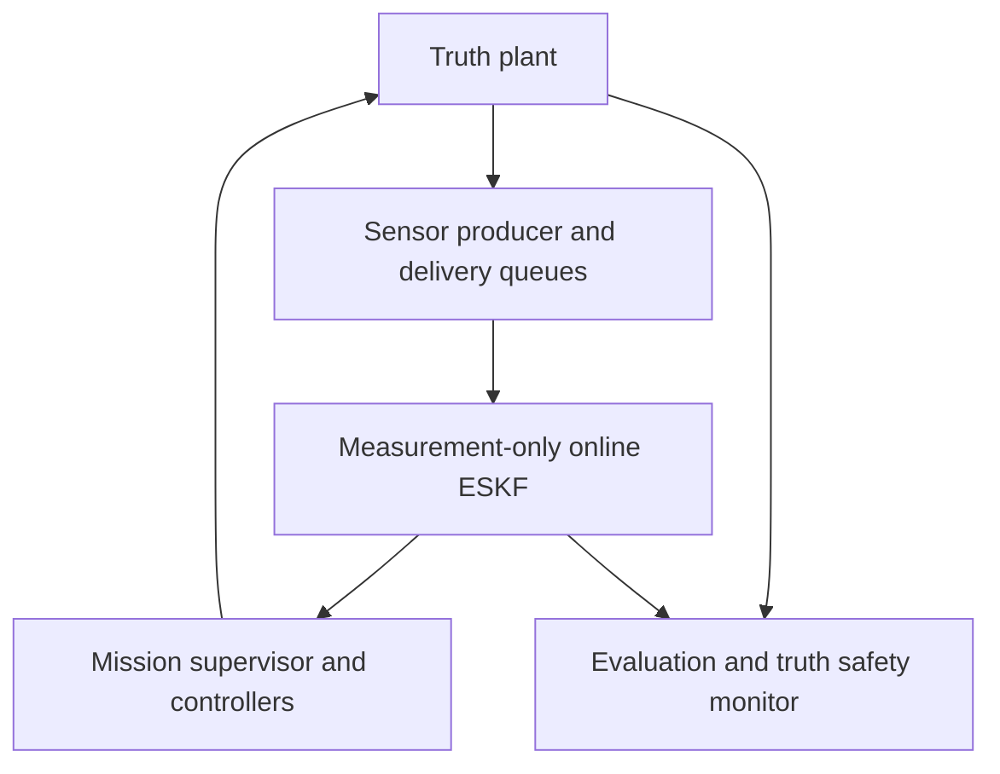

# Estimated-State Mission Feedback

This layer connects the existing sensor models and endpoint error-state Kalman
filter (ESKF) to the existing position/attitude cascade. The controller laws and
gains are unchanged. The new work is the causal execution and information boundary,
not a new filter or controller. [ADR 0013](decisions/0013-estimated-state-mission-feedback.md)
states the scope and frozen acceptance criteria. The
[verification record](progress/2026-09-24-estimated-state-feedback.md) records the
actual audit and campaign results.

## Information flow



Only the sensor producer, independent numerical safety monitor and evaluation
read truth. `EskfOnlineEstimator` has no plant, reference, controller, scheduler or
random-generator inputs. The pure controllers receive estimated position, velocity,
body-to-world attitude and bias/noise-corrected measured body rate. They retain
separate nominal model parameters. No true position/velocity/attitude/bias is
silently substituted for an estimate.

`simulate_mission` remains the original true-state API. A narrow private
`mission_simulation._simulate_mission` loop now serves both modes; its observer-free
path is unchanged numerically. `simulate_estimated_mission` supplies a sensor and
estimator observer, without duplicating motor, drag, RK4 or controller equations.
The existing historical sensor-run artifacts and offline replay default are unchanged.

## Frames, sample model and independent assumptions

NED world coordinates have positive z down; FRD body coordinates have positive z
down through the vehicle. `q_WB` is a scalar-first Hamilton quaternion and `R_WB`
maps body components into world components. All physical vectors have three entries.
Rotor force is negative body z. Let actual rotor force plus aerodynamic drag be
`f_B`, true mass `m_t`, and true gravity magnitude `g_t`. A centre-of-mass,
body-aligned ideal accelerometer measures

    a_W = R_WB f_B / m_t + [0, 0, g_t]
    f_specific_B = R_WB.T (a_W - [0, 0, g_t]) = f_B / m_t.

The producer uses the existing acceleration and specific-force functions to
compute this quantity from **actual**, lagged rotor speeds and current drag,
before the next command is issued. It never uses desired thrust as measured
acceleration. Specific force is FRD m/s², not world acceleration. The gyroscope
measures FRD body angular velocity in rad/s. The unchanged measurement models give

    f_measured_B[k] = f_specific_B[k] + b_a_true[k] + sigma_a * epsilon_a[k]
    w_measured_B[k] = omega_true_B[k] + b_g_true[k] + sigma_g * epsilon_g[k]
    b_true[k] = b_true[k-1] + density * sqrt(dt) * xi[k].

The standard-normal measurement vectors and walk increments come from independent,
named PCG64 streams. `sigma` is per-sample standard deviation. Walk density is bias
units divided by sqrt(second); endpoint sample covariance is `diag(sigma²)`, while
bias-walk spectral density is `diag(density²)`. These are separate dimensional
contracts, not interchangeable tuning parameters. No bias-walk draw precedes t=0.

Position is NED metres with additive configured bias/noise. Barometric altitude
is positive up: `reference_altitude - p_W[2]`, plus configured bias/noise. True sensor
parameters are held in `MissionSensors`; independently supplied ESKF assumptions
are held in `EskfReplayConfiguration`. Configuration copying prevents accidental
shared-memory changes across those boundaries. The experiment declares the true
and assumed quantities explicitly rather than inferring them from each other.

## Explicit prior and online estimator

`EskfOnlineEstimator(configuration)` copies an existing `EskfReplayConfiguration`.
Its `step(time_s, specific_force_measurement_B, angular_velocity_measurement_B,
observations=())` consumes one paired IMU epoch and that epoch's delivered slow
observations. The first time must exactly equal `initial_time_s`; no prediction
precedes it. Subsequent times strictly increase and may be nonuniform. Inputs are
finite real arrays; force/rate shape `(3,)`. Slow observations retain the existing
`EskfReplayObservation` sensor IDs, source row, acquisition epoch and delivery epoch.

Observations are sorted position before altitude, then by source identity. Repeated
source identities or repeated acquisition epochs within a sensor are rejected.
Gaps in delivered source IDs are allowed, as is out-of-order slow arrival. Every
supplied delivery must belong to the current epoch. Pending measurements remain
in the caller's queue and cannot be supplied prematurely. Older acquisitions are
recorded as STALE without correction; this is not delayed fusion or rewind.

Prediction and correction use the existing first-order or endpoint mathematics.
The mission specifically requires the endpoint option. The physical error vector
is `[delta_p_W, delta_v_W, delta_theta_B, delta_b_a_B, delta_b_g_B]` (15 entries),
with right-local attitude error. The endpoint continuation retains its full
21-by-21 joint covariance and six current sample-noise means. Dropping these
temporary coordinates between live calls would incorrectly treat a shared IMU
endpoint as independent. They remain private continuation state, including after
both same-epoch observations. See the [endpoint derivation](decisions/0010-eskf-endpoint-propagation.md).

Online and offline correction call the same `_correct_eskf_epoch` implementation.
This extracts the established ordering, stale/disabled rules, innovation scoring,
gating, Joseph update and reset, without changing their equations. NIS strictly
above the configured threshold is REJECTED. Singular or nonfinite arithmetic is
an error, not a gate rejection.

`EskfOnlineEstimate` returns an owned nominal state, the physical `(15,15)` covariance,
current `(6,)` conditional IMU noise mean, observation events, and rate feedback:

    omega_feedback_B[k] = w_measured_B[k] - b_g_estimated[k] - n_g_mean[k].

All terms are at the **posterior current epoch**, in FRD rad/s. The last term is
zero in first-order mode and is the conditional gyro sample-noise mean in endpoint
mode. This is neither true angular rate nor an additional low-pass filter. It can
retain measurement noise. Position, velocity, attitude and rate feedback all use
the same current posterior.

The stream is transactional. It commits its epoch, held IMU, physical/joint state
and consumed identities only after the entire call succeeds. A failure in the
second correction cannot leave the first correction applied. Retrying a valid
call after failure gives the same result as a fresh stream. Returned snapshots
own independent memory and cannot mutate continuation. This is a synchronous,
caller-driven API, not a concurrent or hard-real-time flight service.

## Mission clock and causality

The declared campaign uses plant/IMU 400 Hz, attitude/rate 100 Hz and position 50 Hz.
Both IMU channels are acquired at every plant epoch, including zero and the terminal
epoch, with no delay. Slow sensors reuse `FixedRateSensorScheduler`: position at
5 Hz and altitude at 25 Hz, beginning at their first **positive** period. An off-grid
fixed slow delay is delivered at the first plant epoch satisfying the scheduler's
existing tolerance. The truth grid must resolve that tolerance.

At each epoch:

1. The plant is at the endpoint of the previous held rotor command. For k>0,
   advance each true sensor bias over that completed interval.
2. Acquire the paired instantaneous IMU; acquire due slow observations and deliver
   due queue entries. Noise is drawn at acquisition, never at delivery.
3. Predict the ESKF through the current endpoint (except at k=0), then process
   delivered observations position first, altitude second.
4. Evaluate guards and estimated-state mission supervision. If terminal, record
   the endpoint and stop without another controller call or plant advance.
5. Update the outer controller if due, then the inner controller if due; hold
   the resulting rotor command through intervening plant steps.
6. Advance the unchanged stage-resolved motor/drag/projected-RK4 plant.

There is no algebraic loop or future-row access: a command at k depends on measurements
of the state already reached at k and first affects the interval starting at k.
The first IMU sample does not initialize pose from truth. The explicit prior at zero
is trusted as supplied; no stationary alignment or observability certification is added.

## Mission completion and safety meaning

Position/velocity completion dwell and feedback geofence/tilt checks use estimates.
The numerical simulation also retains an independent true-state geofence/tilt
monitor. Its reasons are `truth_geofence` / `truth_tilt`; feedback violations are
`estimate_geofence` / `estimate_tilt`. The truth monitor has priority when both
trigger. Controller-domain and timeout failures retain `attitude_domain` and
`landing_timeout`. All sampled guard aborts preserve their terminal histories.

The truth monitor is an evaluation safeguard, **not flight software available on
hardware**. Estimated completion is not proof of physical arrival: an intentionally
wrong position prior with no correcting position observation can complete the
estimated mission while true position is offset. A regression test demonstrates
that distinction. Campaign acceptance separately checks true final position and
speed, so it cannot count that situation as a successful physical tracking result.
LAND still means a virtual airborne plane, not contact, disarming or touchdown.

## Returned data and evidence

| Interface / field | Meaning |
| --- | --- |
| `MissionSensors` | Copied true IMU/position distributions, two slow schedules and root seed |
| `simulate_estimated_mission` | Existing plant/control inputs plus separate sensors and explicit estimator configuration |
| `EstimatedMissionResult.mission` | All existing `MissionResult` truth/reference/command histories; estimated-feedback phase decisions |
| `measurements` | Complete paired IMU and slow source/acquisition/delivery records as `EskfReplayInput` |
| `estimates` | Posterior nominal state and physical covariance per epoch, complete update/innovation/event diagnostics |
| `angular_velocity_estimate_B` | Actual `(N,3)` rate-feedback history, rad/s |
| `imu_noise_mean_B` | `(N,6)` endpoint conditional sample-noise means, accelerometer then gyro |
| `true_accelerometer_bias_B`, `true_gyroscope_bias_B` | `(N,3)` evaluation-only true bias histories |
| `scheduled_observation_delivery_time_s` | Requested delivery times aligned with canonical slow-observation order, including pending |

All public arrays are finite, independently owned and read-only. Measurement,
truth and estimate clocks agree exactly. Every acquisition has one event disposition,
and scheduled times must reproduce actual delivery indices. Numerical failures
raise without returning a partial `EstimatedMissionResult`; campaign failures are
retained as explicit ledger entries.

`estimated_feedback_validation` stores a new-only experimental directory. Each trial
has a pickle-free data NPZ and lossless covariance chunks of at most 4096 epochs.
The data member contains full truth/reference/control/sensor/estimate histories
and canonical UTF-8 event diagnostics stored as uint8 bytes, never Python objects.
The final `report.json` binds exact NPZ bytes with SHA-256 and records protocol,
source digest, provenance, UTC generation time and every planned trial. It is a
completion marker, not a crash-durability or malicious-authentication guarantee.

Loading verifies filenames, chunk counts/shapes, digests on the exact decoded bytes,
duplicate-key rejection, canonical schemas/dtypes and all public contracts. It then
replays the measurement-only ESKF, checks exact online/offline states/covariances/events,
reconstructs controller commands and estimated mission phases, and recomputes metrics.
The paired true-state run is independently validated under the previous protocol.
Nothing is plot-decimated before scoring; each run's RMSE includes its complete
mission and actual duration. Common-horizon differences use the full shared grid.

## Reproduce and interpret

No dependencies or tool versions changed. Use the existing locked environment:

```bash
uv sync --locked
make check
uv run pytest -q -W error
FEEDBACK_EVIDENCE=/tmp/quadrotor-estimated-feedback
uv run python -m experiments.estimated_feedback_validation --partition development --workers 3 --output "$FEEDBACK_EVIDENCE/development"
uv run python -m experiments.estimated_feedback_validation --partition fixed --workers 3 --output "$FEEDBACK_EVIDENCE/fixed"
# Freeze code/protocol before inspecting validation seeds.
uv run python -m experiments.estimated_feedback_validation --partition validation --workers 3 --output "$FEEDBACK_EVIDENCE/validation"
uv run python -m experiments.plot_estimated_feedback --input "$FEEDBACK_EVIDENCE/fixed" --output "$FEEDBACK_EVIDENCE/fixed-plots"
uv run python -m experiments.plot_estimated_feedback --input "$FEEDBACK_EVIDENCE/validation" --output "$FEEDBACK_EVIDENCE/validation-plots"
```

The frozen campaign uses per-sample accelerometer/gyro standard deviations
.04 m/s² and .002 rad/s, position .02 m, altitude .03 m, and bias-walk densities
.0002 m/s²/sqrt(s) and .00002 rad/s/sqrt(s). True initial pose/rate perturbations
follow the preceding mission distribution; independently drawn constant bias
components lie in ±.02 m/s² and ±.003 rad/s. The prior is fixed at zero position,
velocity and biases and identity attitude. Its standard deviations are .03 m,
.03 m/s, 3 degrees, .03 m/s² and .005 rad/s per axis. Nominal sensor biases/datum
are zero, and the existing 99% chi-square NIS preset is explicitly selected.

The noiseless case uses an exact prior with zero covariance, zero sample/walk noise,
and positive assumed slow-observation R to keep innovations solvable. Its zero-gain
updates leave deterministic endpoint propagation unchanged. It measures numerical
integration discrepancy, not stochastic calibration.

The first fixed campaign has **4/5 passing cases**. Noisy hover seed 30 exceeds
the unchanged .08 m hold-peak target (.107563 m), despite completion and no limiting.
The fixed CLI therefore exits 1 and preserves the full failed trial. Plot `FAIL`
markers denote overall trial acceptance, not necessarily the metric in that panel;
`completed=True` in a history title does not mean every acceptance condition passed.
See the verification record for the unaltered scoring window and all outcomes.

Passing this finite distribution does not establish global stability, arbitrary
prior recovery, unseen mismatch/fault robustness, universal filter consistency,
or hardware performance. Delayed observations are rejected as stale; IMU delay,
dropout, automatic startup alignment and real emergency actions remain unsupported.
