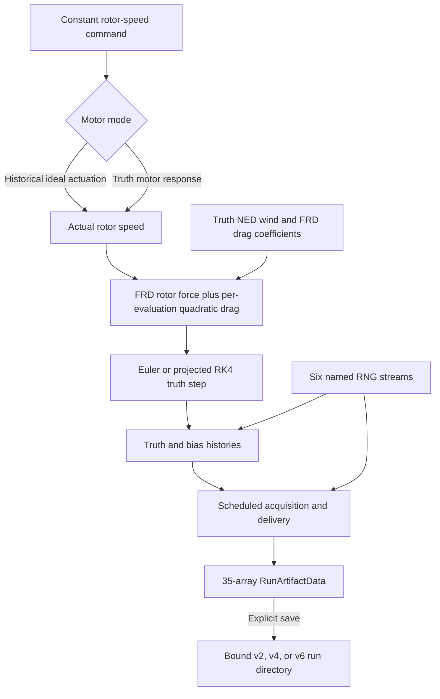

# Plant, sensors and reproducible runs

The plant converts rotor speeds into forces, moments and motion. The sensor
models turn that motion into measurements; the run configuration and persistence
layers make the experiment repeatable. This guide explains those pieces and
their interfaces. For the complete feedback loop, start with
[system design](system-design.md).

## Reading this guide

| Topic | Start here |
| --- | --- |
| Motion, forces and coordinate conventions | [Mathematical model](#mathematical-model) and [frame contract](architecture/frame-contract.md) |
| Accelerometer and gyro measurements | [Specific force](#ideal-accelerometer-specific-force), [gyro](#ideal-gyroscope-angular-velocity) and [bias evolution](#reproducible-imu-bias-random-walk) |
| Navigation sensors and clocks | [Position/altitude](#local-position-and-barometric-altitude), [scheduling](#fixed-rate-sensor-scheduling) |
| Repeatable experiments | [Configuration and random streams](#reproducible-run-configuration-and-named-random-streams), [saved artifacts](#reproducible-run-manifests-and-authenticated-artifacts) |
| Numerical integration | [Euler](#explicit-euler-propagation), [RK4](#fixed-step-projected-rk4-propagation), [convergence](#deterministic-euler-versus-rk4-convergence-study) |
| Physical sanity checks | [Hover](#balanced-hover-equilibrium-characterization), [ballistics](#gravity-only-ballistic-trajectory-characterization), [torque-free rotation](#torque-free-rotation-invariants) |

The source is grouped into [dynamics](../src/quadrotor_math/dynamics.py),
[actuation](../src/quadrotor_math/actuation.py), [IMU](../src/quadrotor_math/imu.py),
[scheduling](../src/quadrotor_math/sensor_scheduling.py),
[run generation](../src/quadrotor_math/run_generation.py) and
[artifact storage](../src/quadrotor_math/run_artifact.py). Historical test counts
below belong to their linked records; [status](status.md) gives the current scope.

## Recorded sensor-run pipeline



The actuation model converts four nonnegative rotor angular speeds into static thrust
magnitudes, sums their force along negative body `z`, and combines offset thrust moments with
the rotor reaction moment about body `z`. The resulting body wrench drives the translational
and rotational equations, which produce instantaneous state derivatives. Explicit Euler
remains a transparent one-step baseline. Fixed-step projected RK4 advances one state while
normalizing its intermediate and final quaternions. Matching deterministic simulators apply
either stepper sequentially to construct complete state histories. Reusable metrics then
compare corresponding trajectory samples in their own physical units, and the convergence
experiment measures how those errors change as the fixed time step is refined.

The reusable history validator independently rejects malformed or numerically invalid state
histories. The existing Euler and projected-RK4 simulators both produce histories accepted by
that validator without modification.

`generate_run_artifact_data(configuration)` uses the configured rotor-speed command directly
in historical ideal-actuator mode. Complete motorized configurations advance a private actual
rotor-speed history with truth motor parameters before each state transition. The generator
combines rotor force with truth environmental drag at every derivative evaluation, then
advances accelerometer and gyroscope biases, samples four scheduled sensors from the completed
truth row, and records acquisitions and deliveries in the unchanged 35-array artifact. The
accelerometer truth calculation uses the same environmental derivative as propagation.
Properly declared nominal-only wind or drag changes do not affect physical or stochastic
artifact data. Actual rotor-speed history is reconstructed during generation but is not persisted.
The allocator is not invoked because the configuration already supplies rotor-speed commands;
allocation is upstream of this boundary. The attitude controller uses allocation in its
separate closed-loop harness; it does not change this generator's constant-command contract.
Saving a run directory remains an explicit separate call.

For compatible sensor schedules, `eskf_replay_input_from_run_artifact` extracts only clock
and measurement/delivery information from an in-memory or loaded artifact. `replay_eskf`
then combines this owned measurement-only input with an independently supplied estimator
prior and nominal assumptions. Truth histories remain outside the filter, available to the
caller for evaluation. Replay never regenerates sensor noise or changes the run artifact.

Rotor speeds determine the force and turning effect on the
vehicle; the dynamics convert those effects into rates of motion; integration turns those
rates into a new state.

The separate published `motor_speed_first_order_step` boundary advances four actual rotor
speeds under a constant command using the exact finite-time first-order response. It clips
commands to configured speed limits before applying lag; a zero time step returns an owned
copy of the unchanged actual speeds. The published
`commanded_rotor_speeds_from_collective_thrust_and_body_moment` boundary converts a requested
collective thrust and FRD body moment into commanded speeds in the supplied rotor order. Its
force and moment signs follow the existing FRD/NED conventions. It validates demand, geometry,
spin directions, coefficients, speed limits, allocation-matrix rank, numerical bounds, and
feasibility. Materially infeasible demands are rejected, not silently saturated; only
roundoff-sized solved-square errors on either side of feasible boundaries are repaired. The
existing multi-step rigid-body simulators still take rotor speeds directly. The complete-run
generator uses motor response, while allocation remains upstream.

## Mathematical model

For the separate attitude controller's equations, input/output contracts, timing and
gain rationale, see [Baseline attitude and body-rate control](control.md).

The propagated rigid-body state consists of world-frame position `position_W`, world-frame
velocity `velocity_W`, body-to-world attitude `q_WB`, and body-frame angular velocity
`omega_B`. Rotor speeds are inputs to the current rigid-body step rather than independently
propagated motor states.

### Translational dynamics

```text
velocity_derivative_W =
    gravity_W + (R_WB @ force_B) / mass
```

Here `gravity_W = [0, 0, gravity_acceleration]` in m/s², `force_B` is the net rotor force in
the historical zero-environment case and the combined rotor-plus-drag force otherwise, in the
FRD body frame in newtons. `R_WB` maps body-coordinate vectors into NED world
coordinates, and `mass` is in kilograms.

Gravity and the rotated rotor force determine how world-frame
velocity changes. Position changes at the current world-frame velocity.

### Constant wind and anisotropic quadratic drag

The environmental model uses one constant wind vector in NED world coordinates and one
nonnegative coefficient per FRD body axis:

```text
velocity_air_W = velocity_W - wind_velocity_W
velocity_air_B = R_WB.T @ velocity_air_W
force_drag_B = (
    -quadratic_drag_coefficient_B
    * abs(velocity_air_B)
    * velocity_air_B
)
```

Both velocity vectors use m/s, `quadratic_drag_coefficient_B` uses kg/m, and
`force_drag_B` uses newtons. The force is dissipative relative to the air:
`force_drag_B @ velocity_air_B <= 0`. It acts at the modelled centre of mass, so this
milestone introduces no aerodynamic moment. Euler evaluates it once at the current state;
projected RK4 evaluates it independently at all four stage velocities and projected
attitudes. The model contains no gust, turbulence, air-density decomposition, aerodynamic
moment, clipping, saturation, CFD, or blade-element approximation.

### Rotational dynamics

```text
inertia_B @ angular_velocity_derivative_B =
    moment_B - cross(omega_B, inertia_B @ omega_B)
```

`inertia_B` is the symmetric positive-definite inertia tensor about the centre of mass in body
coordinates, in kg·m². `moment_B` is the FRD body moment in N·m. The cross-product term is the
gyroscopic coupling required by rigid-body rotational dynamics; the implementation solves the
linear system rather than explicitly inverting the inertia matrix.

Applied moments change the rotation rate, while the coupling
term accounts for the fact that a rotating body's axes and angular momentum interact.

### Quaternion kinematics

```text
quaternion_derivative_WB =
    0.5 * q_WB ⊗ [0, omega_B]
```

The symbol `⊗` denotes the Hamilton quaternion product. `q_WB` uses scalar-first ordering
`[w, x, y, z]`, and `omega_B` is expressed in the FRD body frame in rad/s.

Body angular velocity determines the instantaneous rate of
change of the vehicle's body-to-world attitude.

### Ideal accelerometer specific force

The public module `src/quadrotor_math/imu.py` provides
`ideal_accelerometer_specific_force_body(...)`. For supplied world-frame inertial
translational acceleration `a_W`, the function calculates

```text
g_W = [0, 0, g]
f_B = R_WB.T @ (a_W - g_W)
```

The world frame is north-east-down (NED), the body frame is forward-right-down (FRD), and
positive world `z` points down. `R_WB` maps body-coordinate vectors into world coordinates,
so `R_WB.T` maps world-coordinate vectors into body coordinates. An ideal accelerometer
reports specific force rather than gravity-inclusive inertial acceleration, which is why
`g_W` is subtracted before the result is rotated into the body frame.

Three physical anchors fix the signs and frames: tilted thrust maps to body negative `z`,
level rest or hover returns `[0, 0, -g]`, and gravity-only free fall returns `[0, 0, 0]`.
Zero gravity is valid; with identity `R_WB`, the returned specific force then equals the
supplied inertial acceleration.

The function validates that `translational_acceleration_W` has shape `(3,)`, `R_WB` has shape
`(3, 3)`, both arrays contain only finite entries, and the gravity magnitude is finite and
nonnegative. Proper-rotation construction and correctness remain owned by the existing
rotations layer. This function does not independently test `R_WB` orthogonality or
determinant. The detailed derivation, evidence, ownership, and limitations are recorded in
the [ideal-accelerometer specific-force progress record](progress/2026-09-01-ideal-accelerometer-specific-force.md).

### Constant accelerometer bias

The public IMU module provides:

```text
accelerometer_specific_force_with_bias_body(
    ideal_specific_force_B: NDArray[np.float64],
    accelerometer_bias_B: NDArray[np.float64],
) -> NDArray[np.float64]
```

Its deterministic measurement equation is:

```text
specific_force_with_bias_B
    = ideal_specific_force_B + accelerometer_bias_B
```

Both inputs and the output have exact shape `(3,)`, are expressed along the
forward-right-down body axes, and use m/s². `accelerometer_bias_B` is a caller-supplied
constant additive three-axis accelerometer bias. Finite positive, negative, and zero bias
components are valid; a negative component represents bias in the negative direction of the
corresponding signed FRD body axis. A zero bias returns values exactly equal to the ideal
specific force.

The function validates the ideal-input shape, bias-input shape, ideal-input finiteness, and
bias-input finiteness in that order. Invalid inputs raise `ValueError` with input-specific
messages. NumPy addition produces an independently owned result for the validated arrays: the
output shares memory with neither input, and production performs no separate explicit copy.

This bias-only milestone added no accelerometer white noise, RNG behavior, bias drift,
scale-factor or cross-axis error, saturation, quantization, latency, or sample scheduling.
Its historical next action—reproducible accelerometer white noise with caller-owned RNG
behavior—has now been completed as the separate measurement boundary documented below.
The bias-only contract and evidence remain recorded in the
[constant-accelerometer-bias progress record](progress/2026-09-03-constant-accelerometer-bias.md).

### Reproducible accelerometer white noise

The public IMU module provides
`accelerometer_specific_force_measurement_body(...)`. Its measurement equation is:

```text
specific_force_measurement_B =
    ideal_specific_force_B
    + accelerometer_bias_B
    + noise_standard_deviation_B * standard_normal_sample_B
```

All three input vectors and the returned measurement have shape `(3,)`, use m/s², and are
resolved along the body-aligned forward-right-down axes.
`noise_standard_deviation_B` is configured per axis and per sample. The dimensionless
standard-normal sample comes from exactly one caller-owned generator draw:

```text
standard_normal_sample_B = rng.standard_normal(3)
```

Every valid call consumes that one vectorized draw, including when all configured standard
deviations are zero. Equal seeds with equal call sequences reproduce identical measurements,
and consecutive calls consume successive draws. Shape, finiteness, and nonnegative-noise
validation all complete before sampling, so rejected inputs do not advance the caller-owned
generator. NumPy arithmetic produces an independently owned float64 output.

A deterministic 20,000-sample characterization uses sample standard deviations with
`ddof=1`. On every axis, both the empirical-mean error and sample-standard-deviation error
remain below five normalized standard errors. This finite-sample evidence supports
consistency with the configured first two moments. It does not prove Gaussianity,
independence, stationarity, hardware fidelity, sensor bandwidth, sample-rate scaling, or
continuous-time noise-density conversion.

This boundary adds no bias drift or random walk, scale-factor or cross-axis error,
misalignment, saturation, quantization, latency, timestamps, sample scheduling, vibration,
temperature, calibration, or simulator integration by itself. The complete
contract and evidence are recorded in the
[reproducible accelerometer white-noise progress record](progress/2026-09-08-reproducible-accelerometer-white-noise.md).

### Ideal gyroscope angular velocity

The same public IMU module provides:

```text
ideal_gyroscope_angular_velocity_body(
    omega_B: NDArray[np.float64],
) -> NDArray[np.float64]
```

For an ideal body-aligned gyroscope, the measurement equation is

```text
gyroscope_output_B = omega_B
```

`omega_B` is rigid-body angular velocity with shape `(3,)`, expressed along the
forward-right-down body axes in rad/s. Its components follow the right-hand rule about body
forward, right, and down. Because the supplied quantity is already expressed in the aligned
sensor axes, no attitude or gravity transformation is required; position, translational
velocity, and translational acceleration are not inputs either.

The returned measurement is an independently owned float64 array with no shared memory with
caller-owned truth state. The function validates exact shape `(3,)` and finiteness in that
order. Zero and finite negative rates remain valid, and no arbitrary magnitude restriction is
imposed. Focused tests establish exact mixed-sign component preservation, independent-memory
ownership, invalid-shape rejection, and rejection of NaN and both infinities.

This boundary is ideal and deterministic. It includes no bias, white noise, bias drift or
random walk, scale-factor error, axis misalignment, saturation, quantization, sampling policy,
latency, or stochastic configuration. It does not validate the dynamics that produced
`omega_B`, establish realistic sensor behavior, or complete Gate G1. The detailed contract,
TDD evidence, decisions, and limitations are recorded in the
[ideal-gyroscope angular-velocity progress record](progress/2026-09-01-ideal-gyroscope-angular-velocity.md).

### Constant gyroscope bias

The public IMU module also provides:

```text
gyroscope_angular_velocity_with_bias_body(
    ideal_angular_velocity_B: NDArray[np.float64],
    gyroscope_bias_B: NDArray[np.float64],
) -> NDArray[np.float64]
```

Its deterministic measurement equation is:

```text
angular_velocity_with_bias_B
    = ideal_angular_velocity_B + gyroscope_bias_B
```

Both inputs have exact shape `(3,)`, are resolved along the body-aligned FRD axes, and use
rad/s. `gyroscope_bias_B` is a caller-supplied constant additive three-axis vector; positive,
negative, and zero finite components are valid. The function contains no hidden mutable
sensor state. It establishes this layer separation:

```text
truth omega_B
    -> ideal gyroscope output
    -> deterministic additive bias
    -> biased measurement
```

NumPy addition produces an independently owned result for valid vectors. The result shares
no memory with either input, neither input is mutated, and the bias function adds no explicit
copy or dtype-conversion logic. Its typed public contract uses float64 arrays.

Validation occurs before addition in this exact order: ideal-measurement shape, bias shape,
ideal-measurement finiteness, and bias finiteness. Invalid inputs raise these exact messages:

```text
ideal_angular_velocity_B must have shape (3,)
gyroscope_bias_B must have shape (3,)
ideal_angular_velocity_B must contain only finite values
gyroscope_bias_B must contain only finite values
```

Ten new executed test cases establish component-wise mixed-sign bias addition, independent
output ownership from both inputs, separate invalid-shape rejection, and independent rejection
of NaN and both infinities in each input. There is no dedicated zero-bias characterization
test.

This milestone deliberately adds no white noise, bias random walk, RNG use, sample time,
scale factors, misalignment, saturation, quantization, latency, or generic sensor/configuration
abstraction. It establishes deterministic truth/ideal/biased-measurement separation.
Stochastic sampling, saved replay and estimation are provided by the separate boundaries
described above; hardware realism is not established. The detailed contract, TDD evidence,
decisions, and limitations are recorded in the
[constant-gyroscope-bias progress record](progress/2026-09-02-constant-gyroscope-bias.md).

### Reproducible gyroscope white noise

The public IMU module provides
`gyroscope_angular_velocity_measurement_body(...)`. Its measurement equation is:

```text
angular_velocity_measurement_B =
    ideal_angular_velocity_B
    + gyroscope_bias_B
    + noise_standard_deviation_B * standard_normal_sample_B
```

All three input vectors and the returned measurement have shape `(3,)`, use rad/s, and are
resolved along the body-aligned FRD axes. `noise_standard_deviation_B` is configured per axis
and per sample. The standard-normal sample comes from exactly one caller-owned generator
draw:

```text
standard_normal_sample_B = rng.standard_normal(3)
```

Every valid call consumes that one vectorized draw, including when all configured standard
deviations are zero. Equal seeds with equal call sequences reproduce identical measurements,
and consecutive calls consume successive draws. Rejected inputs do not advance the caller's
generator because shape, finiteness, and nonnegative-standard-deviation validation all occur
before sampling. NumPy arithmetic produces an independently owned output.

A deterministic 20,000-sample population characterization verifies the configured mean and
sample standard deviations on all three axes using five-standard-error bounds. This evidence
does not establish perfect Gaussianity, sample independence, hardware fidelity, estimator
performance, or continuous-time noise-density conversion. It adds no automatic sample-rate
scaling, accelerometer noise, bias random walk, scale-factor or misalignment error,
saturation, quantization, latency, or sample scheduling by itself. The complete
contract and evidence are recorded in the
[reproducible gyroscope white-noise progress record](progress/2026-09-02-reproducible-gyroscope-white-noise.md).

### Reproducible IMU bias random walk

The public IMU module provides two explicit bias-state update boundaries:

```text
accelerometer_bias_random_walk_step_body(
    current_accelerometer_bias_B: NDArray[np.float64],
    accelerometer_bias_random_walk_density_B: NDArray[np.float64],
    time_step: float,
    rng: Generator,
) -> NDArray[np.float64]

gyroscope_bias_random_walk_step_body(
    current_gyroscope_bias_B: NDArray[np.float64],
    gyroscope_bias_random_walk_density_B: NDArray[np.float64],
    time_step: float,
    rng: Generator,
) -> NDArray[np.float64]
```

Both implement the component-wise discrete update

```text
b_(k+1) = b_k + sigma_b * sqrt(dt) * z_k
z_k ~ N(0, I_3)
```

Here `dt` is `time_step` in seconds. The `sqrt(dt)` factor is required for a
continuous-time random-walk density so that increment variance scales linearly with elapsed
time. The bias and density vectors have shape `(3,)` and are resolved along the FRD body
axes. Accelerometer bias uses m/s², gyroscope bias uses rad/s, and each density multiplied by
the square root of seconds yields its corresponding bias-increment units.

Bias state and the NumPy `Generator` remain caller-owned. A valid call consumes exactly one
vectorized `rng.standard_normal(3)` draw, including a zero-density call. A rejected call
consumes no random values because validation completes before sampling. The returned float64
state is independently allocated, and neither caller-owned input vector is mutated.

Each function validates, in order, current-bias shape, density shape, current-bias
finiteness, density finiteness, density nonnegativity, time-step finiteness, and strict
time-step positivity before sampling. Invalid inputs raise input-specific `ValueError`
messages. This boundary does not create hidden sensor state or promise identical random
bitstreams across NumPy versions or different bit generators. The full contract and
evidence are recorded in the
[reproducible IMU bias-random-walk progress record](progress/2026-09-09-reproducible-imu-bias-random-walk.md).

### Local position and barometric altitude

The public module `src/quadrotor_math/position_sensors.py` provides four pure measurement
boundaries:

```text
ideal_position_measurement_world(
    position_W: NDArray[np.float64],
) -> NDArray[np.float64]

position_measurement_world(
    ideal_position_W: NDArray[np.float64],
    position_bias_W: NDArray[np.float64],
    noise_standard_deviation_W: NDArray[np.float64],
    rng: Generator,
) -> NDArray[np.float64]

ideal_barometric_altitude_from_position_world(
    position_W: NDArray[np.float64],
    reference_altitude: float,
) -> float

barometric_altitude_measurement(
    ideal_altitude: float,
    barometric_altitude_bias: float,
    noise_standard_deviation: float,
    rng: Generator,
) -> float
```

The local-position boundary is generic local Cartesian position, not GPS latitude/longitude.
Its input and output vectors use the NED world frame, have exact shape `(3,)`, use float64,
and are measured in metres. The ideal boundary returns an independent copy of `position_W`.
The noisy boundary implements

```text
standard_normal_sample_W = rng.standard_normal(3)

position_measurement_W =
    ideal_position_W
    + position_bias_W
    + noise_standard_deviation_W * standard_normal_sample_W
```

The configured position-noise standard deviation is per sample, not a continuous-time noise
density. Every valid call consumes exactly one vector draw, including a zero-noise call.
Shape, finiteness, and nonnegative-noise validation all complete before sampling, so rejected
calls consume no draws. Inputs remain caller-owned and unmodified, while vector outputs own
independent storage.

Public barometric altitude is positive up, while NED `position_W[2]` is positive down. The
explicit conversion is

```text
altitude = reference_altitude - position_W[2]
```

`reference_altitude` is the caller-selected altitude assigned to the NED origin. There is no
hidden mean-sea-level, ellipsoid, or pressure datum: this boundary is a geometric or indicated
altitude proxy rather than an atmospheric-pressure model. The noisy scalar boundary implements

```text
standard_normal_sample = rng.standard_normal()

measured_altitude =
    ideal_altitude
    + barometric_altitude_bias
    + noise_standard_deviation * standard_normal_sample
```

Its output is a Python float in metres, and its standard deviation is configured per sample.
Every valid call consumes exactly one scalar draw, including a zero-noise call. Scalar
finiteness and nonnegative-noise validation complete before sampling, so rejected calls
consume no draws.

Position bias and barometric bias are caller-supplied on each call. The functions contain no
hidden sensor state, and the caller owns every NumPy generator. They do not determine whether
a sample is due and do not own sample rates, timestamps, held values, acquisition scheduling,
truth interpolation, or delivery delay. Fixed-rate acquisition and fixed delivery delay now
belong to the separate scheduling abstraction documented below; the measurement functions
remain pure value boundaries. The complete position-sensor contract, TDD record, and
deterministic evidence are in the
[local-position and barometric-altitude progress record](progress/2026-09-10-local-position-and-barometric-altitude-sensors.md).

### Fixed-rate sensor scheduling

The public module `src/quadrotor_math/sensor_scheduling.py` schedules scalar Python-float or
float64 NumPy-array measurements without importing ROS 2, PX4, Gazebo, or any sensor-specific
physics. Each `FixedRateSensorScheduler` is configured by a public sample period, the fixed
truth-history time step, and an optional fixed nonnegative delivery delay. The configured
sample period must align with an integer number of truth steps. The implementation
canonicalizes that alignment to an integer stride rather than accumulating floating-point
periods.

For zero-based sequence index `k`, the schedule is:

```text
sample_stride = round(sample_period_s / truth_time_step_s)
truth_index_k = (k + 1) * sample_stride
acquisition_time_k = truth_index_k * truth_time_step_s
delivery_time_k = acquisition_time_k + delivery_delay_s
```

The first acquisition therefore occurs after one complete sample period, never at time zero.
Acquisition timestamps are derived from authoritative integer truth indices. An update that
crosses multiple acquisition boundaries catches up every due row in chronological order; it
does not skip to only the newest row. For each acquisition, the caller-provided callable
receives `(truth_index, acquisition_time_s)` and returns the measurement value. Measurement
frames and physical units remain defined by that producer: the scheduler transports the
value without interpreting its frame or units. All scheduler timestamps are elapsed
simulation seconds.

Each acquired value is stored in a `SensorMeasurement` with its zero-based sequence index,
acquisition timestamp, fixed-delay delivery timestamp, and measurement. All acquisitions due
at an update complete before delivery processing begins. Because a single scheduler has a
fixed nonnegative delay and monotonically increasing acquisition times, pending records have
the same order by acquisition and delivery time; a FIFO queue is therefore sufficient.
Delivery never invokes or resamples the producer. Every record due at the current update is
returned in sequence order, and `latest_delivered_measurement` holds the newest delivered
record until a later delivery replaces it.

The alignment check uses `rtol=1e-12` and `atol=0.0`. Acquisition, delivery, and monotonic-time
comparisons use the scale-aware tolerance

```text
16 * eps_float64 * max(1, abs(a), abs(b))
```

A scheduled event is due when its timestamp is no later than the current time plus that
tolerance. Updates must otherwise be finite, nonnegative, and monotonically nondecreasing.
A tiny backward time within tolerance is accepted, but the scheduler retains the previous
authoritative time instead of moving it backward. Scheduler-owned validation completes before
the first producer invocation, so rejected scheduler updates consume no producer RNG.

The scheduler does not own, create, seed, or serialize RNGs. Random consumption occurs inside
the caller's producer when an acquisition is due. Delivery-only updates consume no random
values. Equal scheduler configuration, truth, initial state, RNG state, update sequence, and
producer behavior reproduce equal acquisitions and timestamps. Incremental and catch-up
updates preserve acquisition order and values when they reach the same final time, although
delivery batch boundaries can differ because deliveries are observed only when `update` is
called. Separate stochastic sensors and bias processes should use separate caller-owned
generators.

`SensorMeasurement` records are frozen, slotted, and use identity rather than field equality.
Producer arrays are copied into pending storage, returned array deliveries cannot mutate the
internally held value, and every latest-delivered array snapshot owns independent storage.
Python floats remain Python floats; arrays within the declared float64 contract preserve
their dtype and values. Pending records are not automatically flushed when a simulation
terminates: the caller must issue a sufficiently late update if it wants later deliveries.

This scheduling boundary does not provide ROS 2 or PX4 integration, asynchronous threads,
truth interpolation, off-grid acquisition, variable or adaptive truth stepping, stochastic
latency, packet loss or dropout, clock offsets or drift, bounded-buffer overflow policies,
transactional recovery from producer exceptions, scheduler or RNG serialization, automatic
end-of-run draining, or estimator/controller integration by itself. The mission harness
composes that integration separately. The scheduler remains a timing and ownership
primitive. The complete contract and development evidence are recorded in the
[fixed-rate sensor-scheduling progress record](progress/2026-09-11-fixed-rate-sensor-scheduling.md).

### Reproducible run configuration and named random streams

The public run-configuration foundation separates the values used by truth from the values
assumed by future consumers. `TruthConfiguration` and `NominalConfiguration` each group
rigid-body, rotor, world, IMU, and position-sensor parameters. `RunConfiguration` adds an
independently owned initial truth state, the truth integration method, a finite positive fixed
truth time step, an authoritative positive non-Boolean integer step count, explicit schedules
for the accelerometer, gyroscope, local-position sensor, and barometric-altitude sensor, a
constant four-rotor speed input in rad/s, one root seed, and declared truth/nominal
mismatches. The integration methods have stable values `euler` and `projected_rk4`.

`RotorParameters` optionally adds `minimum_rotor_omega`, `maximum_rotor_omega`, and
`motor_time_constant_s`. All three may be omitted for historical configurations, or all
three must be supplied. Supplied limits are finite and nonnegative at the minimum, strictly
ordered, and safe to square in float64; the time constant is finite and positive.
`RunConfiguration.initial_actual_rotor_omega` is likewise optional historically. When
present, it requires truth motor parameters and a float64-compatible, finite `(4,)` vector
within the inclusive **truth** speed limits. Its stored value is an owned, C-contiguous,
read-only float64 copy. Truth/nominal motor differences use the existing declared-mismatch
rules rather than a separate override.

The configuration dataclasses are frozen, slotted, and use `eq=False`. Generated field
equality is deliberately avoided because NumPy arrays do not have a suitable scalar truth
value for general dataclass equality; array-bearing result-record design follows the same
policy. At every array-bearing configuration boundary, valid input is copied into
independently owned float64 storage, no caller-owned view is retained, and the stored array is
marked non-writeable. Validation completes before a constructed object is returned. The
NumPy writeable flag is an ownership and accidental-mutation guard, not an adversarial
security boundary.

Frames and units follow the existing contract: the world frame is NED, the body frame is
FRD, and `R_WB` maps body-coordinate vectors into world coordinates. Initial position and
velocity are world-frame quantities, `omega_B` is FRD body angular velocity, and `q_WB` is a
Hamilton scalar-first body-to-world attitude quaternion. Sensor periods and delivery delays
are seconds, rotor speeds are rad/s, and the existing IMU parameter units remain those of
their measurement and random-walk boundaries. Barometric altitude stays positive-up relative
to its explicit reference datum.

Local validation rejects non-finite or non-positive mass; malformed, non-finite,
non-symmetric, or non-positive-definite inertia; malformed rotor geometry or spin directions;
negative thrust or moment coefficients; negative gravity magnitude; malformed or non-finite
sensor vectors; negative sensor noise and random-walk density values; malformed or non-finite
initial state; and a non-unit `q_WB` without silently normalizing it. It also requires a valid
integration enum, a finite positive truth step, a positive non-Boolean integer step count,
finite positive sample periods, finite nonnegative delivery delays, a shape `(4,)`, finite,
nonnegative constant rotor-speed input, nonempty mismatch paths and rationales, and a
non-Boolean Python integer root seed in `[0, 2**128)`.

Structural configuration retains historical zero gravity/coefficient values and its original
inertia tolerance. Before executing a run, `generate_run_artifact_data` preflights the
narrower truth-plant domain: positive gravity and rotor coefficients, inertia symmetry with
`rtol=0, atol=1e-12`, and an initial quaternion accepted by the downstream rotation utility.
These checks precede history allocation and RNG creation. Nominal-only values remain beliefs
and do not drive truth generation.

Each requested sensor period must align with the fixed truth grid. Configuration validation
uses:

```text
sample_stride = round(sample_period_s / truth_time_step_s)
effective_sample_period_s = sample_stride * truth_time_step_s
```

Acceptance requires `sample_stride > 0` and:

```python
np.isclose(
    sample_period_s,
    effective_sample_period_s,
    rtol=1e-12,
    atol=0.0,
)
```

Delivery delays must be finite and nonnegative but need not be truth-grid multiples. This
cross-field check neither constructs nor advances a scheduler and does not rewrite the
requested period. The prior scheduling milestone remains authoritative for stateful
fixed-rate acquisition and delivery behavior.

A deliberate model mismatch has exactly two representations: differing truth and nominal
values, plus a declaration containing the exact parameter path and a rationale. There is no
third numerical override set. Unsupported and duplicate paths are rejected; every actual
difference must be declared; and every declaration must identify an actual difference.
Scalars are compared exactly and arrays use `np.array_equal`. Caller declaration order is
retained as historical input but does not affect mismatch-set equality. The supported schema
is exactly:

```text
rigid_body.mass
rigid_body.inertia_B
rotors.rotor_positions_B
rotors.rotor_spin_directions
rotors.thrust_coefficient
rotors.moment_coefficient
rotors.minimum_rotor_omega
rotors.maximum_rotor_omega
rotors.motor_time_constant_s
world.gravity_acceleration
imu.initial_accelerometer_bias_B
imu.accelerometer_noise_standard_deviation_B
imu.accelerometer_bias_random_walk_density_B
imu.initial_gyroscope_bias_B
imu.gyroscope_noise_standard_deviation_B
imu.gyroscope_bias_random_walk_density_B
position_sensors.local_position_bias_W
position_sensors.local_position_noise_standard_deviation_W
position_sensors.barometric_reference_altitude
position_sensors.barometric_altitude_bias
position_sensors.barometric_altitude_noise_standard_deviation
```

The six stable random-stream names and their explicit numeric IDs are:

| ID | Stable stream name |
| ---: | --- |
| 1 | `accelerometer.measurement_noise` |
| 2 | `accelerometer.bias_random_walk` |
| 3 | `gyroscope.measurement_noise` |
| 4 | `gyroscope.bias_random_walk` |
| 5 | `local_position.measurement_noise` |
| 6 | `barometric_altitude.measurement_noise` |

The implemented derivation protocol has version `1`. For one named stream it constructs:

```python
SeedSequence(
    [derivation_version, stable_numeric_stream_id, root_seed],
    pool_size=4,
)
```

Each child generator explicitly uses `PCG64`. `create_run_random_streams` creates a persistent
bundle of six distinct generators, and explicit IDs keep derivation independent of enum
iteration order. Recreating the same name from the same root seed replays its sequence in the
tested environment, while consuming one generator leaves the others untouched. `create_rng`
retains its original `np.random.default_rng(seed)` behavior. The narrow reproducibility claim
is: the same configuration, root seed, stream protocol, NumPy environment, and consumption
order reproduce the same stochastic sequences. This is not a promise across arbitrary NumPy
or Python versions, platforms, or future distribution implementations.

Run 1 establishes structural truth/nominal separation. The complete-run generator test
confirms that selected nominal perturbations leave all 35 generated arrays exactly
unchanged. Wind/drag, declared mismatch effects, estimation and baseline control are
implemented in the separate boundaries described above. The Run 1 contract and historical
TDD evidence are in the
[run-configuration and named-stream progress record](progress/2026-09-14-run-configuration-and-random-streams.md).

### Reproducible run manifests and authenticated artifacts

Run 2A adds a canonical UTF-8 JSON run manifest. Version 1 contains the `schema` name and
version, `randomness`, `software_provenance`, and `run_configuration`. Its canonical bytes
remain stable and version-1 manifests remain decodable as unbound compatibility manifests.
Version 2 adds only this binding object:

```json
{
  "data_artifact": {
    "sha256": "<64 lowercase hexadecimal characters>"
  }
}
```

The manifest version is selected from environmental state, motor completeness, and binding
presence:

| Environment | Motor mode | Unbound | SHA-256 bound |
| --- | --- | ---: | ---: |
| All environmental arrays zero | Historical | Version 1 | Version 2 |
| All environmental arrays zero | Complete motorized | Version 3 | Version 4 |
| Any environmental element nonzero | Historical | Version 5 | Version 6 |
| Any environmental element nonzero | Complete motorized | Version 5 | Version 6 |

Versions 1 and 2 retain their historical canonical representation. Versions 3 and 4 persist
the three motor fields in both truth and nominal rotor objects, plus
`initial_actual_rotor_omega`. Versions 5 and 6 add truth and nominal
`quadratic_drag_coefficient_B` and `wind_velocity_W`, while retaining the version-3/4 motor
field layout. Historical environmental manifests encode all six rotor motor scalars and the
initial actual speed as JSON `null`; motorized environmental manifests require every value.
Partial motor configurations are rejected rather than silently downgraded. Decoding requires
exact version-specific top-level, run-configuration, and parameter-object member sets, and a
manually labelled v5/v6 document with four all-zero environmental arrays is rejected.
Duplicate JSON keys, nonstandard numeric constants, malformed versions or bindings,
inconsistent derived duration or sensor stride/effective period, and invalid configuration
values are rejected. A persisted `sample_stride` must be a non-Boolean integer, and
`effective_sample_period_s` must exactly equal that stride times the truth step. Canonical
encoding is deterministic, compact, sorted, finite UTF-8 JSON with no trailing newline.

Invalid keys, types, versions, and digests are rejected rather than normalized. Run 2B saves
one run directory with exactly two entries:

```text
run-directory/
├── manifest.json
└── data.npz
```

`manifest.json` is canonical UTF-8 JSON. `data.npz` is a deterministic, uncompressed NumPy
archive. Versions 2, 4, and 6 bind the exact archive bytes by SHA-256; unbound versions 1, 3,
and 5 cannot be loaded as run directories.

`RunArtifactData` is frozen, slotted, and identity-equal. Its 35 explicitly ordered NumPy
arrays comprise truth and command histories; six aligned arrays for each of four sensor
streams; accelerometer and gyroscope bias histories; and three columns for the global
delivery table. Construction requires exact `np.ndarray` inputs with the specified
little-endian float64 or int64 dtype, rank, and trailing shape. Every floating payload must
be finite, including measurements and all bias-history rows. Stored arrays are owned,
C-contiguous, read-only copies. Intrinsic checks enforce aligned dimensions, stream indices,
and exact global delivery-table membership and order.

Save and authenticated load share one compatibility validator. It checks configured truth and
command row counts, the exact truth-time grid and constant rotor commands, sensor acquisition
counts and timestamps, delivered-at-truth rows with pending `-1` semantics, finite valid
rigid-body histories with unit quaternions, and configured initial state and bias values.
Artifact timestamps use the scheduler's scale-aware tolerance
`16 * eps_float64 * max(1, abs(t1), abs(t2))`. Delivery matching uses the same due-time
inequality as the scheduler. Save rechecks every floating payload for finiteness; these
checks do not reintegrate the trajectory.

`save_run_directory` requires an absent destination and checks compatibility before NPZ
encoding or filesystem staging. It encodes the NPZ in memory, hashes those exact bytes, and
returns a distinct bound manifest without changing the caller's manifest: historical v1
input becomes v2, complete motorized v3 input becomes v4, and environmental v5 input becomes
v6 for either actuator mode. In the destination's parent directory, it writes and
individually fsyncs `data.npz` and
`manifest.json`, fsyncs their staging directory, publishes with one Linux `renameat2` call
using `RENAME_NOREPLACE`, and fsyncs the parent. Failures before publication clean staging;
a racing destination is never replaced. There is no overwrite mode. If the final parent
fsync fails, the error propagates while the published two-file directory remains present.

`load_run_directory` requires a directory containing exactly those two entries. It reads and
decodes the manifest first and requires a data binding. It reads `data.npz` once, checks its
SHA-256 before NPZ parsing, decodes with `allow_pickle=False`, requires exactly the 35
expected logical members, and validates the decoded artifact against the manifest before
returning the bound manifest and immutable data.

The existing 35-array artifact schema did not change for motorization or the environmental
model. It stores
`commanded_rotor_omega`, but not an actual rotor-speed trajectory. The persisted initial
actual speed, truth motor parameters, command history, truth step, and fixed motor update
policy suffice to reconstruct that trajectory under the current deterministic model;
`actual_rotor_omega_history` was therefore not added. The published complete-run generator
reconstructs this private history while running and leaves it out of the artifact. Loaded
arrays remain owned, C-contiguous, and read-only; valid
manifest and NPZ re-encoding is byte-identical in the tested environment.

Manifest decoding rejects duplicate JSON keys in the top-level or any nested object before
they can be discarded by dictionary construction. It also rejects the nonstandard numeric
constants `NaN`, `Infinity`, and `-Infinity`, and requires
`run_configuration.numerics.duration_s` to equal exactly `truth_time_step_s * number_of_steps`.
These invalid manifests raise `ValueError`. The public APIs, manifest versions, and
deterministic canonical encoding were unchanged by the Run 2C decoder increment; the later
published Run 3 work added versions 3 and 4 without changing the public save/load APIs.

Given an already valid `manifest` and `data`, the public calls are:

```python
from pathlib import Path

from quadrotor_math.run_artifact import load_run_directory, save_run_directory

run_directory = Path("runs/example")  # Must not exist before saving.
bound_manifest = save_run_directory(run_directory, manifest, data)
loaded_manifest, loaded_data = load_run_directory(run_directory)
```

Atomic no-replace publication requires Linux `renameat2`; an unavailable symbol fails
closed. Run 2B authenticates and structurally validates trusted, locally produced artifacts.
The digest binds data to the supplied manifest; it is not a signature protecting against a
maliciously replaced manifest.

The [run-architecture progress record](progress/2026-09-14-run-configuration-and-random-streams.md)
records the Run 2B, Run 2C, and published Run 3 implementation and verification history.
The [complete-run generation progress record](progress/2026-09-22-complete-run-generation.md)
records the generator audit, publication, hosted CI, and exact replay evidence.

### Explicit-Euler propagation

```text
state_next = state_current + time_step * state_derivative
```

The same current state is used to calculate all four derivatives before position, velocity,
quaternion, and angular velocity are updated. After the Euler update, only the quaternion is
normalized:

```text
q_WB_next = normalize(q_WB + time_step * quaternion_derivative_WB)
```

Euler integration projects the current rates forward over a
short interval. Quaternion normalization removes the norm drift introduced by that numerical
update so the result remains a valid attitude representation.

### Fixed-step projected RK4 propagation

Let `state` contain `position_W`, `velocity_W`, `q_WB`, and `omega_B`. Let `input` be the four
rotor speeds, held constant over one integration step, and let
`f = rigid_body_state_derivative_from_rotor_speeds`. The rotor geometry and all physical
parameters also remain constant over the step. Every `k` below is a complete state derivative,
not a state:

```text
k1 = f(state_current, input)

k2 = f(
    state_current + 0.5 * time_step * k1,
    input,
)

k3 = f(
    state_current + 0.5 * time_step * k2,
    input,
)

k4 = f(
    state_current + time_step * k3,
    input,
)

state_next =
    state_current
    + (time_step / 6)
    * (k1 + 2*k2 + 2*k3 + k4)
```

The `k2` derivative is evaluated at the `k1` half-step state, `k3` at the `k2` half-step
state, and `k4` at the `k3` full-step state. Each intermediate state is constructed from the
original state and the corresponding scaled derivative. Because attitude must remain on the
unit-quaternion manifold, the intermediate `q_WB` values used for the `k2`, `k3`, and `k4`
evaluations are normalized. The final quaternion component of the classically weighted update
is normalized as well. This is a projected quaternion treatment within a fixed-step RK4
method; it is neither exact nor adaptive.

Euler samples one slope at the start of the step. RK4 samples
four slopes across the step and combines them to represent curved motion more accurately.

### Deterministic multi-step Euler and RK4 simulation

Two public simulators provide method-specific, constant-input histories:

- `simulate_rigid_body_euler_from_rotor_speeds`; and
- `simulate_rigid_body_rk4_from_rotor_speeds`.

They share the same explicit-array inputs and history contract. Both use a fixed positive
`time_step` and a positive, non-Boolean integer `number_of_steps`. Rotor speeds, rotor geometry,
mass, body-frame inertia, gravity magnitude, thrust coefficient, and moment coefficient remain
constant throughout a simulation. Each returned complete state becomes the input state for
the next transition. Quaternion normalization is performed by the selected underlying
stepper.

Both functions return five float64 arrays in this exact order:

1. `time_s`, shape `(N + 1,)`, in seconds;
2. `position_history_W`, shape `(N + 1, 3)`, in the NED world frame in metres;
3. `velocity_history_W`, shape `(N + 1, 3)`, in the NED world frame in m/s;
4. `q_history_WB`, shape `(N + 1, 4)`, containing dimensionless Hamilton scalar-first
   body-to-world unit quaternions; and
5. `omega_history_B`, shape `(N + 1, 3)`, in the FRD body frame in rad/s.

Here `N = number_of_steps`. The histories have `N + 1` rows because row zero stores the
supplied initial state; row `i` corresponds to `time_s[i] = i * time_step`.

A state derivative describes the instantaneous rate of change of position, velocity,
attitude, and angular velocity. One integration step turns derivative information into one
next state. A multi-step simulation history performs `N` such transitions in sequence and
records the initial state plus every result.

Euler uses one derivative evaluation per step and is a first-order method. RK4 uses four
derivative stages per step and is expected to provide much better accuracy for a given step
size. Because the RK4 stepper projects intermediate and final quaternions to unit norm, the
observed order of the complete state update is measured rather than assumed.

The derivative says how the vehicle is changing now, a stepper
chooses how carefully to advance one interval, and a simulator repeatedly feeds each new state
into the next step to build a time-aligned history.

### Rigid-body state-history validation

The public module `src/quadrotor_math/validation.py` provides
`validate_rigid_body_state_history(...)` for reusable unconditional validation of complete
rigid-body histories. It checks:

- `time_s` has shape `(N,)` and contains at least two samples;
- `position_history_W` and `velocity_history_W` have shape `(N, 3)` in the NED world frame;
- `q_history_WB` has shape `(N, 4)` as Hamilton scalar-first body-to-world quaternions;
- `omega_history_B` has shape `(N, 3)` in the FRD body frame;
- all state histories contain the same number of samples as `time_s`;
- time and state entries are finite;
- time is strictly increasing and uniformly spaced; and
- every quaternion row has unit Euclidean norm.

Uniform time spacing uses internal `rtol=1e-12` and `atol=0.0`. Quaternion unit norms use
internal `rtol=1e-12` and `atol=1e-12`. Invalid histories raise `ValueError`; the validator
does not normalize or otherwise repair corrupted inputs. Focused integration-style tests pass
the Euler and projected-RK4 simulator outputs directly into the validator, and both are
accepted without preprocessing.

This boundary establishes structural and numerical validity only. It does not prove that a
trajectory is dynamically accurate, conserves energy or momentum, represents hover, or
satisfies any scenario-specific physical invariant. Conditional conservation and equilibrium
checks are exercised by the named physical scenarios below, separately from
structural history validation.

Rotation-matrix orthogonality and determinant checks are not duplicated here because
`R_WB` is not stored in the state history. Unit quaternion validity is checked at this
boundary, while quaternion-to-matrix correctness remains owned and tested by `rotations.py`.

### Balanced-hover equilibrium characterization

A test-local balanced-hover scenario exercises the physical model at identity attitude with
zero world-frame velocity and zero body-frame angular velocity. In NED, gravity acts along
positive world `z`; in FRD, upward rotor thrust acts along negative body `z`. Four equal rotor
speeds are selected from

```text
hover_rotor_speed = sqrt(
    mass * gravity_acceleration / (4 * thrust_coefficient)
)
```

The test geometry places the rotors at front `[+L, 0, 0]`, right `[0, +L, 0]`, rear
`[-L, 0, 0]`, and left `[0, -L, 0]`, with spin directions `[+1, -1, +1, -1]`. This ordering is
local to the tests and does not establish a package-wide rotor numbering convention. For the
tested parameters, each rotor produces `2.4525 N`, total body thrust is `[0, 0, -9.81] N`,
symmetric offset-thrust moments cancel roll and pitch, and the balanced spin directions cancel
the yaw reaction moment.

The derivative-level test independently verifies zero position, velocity, quaternion, and
angular-velocity derivatives. A parameterized simulation test verifies that explicit Euler
and projected RK4 preserve constant position, zero velocity, identity attitude, and zero
angular velocity over 20 steps of `0.05 s`, using `rtol=0.0` and `atol=1e-12`.

This proves that the implemented model recognizes and numerically preserves this specified
exact hover equilibrium. It does not prove hover stability: without a feedback controller, a
perturbed vehicle will not automatically return to equilibrium. Arbitrary yaw, tilted hover,
motor dynamics, aerodynamic effects, disturbances, sensors, estimation, and uncertainty are
not validated by this scenario. The scenario remains test-local because
its assertions concern this exact equilibrium rather than a general mission or
controller configuration.

### Gravity-only ballistic trajectory characterization

A second test-local physical scenario uses zero rotor speeds, zero angular velocity, and
identity attitude in the NED world frame. Zero rotor speeds produce zero body force and moment,
so translation is driven only by `gravity_W = [0, 0, +g]`, while attitude remains identity and
body angular velocity remains zero. The scenario starts at `[10, 20, 30] m` with velocity
`[1, -2, -3] m/s`, uses mass `2.0 kg`, gravity `9.81 m/s²`, a `0.25 s` time step, and four
steps for a total duration of `1.0 s`.

Projected RK4 matches the analytical constant-gravity position and velocity histories, the
constant identity attitude, and zero angular velocity using `rtol=0.0` and `atol=1e-12`. At
`t = 1.0 s`, the analytical position is `[11, 18, 31.905] m` and velocity is
`[1, -2, 6.81] m/s`. Quaternion projection has no physical effect in this scenario because the
attitude remains constant and unit length.

Explicit Euler matches its separately derived discrete trajectory. Its velocity is analytical
at the grid times because acceleration is constant, while its position uses the velocity at
the beginning of each step. At `t = 1.0 s`, Euler position is `[11, 18, 30.67875] m`, giving
Euler-minus-analytical position error `[0, 0, -1.22625] m`. This is expected first-order
integration behavior, not a dynamics defect.

These trajectory tests establish method-specific behavior independently of the separate
conservation characterization below. They do not establish aerodynamic realism, stability,
control, estimation, or robustness. The scenario remains test-local;
no helper, invariant module, energy metric, or standalone experiment has been added.

### Gravity-only mechanical-energy characterization

Under the explicit assumptions of zero rotor speeds, no thrust or applied body moment,
constant uniform NED gravity, constant mass, and no other conservative or nonconservative
effects, the test-local mechanical energy is

```text
kinetic_energy = 0.5 * mass * sum(velocity_history_W**2, axis=1)
potential_energy = -mass * gravity_acceleration * position_history_W[:, 2]
mechanical_energy = kinetic_energy + potential_energy
```

The negative potential-energy sign follows from positive NED world `z` pointing downward.
For the established `2.0 kg` ballistic scenario, the initial kinetic energy is `14.0 J`, the
initial potential energy is `-588.6 J`, and total mechanical energy is `-574.6 J`.

Projected RK4 maintains `-574.6 J` across all five stored samples within `rtol=0.0` and
`atol=1e-12 J`. This tight result is specific to the short polynomial constant-gravity case;
it does not mean RK4 exactly conserves energy for arbitrary nonlinear systems.

Explicit Euler instead follows the analytically derived drift law

```text
energy_n - energy_0 = (
    0.5
    * mass
    * gravity_acceleration**2
    * time_n
    * time_step
)
```

At `t = 1.0 s` with a `0.25 s` step, the drift is `+24.059025 J` and final energy is
`-550.540975 J`. This is predictable numerical drift from Euler's position discretization,
not physical energy entering the vehicle or a dynamics-model defect. The existing analytical
and discrete trajectory tests already establish constant horizontal velocity, so for the
fixed `2.0 kg` mass they implicitly verify constant horizontal momentum
`[2.0, -4.0] kg·m/s`; a duplicate momentum-only test was not added.

Energy remains calculated locally in the tests. No public energy function, metrics extension,
`invariants.py` module, generic monitor, report object, or tolerance policy has been added.

### Torque-free rotation invariants

A test-local asymmetric rigid-body scenario uses `inertia_B = diag(2, 3, 4) kg·m²`, initial
`omega_B = [0.7, -0.4, 1.1] rad/s`, identity `q_WB`, and zero applied moment. A focused
dynamics test verifies the nonzero gyroscopically coupled angular acceleration and zero
instantaneous rotational-energy rate within `1e-12 W`.

Over a separate 10-second projected-RK4 simulation with a `0.05 s` step, the complete
inertial-frame angular-momentum history remains within an absolute componentwise bound of
`5e-7 kg·m²/s` from its initial value. This characterizes small numerical drift for the exact
scenario and grid; it does not claim exact discrete conservation or make RK4 an
invariant-preserving integrator. The detailed derivations, measured drift, ownership decision,
and limitations are recorded in the
[torque-free rotation invariants progress record](progress/2026-08-31-torque-free-rotation-invariants.md).

### Trajectory-error and convergence metrics

Three reusable metrics support quantitative comparisons:

- `euclidean_vector_trajectory_errors` returns one row-wise Euclidean error per sample for a
  generic `(N, D)` history. It is used independently for NED position in metres, NED velocity
  in m/s, and FRD angular velocity in rad/s. These quantities are not combined into a single
  mixed-unit norm.
- `quaternion_attitude_trajectory_errors_body_to_world` returns sign-invariant geodesic
  attitude errors in radians for Hamilton scalar-first body-to-world quaternion histories.
  It sign-aligns each pair before applying the chord-based physical angle, so `q_WB` and
  `-q_WB` correctly have zero attitude error.
- `observed_convergence_orders` reports one order for each adjacent pair of decreasing time
  steps. Pairs touching the numerical error floor return `NaN`; negative measured orders are
  retained. Differences of logarithms avoid overflow and underflow from extreme direct
  ratios, and targeted `log1p` fallbacks preserve distinguishable values when separately
  rounded logarithms cancel.

### Deterministic Euler-versus-RK4 convergence study

The reproducible study runs the established asymmetric one-active-rotor scenario for 1 second
at fixed time steps `0.1`, `0.05`, `0.025`, and `0.0125` seconds. A 2560-step projected-RK4
trajectory supplies a fine numerical reference sampled at the coarse output times by exact
integer strides. Errors are measured separately for NED position, NED velocity,
sign-invariant body-to-world attitude, and FRD angular velocity at final time and over the
matching trajectory samples.

Euler's measured orders approach one across all four state quantities. Projected RK4 shows
measured approximately fourth-order convergence, with observed orders ranging from about
`3.97` to `4.01`. This supports the expected RK4 behavior over the tested range. All values
are measured relative to a fine numerical reference, not an exact solution, so the experiment
is empirical evidence rather than a proof of formal order or absolute accuracy.

For position at final time, the Euler error decreases from `3.7898843195e-01 m` on the
coarsest grid to `4.8673997501e-02 m` on the finest grid. The corresponding RK4 error decreases
from `8.0402004144e-06 m` to `2.0267431351e-09 m`. The reported final-time and
maximum-trajectory order tables contain no `NaN`, negative, or nonmonotonic measured orders
for this scenario.

In this experiment, halving the time step reduces Euler error by
roughly a factor of two and RK4 error by roughly a factor of sixteen.

Run the study with:

```sh
uv run python experiments/euler_rk4_convergence.py
```
