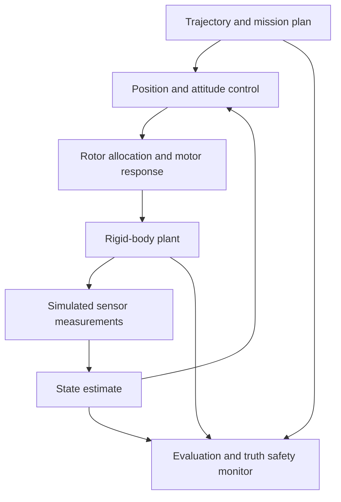

# System design

The project asks a practical control question: how well can a quadrotor follow a
trajectory when the controller has noisy measurements, an imperfect model, and
motors that take time to respond?

I keep the mathematical core separate from middleware so each assumption can be
tested directly. The same force model, rotation conventions and estimator
equations are used by the small tests and the larger flight experiments.

## The flight loop

The planner describes where the vehicle should be and how that position should
change. The position loop requests an acceleration, which becomes a thrust
magnitude and orientation. The attitude controller requests body moments. An
allocator converts the thrust and moments into four rotor-speed commands, and
the motor model determines how quickly the actual speeds approach them.

The rigid-body equations advance the simulated vehicle. Sensors observe that
state with their configured noise and biases. The error-state Kalman filter
combines those observations into an estimate for the next control calculation.
The controller has its own nominal parameters; it does not look up the true
mass, bias or wind to correct its answer.

The mission fixtures use a 400 Hz plant/IMU, 100 Hz attitude loop and 50 Hz
position loop, with position measurements at 5 Hz and altitude at 25 Hz. At each
plant epoch, measurements and estimator updates happen before the control call.
Commands are held between controller ticks. These rates are configuration
choices, not promises of real-time execution on flight hardware.

## Why the boundaries matter

| Boundary | Design choice | What it lets me check |
| --- | --- | --- |
| True plant / nominal model | Parameters are supplied separately and intentional differences are declared | Whether performance depends on knowing the simulated truth |
| Measurements / estimator | The ESKF consumes measured data and an explicit initial estimate | Estimation can be replayed without exposing truth to the filter |
| Controller / plant | Controllers return thrust and moments through the same actuator model | Motor delay, saturation and model error remain visible |
| Planning / execution | Smoothness and nominal reference bounds are checked before flight | A smooth path can still be too demanding to track |
| Experiment / evaluation | Full histories, seeds, configurations and failures are retained | A plot or successful run cannot hide an omitted failure |

Two feedback modes serve different purposes. True-state feedback gives the
controller the simulated state to isolate its behavior. Estimated feedback
closes the loop through the sensor and ESKF models. A result from the first mode
does not establish performance in the second. The truth safety monitor is
explicitly separate from both the estimator and controller; it is a simulation
guard, not an onboard sensing capability.

The optional [observation supervisor](observation-supervision.md) consumes the
passive monitor's current availability states. Independent elapsed budgets can
stop an estimated mission before another command, with existing truth and
estimate safety guards retaining priority. It has no truth-state input and
does not implement a hardware recovery maneuver.

## Frames and physical assumptions

All core calculations use North-East-Down world coordinates and
Forward-Right-Down body coordinates. `R_WB` rotates a body vector into the world
frame; `q_WB` is the equivalent scalar-first Hamilton quaternion. Gravity points
down and rotor thrust points along negative body z. These signs are tested at
nonidentity attitudes as well as at hover.

The plant is a rigid body with quadratic rotor thrust, reaction torque,
first-order motor response, constant world-frame wind and anisotropic quadratic
drag. It does not model contact, battery voltage, rotor inflow or a particular
identified airframe. A mission's landing ends at a virtual airborne plane; it
does not simulate touchdown or disarming. The [foundations](foundations.md) and
[frame contract](architecture/frame-contract.md) give the equations and units.

## Control and planning choices

The cascade is the default because it provides a simple reference: position
error requests attitude, attitude error requests rate, and rate error requests
moment. Its limited disturbance rejection and startup behavior are retained in
the evidence. The geometric option uses rotation errors directly and includes
desired angular-rate and acceleration feedforward. It tracks the tested
true-state trajectories well, but differentiating noisy estimated feedback
creates additional difficulties. The [controller discussion](controller-tradeoffs.md)
explains that comparison before the detailed [cascade](control.md) and
[geometric](geometric-control.md) equations.

Minimum-snap planning chooses a polynomial path through waypoints at specified
times. Penalizing the fourth position derivative encourages smooth changes in
acceleration. A separate retimer slows the path until conservative nominal
reference bounds pass. Neither smoothness nor a reference-bound pass proves
that the real closed loop can follow it; the mission experiment checks that
separately. See [planning](trajectories.md) and [trajectory execution](trajectory-missions.md).

## How I evaluate a change

I use analytical cases and independent numerical calculations for the equations,
then deterministic simulations for behavior. Estimator checks include Jacobians,
covariance consistency, replay and observation faults. Controller checks include
tracking error, terminal error, effort, limiting, timestep refinement and
repeatability. Experiment protocols fix their cases and thresholds before a run.

The evidence is strongest within those declared cases. Passing software tests,
good true-state tracking, calibrated estimator uncertainty and successful noisy
flight are separate findings. [Current status](status.md) states which findings
are supported and [the next-step plan](next-steps.md) defines the remaining work.
